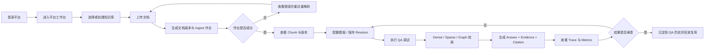

# RAG 调试平台原型设计文档

更新时间：2026-04-24

## 1. 文档说明

本文档基于 [需求规格说明书](./需求规格说明书.md) 补充产品原型设计，用于指导：

- 页面原型设计与评审
- 用户交互流程梳理
- Figma 原型搭建
- 前后端联调时的页面与交互对齐

本文档聚焦“用户看到什么、如何操作、系统如何反馈”，不替代技术实现方案。

## 2. 设计范围

本次原型设计覆盖需求规格说明书中的核心业务范围：

- 用户登录与身份识别
- 平台级用户与用户组管理
- 知识库创建、成员管理与权限查看
- 模板与配置版本化
- 文档上传、重解析、版本切换与 Chunk 查看
- Ingest 作业跟踪
- QA 调试、证据回溯、Trace 与历史记录
- 图检索增强结果查看

不纳入本轮高保真原型范围：

- 复杂审批流
- 商业化计费
- BI 统计报表中心
- 对外门户与终端用户聊天产品

## 3. 设计目标

### 3.1 业务目标

- 让用户在一个工作台内完成“文档入库 -> 检索构建 -> QA 调试 -> 结果分析 -> 配置优化”的闭环。
- 让调试结果具备可追溯性，能快速定位到知识库、配置版本、文档版本和 Chunk。
- 让权限边界在页面中清晰可见，但实际授权判断仍以后端为准。

### 3.2 交互目标

- 以知识库为核心入口，减少跨模块跳转成本。
- 在 QA 调试页中集中呈现“答案、证据、引用、Trace、指标、配置版本”。
- 针对耗时任务提供明确状态反馈，避免用户不确定系统是否仍在执行。
- 对高风险操作提供二次确认，例如切换 active version、停用知识库、重解析文档。

### 3.3 设计原则

1. 可追溯优先：所有关键结果都能回看来源与过程。
2. 调试优先于展示：页面优先服务研发调试与内部运营，不追求面向消费者的轻量聊天体验。
3. 渐进暴露复杂度：默认展示关键结果，深入诊断信息按需展开。
4. 权限前置提示：在页面中提前告知用户可执行范围，减少提交后报错。
5. 统一对象视角：知识库、文档、Chunk、Run、Config Revision 都应有稳定的详情视图。

## 4. 用户角色与核心任务

| 角色 | 主要任务 | 高频页面 |
| --- | --- | --- |
| 平台管理员 | 管理用户、用户组、平台级策略 | 平台首页、用户管理、用户组管理 |
| 知识库负责人 | 创建知识库、分配成员、管理配置、审查调试结果 | 知识库概览、成员权限、配置中心、QA 历史 |
| 知识库编辑者 | 上传文档、重解析、查看 Chunk、维护模板与配置 | 文档中心、文档详情、配置中心、QA 调试 |
| 问答操作员 | 发起 QA 调试、查看结果、回放历史 | QA 调试、QA 历史、运行详情 |
| 只读用户 | 查看被授权知识库摘要与运行结果 | 知识库概览、QA 历史摘要 |

## 5. 信息架构

## 5.1 一级导航

### 平台层

- 登录
- 平台工作台
- 用户管理
- 用户组管理

### 知识库层

- 知识库概览
- 文档中心
- 文档详情
- 配置中心
- QA 调试
- QA 历史
- 图检索分析
- 成员与权限

## 5.2 页面树

```text
RAG 调试平台
├─ 登录页
├─ 平台工作台
│  ├─ 知识库列表
│  ├─ 知识库创建/编辑弹窗
│  ├─ 用户管理
│  └─ 用户组管理
└─ 知识库工作区
   ├─ 概览页
   ├─ 文档中心
   │  ├─ 上传文档弹窗
   │  └─ 文档详情
   │     ├─ 版本列表
   │     ├─ Chunk 列表
   │     └─ Ingest 作业记录
   ├─ 配置中心
   │  ├─ 模板列表
   │  ├─ 当前配置
   │  └─ Revision 历史
   ├─ QA 调试
   │  ├─ 结果面板
   │  ├─ Evidence/Citation 面板
   │  ├─ Trace 面板
   │  └─ Diagnostics 面板
   ├─ QA 历史
   │  └─ 运行详情抽屉/详情页
   ├─ 图检索分析
   └─ 成员与权限
```

## 6. 全局交互规则

### 6.1 布局规则

- 采用左侧一级导航 + 顶部知识库上下文 + 主内容区三段式布局。
- 平台级页面显示平台导航；进入知识库后切换为知识库工作区导航。
- 顶部固定展示当前用户、知识库名称、当前 active config revision。

### 6.2 状态规则

- 列表页统一支持：搜索、筛选、分页、空状态、加载中、失败重试。
- 长任务统一显示状态枚举：`queued / running / success / failed / cancelled`。
- 风险操作统一使用二次确认弹窗，并展示影响范围。

### 6.3 权限规则

- 无权限入口在页面中隐藏或置灰，同时保留说明文案。
- 文档下载、Chunk 正文查看、QA 执行等能力需明确展示权限要求。
- 当后端拒绝请求时，页面需提示“权限不足或资源不可见”，不暴露未授权对象细节。

### 6.4 可追溯规则

- 所有 QA Run 详情必须可回看：知识库、配置版本、文档版本、Evidence、Citation、Trace。
- 文档详情必须能看见最新 active version 与历史版本关系。
- 配置中心必须显式标注 current active revision。

### 6.5 本轮原型补充落地原则

- 本轮原型优先补齐“文档入库 -> 版本查看 -> 配置保存与激活 -> QA 调试 -> QA 历史回放”的主链路闭环。
- 原型阶段必须明确动作入口、状态反馈、风险确认与异常可见性，但不要求接入真实后端接口。
- 可在原型阶段以抽屉、弹窗、演示态数据模拟上传、保存 revision、回放 run 等行为，但页面语义必须与后续设计一致。
- 字段级校验规则、接口入参与出参、任务调度机制、持久化策略保留到总体设计说明书和详细设计说明书中补充。

## 7. 页面原型设计

以下页面编号可直接用于 Figma Frame 命名。

## 7.1 P01 登录页

**页面目标**

完成用户身份识别并进入平台。

**核心模块**

- 品牌区：产品名称、平台定位说明
- 登录区：用户名/邮箱、密码、登录按钮
- 登录反馈区：错误提示、认证方式说明

**关键交互**

- 用户输入账号信息并提交。
- 登录成功后进入平台工作台。
- 登录失败时在表单内联提示，不跳转页面。

**状态与异常**

- 加载中：按钮变为 loading，不可重复点击。
- 失败：提示认证失败原因，但不泄露安全细节。

**关联需求**

- FR-001

## 7.2 P02 平台工作台 / 知识库列表

**页面目标**

作为平台入口，帮助用户快速定位自己有权限访问的知识库。

**核心模块**

- 顶部信息条：当前用户、平台角色、快捷入口
- 筛选区：知识库名称、状态、负责人
- 知识库列表：名称、描述、状态、默认密级、索引能力、负责人、最近更新时间
- 快捷操作：进入知识库、创建知识库、停用知识库

**关键交互**

- 点击知识库卡片或行项进入知识库概览。
- 平台管理员可打开“创建知识库”弹窗。
- 创建或编辑知识库时需选择索引能力开关，例如是否维护 Sparse 文本索引、是否维护图索引，以及这些副本是否阻塞 active version 切换。
- 可按名称搜索和按状态筛选。

**状态与异常**

- 空状态：首次使用时提示创建首个知识库。
- 无权限时不展示未授权知识库。

**关联需求**

- FR-010、FR-011、SR-002

## 7.3 P03 用户管理

**页面目标**

支持平台管理员维护用户基础资料。

**核心模块**

- 用户列表：用户名、展示名、邮箱、平台角色、密级、状态
- 操作区：新增用户、禁用用户、查看详情
- 筛选区：角色、状态、密级

**关键交互**

- 新增用户使用弹窗或抽屉完成。
- 禁用用户前需二次确认。
- 点击用户可查看已加入的用户组与知识库角色摘要。

**关联需求**

- FR-002、SR-001

## 7.4 P04 用户组管理

**页面目标**

支持平台管理员维护用户组以及组成员关系。

**核心模块**

- 用户组列表：组名、成员数量、创建时间
- 详情抽屉：成员列表、知识库绑定摘要
- 操作区：创建用户组、添加成员、移除成员

**关键交互**

- 点击组名进入成员管理抽屉。
- 支持批量添加成员。
- 在知识库成员绑定页面可按用户组快速授权。

**关联需求**

- FR-003、FR-011

## 7.5 P05 知识库概览

**页面目标**

提供某个知识库的核心状态总览和下一步操作入口。

**核心模块**

- 基本信息卡：名称、描述、状态、默认密级、索引能力、负责人
- 数据概览卡：文档数、活跃文档版本数、Chunk 总量、最近 QA 次数
- 运行状态卡：最近 Ingest 作业、最近图构建状态、当前 active config revision
- 快捷操作区：上传文档、进入 QA 调试、查看配置中心、管理成员

**关键交互**

- 用户从概览页进入各二级功能页。
- 当存在失败作业时，概览页给出明显告警入口。

**关联需求**

- FR-010、FR-021、FR-040、FR-055

## 7.6 P06 文档中心

**页面目标**

管理知识库下的文档生命周期。

**核心模块**

- 文档列表：文档名、当前 active version、状态、密级、最近解析时间、上传人
- 顶部操作：上传文档、批量重解析、导出筛选结果
- 筛选区：状态、密级、上传时间、发起人
- 作业侧边栏：最近 ingest 作业列表

**关键交互**

- 点击“上传文档”打开上传弹窗，选择文件并提交。
- 点击某文档进入文档详情。
- 批量重解析前弹出影响说明。

**状态与异常**

- 上传后立即生成文档对象，并在列表中显示处理状态。
- 解析失败时支持查看错误信息和重新发起。

**本轮原型补充落地**

- 原型中明确提供“上传文档”抽屉，提交后立即在列表中新增文档对象，并在右侧最近 ingest 作业区新增一条任务记录。
- 原型中明确提供“批量重解析”二次确认弹窗，确认后需将选中文档状态切换为 `running`，用于演示风险操作反馈。
- 原型中最近 ingest 作业区为固定侧边模块，不依赖跳转即可看到任务状态、阶段与触发时间。
- 原型中列表需显式呈现空状态，用于评审筛选结果为空时页面如何反馈。

**关联需求**

- FR-030、FR-031、FR-032、FR-040、SR-010

## 7.7 P07 文档详情

**页面目标**

查看文档版本、Chunk、作业与权限信息，支持 active version 切换。

**核心模块**

- 文档头部信息：文档名、文档 ID、当前 active version、密级、ACL 摘要
- Tab1 版本列表：版本号、来源、状态、创建时间、是否 active
- Tab2 Chunk 列表：正文摘要、页码、章节、token 数、metadata
- Tab3 Ingest 作业：状态、进度、错误信息、发起人
- 右侧操作区：重解析、切换 active version、下载原始文档

**关键交互**

- 用户切换 Tab 查看不同维度信息。
- 点击某个 Chunk 可打开详情抽屉，查看完整正文与 metadata。
- 切换 active version 需要二次确认，并说明对 QA 的影响。

**状态与异常**

- 无 `kb.chunk.read` 权限时，Chunk 正文使用脱敏提示替代。
- 作业失败时保留失败原因与重试入口。

**本轮原型补充落地**

- 原型中 Chunk 点击后必须打开详情抽屉，且抽屉内容跟随当前选中的 Chunk 变化，不允许使用固定示例内容替代。
- 原型中需显式提供“模拟无 `kb.chunk.read` 权限”的脱敏态，用于评审正文可见性边界。
- 原型中版本列表必须提供“设为 Active”入口，并在切换前通过二次确认说明对后续 QA 的影响。
- 原型中 Ingest 作业列表需显式展示失败原因，并提供失败作业重试入口。

**关联需求**

- FR-031、FR-032、FR-033、FR-040、SR-011、SR-012

## 7.8 P08 配置中心

**页面目标**

管理模板、基线配置与配置版本，定义知识库默认运行方式，保证 QA 调试可追溯。

**核心模块**

- 模板列表：模板名、最近更新时间、适用范围
- 受约束 Pipeline Designer：以阶段式画布表达 Query Rewrite、检索、融合、安全过滤、生成、引用和诊断链路
- 节点库与模板库：区分可配置节点、系统锁定节点和暂不开放节点
- 节点 Inspector：展示选中节点参数、输入输出摘要、约束规则、启用状态和运行预览
- Validation 面板：展示保存前必须满足的 Pipeline 合法性规则
- Revision 历史：revision 编号、创建人、创建时间、备注、是否 active
- 配置差异对比：当前编辑态与 active revision 的差异摘要

**受约束工作流编排设计**

P08 的交互目标是“看起来像工作流，但不能随便编排”。页面不采用完全自由 DAG，而采用固定阶段的 Pipeline Canvas：

- 阶段 1：输入与问题预处理，包含 Input、Query Rewrite。
- 阶段 2：并行召回，包含 Dense Retrieval、Sparse Retrieval、Graph Retrieval。
- 阶段 3：融合与安全过滤，包含 Fusion、Permission Filter、Rerank。
- 阶段 4：生成与引用，包含 LLM Generation、Citation Builder。
- 阶段 5：输出与诊断，包含 Answer、Trace、Metrics。

画布中的连线由系统隐式生成，用户不能任意跨阶段连线。用户主要操作是选择模板、启用或禁用可选节点、调整节点参数、查看节点约束、保存为 Revision。系统锁定节点必须显式展示 `Locked` 状态，避免评审误解为可以删除或绕过。

原型阶段以当前设计稿组件为准；研发实现时需将画布节点展示结构与后端 `pipelineDefinition` 分离。Pipeline 画布、节点卡片、Inspector、Validation 等 UI 组件应只消费稳定 ViewModel 和事件回调，不直接依赖后端 DTO、API 路径或具体检索服务实现，以便未来替换画布组件或节点组件时减少改动范围。

**必须明确承载的配置项**

- Query 预处理：是否开启问题重写、重写策略、重写提示词版本、是否保留原始问题
- 检索默认参数：Dense / Sparse / Graph 是否默认开启、各路 topK、最小分数、过滤策略
- 融合参数：融合算法、Dense / Sparse / Graph 权重、去重策略、候选截断规则
- Rerank 参数：是否开启 rerank、rerank 模型、rerank topN、保留策略
- 生成与引用参数：回答模型、回答长度、citation 策略、最小证据支撑数

**能力边界**

- P08 负责：定义知识库的“默认基线配置”、版本化保存、active revision 切换、配置差异比较、模板复用
- P08 可选负责：维护少量可复用的“调试预设”，例如“高召回模式”“低成本模式”
- P08 不负责：执行单次 QA、展示单次 run 的召回 chunk、展示改单次 run 的改写问题、展示单次 run 的回答质量判定
- P08 不负责：承载频繁的试错式临时调参；临时覆盖参数应在 P09 完成
- P08 不负责：绑定具体前端组件库或后端检索实现；正式研发应通过 Adapter 将业务契约转换为页面 ViewModel。

**关键交互**

- 用户可从模板创建配置或在当前配置上编辑。
- 保存配置后自动生成新 revision。
- 点击某个 revision 可查看详情并切换为 active。
- 用户可查看某个 revision 与 active revision 的字段级差异。
- 用户可将某个 revision 作为基线，在 P09 中进行“仅本次运行有效”的临时覆盖。
- 用户点击节点后，右侧 Inspector 展示该节点的参数、约束规则和运行预览。
- 用户尝试删除锁定节点时，页面必须提示该节点属于系统护栏，不允许删除或禁用。
- 用户尝试保存非法 Pipeline 时，保存按钮应禁用或弹出校验失败提示。
- 用户点击“验证此 Pipeline”时，应表达“带当前草稿进入 P09 运行验证”，但 P09 不负责修改正式拓扑。

**状态与异常**

- 未保存修改时离开页面需提示。
- 切换 active revision 需说明后续 QA 将基于新版本执行。
- 当 revision 尚未激活时，应明确标注“仅保存未生效”。
- 当配置字段存在冲突时，应阻止保存，例如三路检索默认全关、fusion 权重不合法、rerank topN 大于候选数。
- 当 Dense、Sparse、Graph 全部关闭时，Pipeline 处于 Invalid 状态，不允许保存。
- 当用户试图把 Query Rewrite 放到检索之后时，页面应阻止操作并提示“问题重写必须发生在检索之前”。
- 当用户试图绕过 Permission Filter 或 Citation Builder 时，页面应提示这是系统锁定节点。
- 当 Graph Retrieval 开启时，页面需提示图结果必须回落到授权 Chunk / Evidence 后才能进入生成上下文。

**本轮原型补充落地**

- 原型中已将“保存配置生成新 revision”和“切换 active revision”拆分为两个独立动作，避免评审时误解为“保存即生效”。
- 原型中 Revision 历史以抽屉形式查看，需展示 revision 编号、创建人、创建时间、备注、当前是否 active。
- 原型中切换 active revision 前必须弹出确认，明确说明后续 QA 将基于新版本执行。
- 原型中的模板切换与配置编辑只要求能触发“未保存修改”提示，不要求在本阶段完成真实字段持久化。
- 原型中 P08 已调整为三栏式 Pipeline Designer：左侧模板与节点库，中间阶段式画布，右侧 Node Inspector 与 Validation。
- 原型中节点以受控卡片展示，并通过 `Locked`、`Enabled`、`Disabled` 标识节点权限和状态。
- 原型中已露出关键校验规则：Query Rewrite 必须在 Retrieval 前、至少启用一路检索、Permission Filter 不可删除、Graph 结果必须回落 Chunk / Evidence、Citation 必须来自授权 Evidence。
- 原型中 P08 负责正式 Pipeline 编排与 Revision 保存，P09 只展示实际执行 Trace 和单次临时覆盖。

**关联需求**

- FR-020、FR-021、NFR-001

## 7.9 P09 QA 调试页

**页面目标**

完成一次完整的单次问答实验，并对问题改写、检索、融合、rerank、生成链路进行诊断。

**核心模块**

- 调试输入区：原始 Query、知识库上下文、运行来源 revision、实验备注
- 临时覆盖参数区：Query Rewrite、Dense / Sparse / Graph、融合参数、rerank 参数、生成参数
- 中间结果区：改写后问题、多路召回结果、融合后候选、rerank 前后排序变化、最终送入 LLM 的上下文
- 结果区：Answer、Evidence、Citation、授权后可见的 Retrieved Chunks
- Executed Pipeline Trace 区：展示本次 QARun 实际执行的步骤顺序、耗时、tokens、输入输出摘要、异常与降级说明
- Metrics 区：总耗时、总 tokens、召回诊断、rerank 统计、回答诊断摘要
- 侧边上下文：当前 active config revision、本次 runId、触发时间、是否使用临时覆盖

**必须明确承载的调试能力**

- 支持查看原始问题、改写后问题、最终实际检索问题
- 支持调整问题重写开关，并显示本次是否命中重写链路
- 支持单次运行维度调整 Dense / Sparse / Graph 的开关与候选数
- 支持单次运行维度调整融合算法、融合权重、去重策略、rerank topN
- 支持查看 Dense / Sparse / Graph 各自召回的 chunk 列表与得分摘要
- 支持查看融合后候选列表，以及哪些 chunk 被淘汰、为什么被淘汰
- 支持查看最终进入生成上下文的 chunk 集合
- 支持展示本次运行使用的 Pipeline Trace，但不允许在 P09 修改正式 Pipeline 拓扑。
- 支持把本次有效参数沉淀为 Revision 草稿入口，再回到 P08 审核和保存。

**能力边界**

- P09 负责：单次实验、临时调参、中间过程可视化、结果诊断、结果保存与回放入口
- P09 负责：以“本次 run”为中心展示改写、召回、融合、rerank、回答的完整链路
- P09 不负责：修改知识库正式 active revision；如需长期生效，应由用户将参数沉淀回 P08
- P09 不负责：承载跨多次 run 的统计监测、趋势分析、回归对比；这些应进入 P10
- P09 不负责：直接绑定后端 QARun DTO 或具体模型/检索 Provider；正式研发应通过 `QARunTraceViewModel`、`RetrievalCandidateViewModel`、`EvidenceCitationViewModel` 等展示模型隔离。

**关键交互**

- 用户输入 Query 后点击“开始调试”。
- 系统执行过程中通过状态轮询显示阶段状态，如“检索中”“生成中”“整理证据中”；后续可升级为实时推送，但不改变页面语义。
- 用户可切换“使用 active revision”与“本次临时覆盖参数”两种模式。
- 用户可展开查看改写问题、Dense / Sparse / Graph 各路召回结果、融合后结果与 rerank 差异。
- 用户可展开某条 evidence 查看对应 Chunk 内容与来源文档。
- 用户可从 citation 直接跳转至文档详情定位。
- 用户可保存本次调试、复制参数、保存为调试预设，或将本次参数回填为新 revision 草稿。
- 用户可进入历史记录查看同类问题，或把当前 run 标记为后续评估样本。

**状态与异常**

- 无 `kb.qa.run` 权限时，执行按钮禁用并提示。
- 当 Dense、Sparse、Graph 全部关闭时，不允许提交。
- 如果某一路检索失败，页面需区分“部分降级成功”与“整体失败”。
- 当开启问题重写但改写失败时，应明确回退为原始问题执行。
- 当融合或 rerank 阶段淘汰了高分 chunk 时，应提供“淘汰原因”说明，而不是只展示最终答案。
- 当最终上下文因权限过滤被裁剪时，应标记“候选命中但不可用于生成”。

**本轮原型补充落地**

- 原型中明确提供三类演示场景：正常成功、部分降级成功、权限裁剪场景，用于评审异常反馈是否充分。
- 原型中“开始调试”必须驱动运行中状态、运行完成状态以及对应的反馈文案，不再仅展示静态结果页。
- 原型中必须显式展示改写结果、多路召回摘要、融合后候选列表及其“保留/淘汰/失败/权限过滤”原因。
- 原型中 citation 点击后需能跳转到文档详情或图检索分析页，形成页面间追溯闭环。
- 原型中必须提供“保存本次调试”“保存为调试预设”“生成 revision 草稿”入口，即便后端持久化后续实现。
- 原型中 Trace 标签已调整为 `Executed Pipeline Trace`，强调这里展示实际执行链路，而不是正式拓扑编辑器。
- 原型中明确提示 P09 的覆盖参数仅影响本次 QARun，不会修改 P08 中的 active Pipeline。
- 原型仍使用当前设计稿组件表达交互；研发实现时需把页面组件与服务调用、DTO、Provider 实现隔离，保证未来替换 UI 组件或后端服务时不重写页面主体。

**关联需求**

- FR-050、FR-051、FR-052、FR-053、FR-054、SR-020、SR-021、SR-022、SR-031

## 7.10 P10 QA 历史 / 监测页

**页面目标**

查看知识库范围内的历史 QA 运行记录，并对回答质量、引用质量、回归变化进行监测。

**核心模块**

- 历史列表：runId、query、发起人、时间、状态、配置版本、是否使用临时覆盖、总耗时
- 监测筛选区：发起人、时间范围、状态、配置版本、问题集、反馈状态、失败类型
- 详情抽屉：答案、证据、引用、Trace、Metrics 快照、参数快照、评估快照
- 质量标注区：人工反馈、是否答对、是否命中正确 chunk、是否存在错误引用、失败类型
- 对比区：同一 query 的多次 run 对比、不同 revision 的效果对比、回归退化提示
- 快捷操作：复制 query 重新调试、打开完整详情、加入评估集、导出监测快照

**必须明确承载的监测能力**

- 支持按 query、revision、时间范围查看历史 run
- 支持查看某次 run 的参数快照，区分“来自 active revision”还是“带临时覆盖”
- 支持人工标记回答质量，例如正确、部分正确、错误、无证据、引用错误
- 支持记录失败类型，例如未召回、召回不准、融合误杀、改写偏题、生成幻觉
- 支持同一 query 在不同 revision / 不同参数下的结果对比
- 支持将典型 query 沉淀为回归样本，供后续版本验证

**能力边界**

- P10 负责：多次 run 的沉淀、检索问题归因、回答质量监测、回归验证入口
- P10 负责：从“单次结果”提升到“样本集与趋势”的视角
- P10 不负责：执行详细临时调参；需要重试或继续实验时，应回到 P09
- P10 不负责：编辑知识库正式配置；需要变更默认策略时，应回到 P08

**关键交互**

- 点击某条记录打开详情。
- 可按 query 关键词或 runId 搜索。
- 支持从历史记录一键回放到 QA 调试页。
- 支持对某条 run 进行人工评估标记，并记录问题类型。
- 支持按“同一 query”聚合查看不同 revision 的回答差异。
- 支持把某条或某组 query 加入回归测试集合。

**本轮原型补充落地**

- 原型中历史详情以抽屉形式展开，需展示 run 快照、回答摘要、revision、是否带临时覆盖、失败类型与后续动作。
- 原型中需提供人工标注入口，至少支持“正确 / 错误或不满意”两类反馈，用于演示质量沉淀流程。
- 原型中需提供“同一 query 对比”区块，展示不同 revision 或不同参数下的结果差异。
- 原型中“回放”动作必须将 query、source runId、revision 上下文带回 QA 调试页，而不是仅做页面跳转。
- 原型中需提供“加入回归集”入口，用于明确后续版本验证样本的沉淀方式。

**关联需求**

- FR-055、FR-054、NFR-001

## 7.11 P11 图检索分析页

**页面目标**

帮助用户理解 Neo4j 图增强的过程与结果。

**核心模块**

- 查询输入区：图检索测试 query
- 图摘要区：命中的实体、关系、社区
- Chunk 回落区：支撑 Chunk 列表、权限过滤结果
- 图构建状态区：最近构建时间、作业状态、快照信息

**关键交互**

- 用户可单独验证图增强效果。
- 点击实体或关系可查看其对应支撑 Chunk。
- 如某图结果因权限被裁剪，需要明确提示“结果已过滤”。

**关联需求**

- FR-043、FR-052、DR-020、DR-021、DR-022、SR-030、SR-031

## 7.12 P12 成员与权限页

**页面目标**

管理知识库角色绑定，并帮助用户理解访问边界。

**核心模块**

- 成员列表：用户/用户组、角色、来源、更新时间
- 权限说明区：各角色能力矩阵
- 操作区：添加成员、移除成员、修改角色

**关键交互**

- 支持按用户或用户组添加角色绑定。
- 角色变更后立即生效，并提示对文档读取和 QA 的影响。

**关联需求**

- FR-011、SR-010、SR-020

## 8. 关键用户交互流程

## 8.1 流程 A：平台管理员初始化平台

1. 登录平台。
2. 进入平台工作台。
3. 创建用户与用户组。
4. 创建知识库并指定负责人。
5. 为知识库绑定用户或用户组角色。
6. 通知知识库负责人开始导入文档与配置。

## 8.2 流程 B：知识库编辑者完成文档入库

1. 进入指定知识库概览页。
2. 打开文档中心上传文档。
3. 系统生成文档对象与新版本。
4. 系统启动 ingest 作业并显示进度。
5. 作业成功后，用户进入文档详情查看版本与 Chunk。
6. 若结果异常，用户执行重解析或切换 active version。

## 8.3 流程 C：知识库负责人维护配置版本

1. 进入配置中心。
2. 选择模板或编辑当前配置。
3. 保存配置，系统生成新 revision。
4. 审核配置差异后切换 active revision。
5. 进入 QA 调试页验证新配置效果。

## 8.4 流程 D：问答操作员执行 QA 调试

1. 进入 QA 调试页。
2. 输入 query，确认当前知识库与 active revision。
3. 设置 Dense / Sparse / Graph 检索开关。
4. 发起调试运行。
5. 查看 Answer、Evidence、Citation、Trace、Metrics。
6. 若结果不理想，则返回配置中心或文档中心优化。
7. 若结果符合预期，则保留在 QA 历史中供后续回放。

## 8.5 流程 E：查看历史并回放

1. 进入 QA 历史页。
2. 按 query、时间、配置版本筛选历史记录。
3. 查看某次 run 的详细结果。
4. 一键复制 query 回到 QA 调试页重新运行。

## 9. 流程图草案

以下 Mermaid 草案可用于文档评审，也可作为 FigJam/Figma 流程图绘制依据。



## 10. 页面跳转关系

| 来源页面 | 触发动作 | 目标页面 |
| --- | --- | --- |
| 登录页 | 登录成功 | 平台工作台 |
| 平台工作台 | 点击知识库 | 知识库概览 |
| 知识库概览 | 上传文档 | 文档中心 |
| 文档中心 | 点击文档 | 文档详情 |
| 知识库概览 | 查看配置 | 配置中心 |
| 配置中心 | 开始验证 | QA 调试页 |
| QA 调试页 | 查看历史 | QA 历史页 |
| QA 历史页 | 回放 | QA 调试页 |
| QA 调试页 | 查看图增强 | 图检索分析页 |
| 知识库概览 | 管理成员 | 成员与权限页 |

## 11. Figma 原型规划

## 11.1 建议画板清单

建议在 Figma 中按以下顺序创建画板：

1. `P01-登录页`
2. `P02-平台工作台`
3. `P03-用户管理`
4. `P04-用户组管理`
5. `P05-知识库概览`
6. `P06-文档中心`
7. `P07-文档详情`
8. `P08-配置中心`
9. `P09-QA调试页`
10. `P10-QA历史页`
11. `P11-图检索分析页`
12. `P12-成员与权限页`

## 11.2 原型层级建议

- L1：低保真线框，先确认信息架构与主要操作路径
- L2：中保真页面，补充表单、表格、标签、状态与弹窗
- L3：交互标注，补充页面切换、按钮行为、异常提示与权限提示

## 11.3 页面统一组件建议

- 顶部导航栏
- 左侧知识库导航
- 列表筛选工具栏
- 状态标签
- 作业进度条
- Evidence / Citation 折叠面板
- Trace 时间线
- 二次确认弹窗
- 空状态与权限受限提示

## 12. 原型验收建议

原型评审时建议重点确认以下问题：

1. 是否覆盖了需求规格说明书中的核心链路。
2. QA 调试页是否足以支持结果分析与问题定位。
3. 文档版本、配置版本、QA 历史之间的追溯关系是否清晰。
4. 权限不足、任务失败、部分降级成功等异常态是否有明确反馈。
5. 平台管理员与知识库角色的页面边界是否明确。
6. 风险操作是否都具备显式确认，例如批量重解析、切换 active version、切换 active revision。
7. 历史记录是否能够带着上下文回放到 QA 调试页，而不是仅回到空白调试页。
8. 原型中的演示态数据是否已经足够说明后续总体设计与详细设计的对象关系与状态流转。

## 13. 后续细化建议

- 下一轮可补充字段级原型说明，例如各筛选项、表格列、按钮权限矩阵。
- 若进入高保真阶段，建议为 QA 调试页补充多状态稿：首次进入、运行中、成功、部分失败、无权限。
- 若进入研发阶段，建议将页面编号与接口清单一一映射，便于联调和验收。
- 总体设计说明书建议重点补充：对象模型、模块边界、状态流转、任务链路、接口关系与权限判定边界。
- 详细设计说明书建议重点补充：字段级校验规则、错误码、请求响应示例、持久化策略、回归集与预设的存储方案。
