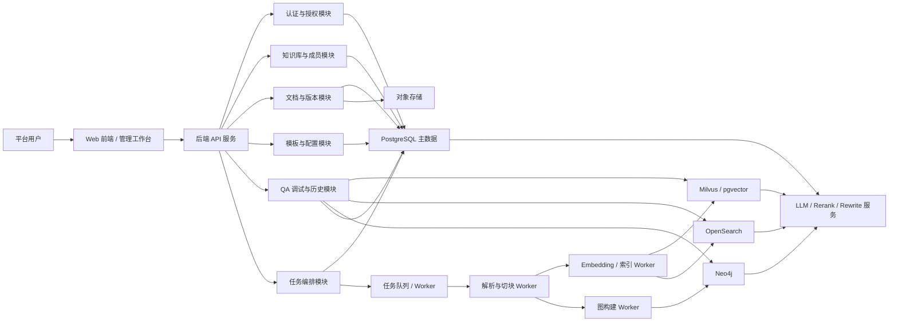

# 总体设计说明书

## 1. 文档目的

本文档用于说明 RAG 调试平台的总体设计方案，重点回答以下问题：

- 系统边界是什么
- 系统由哪些核心模块组成
- 各模块之间如何协作
- 核心业务对象、数据流和任务流如何组织
- 权限、可追溯性和可恢复性如何在架构层面得到保障

本文档面向产品、研发、测试和项目管理使用，作为详细设计说明书、接口设计说明、数据模型设计和开发实施的上位输入。

## 2. 设计依据

- [需求规格说明书](../02-需求与原型/需求规格说明书.md)
- [原型设计文档](../02-需求与原型/原型设计文档.md)
- [Figma视觉原型说明](../02-需求与原型/Figma视觉原型说明.md)

## 3. 系统目标

### 3.1 总体目标

建设一个面向内部研发和知识库维护场景的 RAG 调试平台，围绕真实文档、真实检索链路和真实模型调用，支撑以下闭环：

1. 文档入库与版本化管理
2. 检索副本与图结构构建
3. 配置版本化与激活切换
4. 单次 QA 调试与链路诊断
5. QA 历史沉淀、回放与回归验证

### 3.2 设计目标

- 以知识库为核心工作对象，统一文档、配置、QA、历史与权限管理。
- 以 PostgreSQL 为业务主数据真值中心，确保文档、版本、Chunk、配置和运行记录可追溯。
- 通过异步任务机制解耦文档解析、向量写入、关键词索引和图构建，提升可恢复性。
- 支持 Dense / Sparse / Graph 三类检索能力按配置组合使用，并确保结果不绕过权限控制。
- 通过 Config Revision 和 QA Run 建立稳定的审计链路，保证调试结果可回放、可对比、可复现。

### 3.3 非目标

- 不在本期建设公网聊天产品能力。
- 不在本期建设复杂审批流、计费中心、BI 统计中心。
- 不在本期建设多租户 SaaS 隔离体系。
- 不要求在总体设计阶段冻结所有字段级实现细节，这些内容由详细设计承接。

## 4. 系统边界

### 4.1 系统内功能

系统内功能包括：

- 用户登录与身份识别
- 平台级用户、用户组管理
- 知识库创建、维护、停用和成员绑定
- 模板管理与配置版本化
- 文档上传、文档版本管理、重解析和 Chunk 查看
- Ingest 作业跟踪和失败重试
- Dense 检索、可选 Sparse 检索、Neo4j 图检索增强
- QA 调试、证据回溯、Citation、Trace 和 Metrics
- QA 历史、人工标注、回放与回归样本沉淀

### 4.2 系统外部依赖

系统依赖以下外部组件或服务：

- 统一认证来源或本地认证模块
- 对象存储，用于保存原始文档和大体积解析产物
- 大模型服务，用于问题重写、生成回答、抽取图结构等
- Embedding 服务，用于生成向量
- Rerank 服务，用于候选排序
- 向量检索层：优先 Milvus，中小规模可使用 PostgreSQL `pgvector`
- 关键词检索副本层：按需启用 OpenSearch
- 图数据库：Neo4j

### 4.3 设计假设

- 平台以内部用户使用为主，用户规模和知识库规模处于可控范围。
- QA 调试以单次实验和回放分析为主，不追求公网实时并发聊天吞吐。
- 文档正文真值必须保存在 PostgreSQL，不允许仅保存在对象存储、向量库或图数据库中。
- 图检索增强必须回落到授权 Chunk 才能进入回答上下文。

## 5. 总体架构

### 5.1 架构原则

- 分层清晰：表现层、服务层、任务层、存储层职责分离。
- 真值优先：业务主数据统一落 PostgreSQL。
- 异步解耦：重任务通过队列与 Worker 执行。
- 副本可重建：向量索引、关键词索引、图结构均可基于真值重建。
- 权限前置：检索阶段和输出阶段都进行权限控制。
- 运行可追溯：QA Run、Config Revision、Document Version 形成稳定关联。
- 接口先行：页面、业务状态、后端 API 和外部服务之间通过稳定接口衔接，不让 UI 组件形态决定接口结构。
- 组件可替换：当前实现以设计稿组件为准，但前端页面必须通过 ViewModel 和组件 props 隔离 UI 组件库，降低后续组件替换成本。
- 依赖倒置：服务层依赖 LLM、Embedding、Rerank、Dense、Sparse、Graph 等 Provider 抽象，不直接依赖具体模型厂商或存储组件实现。

### 5.2 总体架构图

### 5.3 架构分层说明

#### 5.3.1 表现层

表现层为 Web 管理工作台，主要职责：

- 展示平台级和知识库级页面
- 接收用户输入并调用后端 API
- 呈现文档、配置、QA、历史和图检索页面
- 在前端做基础校验和友好反馈
- 通过 Adapter 将后端 DTO 转换为页面 ViewModel
- 组件只消费稳定 props 和事件回调，不直接依赖 API 路径、后端枚举或具体服务实现

前端不承担最终权限判断，也不承担业务真值计算。页面实现不得把 `pipelineDefinition`、后端 DTO 和画布展示结构混为同一个对象；正式研发时应将业务契约、服务调用和 UI 展示分层维护。

#### 5.3.2 服务层

服务层为平台业务中枢，主要职责：

- 承担认证、鉴权与权限裁剪
- 维护知识库、文档、版本、Chunk、配置、运行记录等主对象
- 统一编排 QA 调试流程
- 统一管理任务下发、状态记录和失败恢复入口
- 通过 Provider / Adapter 统一封装 LLM、Embedding、Rerank、Dense Retrieval、Sparse Retrieval 和 Graph Retrieval 能力
- 屏蔽 Milvus、pgvector、OpenSearch、Neo4j、模型厂商等具体实现差异

#### 5.3.3 任务层

任务层负责执行耗时异步任务，主要包括：

- 文档解析与切块
- Embedding 生成与向量写入
- OpenSearch 文本索引写入
- 图结构抽取与写入 Neo4j
- 批量重建、重试和补偿任务

任务层与服务层通过任务队列或作业表解耦，避免长耗时操作阻塞前台请求。

#### 5.3.4 存储层

存储层按“主数据真值 + 检索副本 + 图结构主存”划分：

- PostgreSQL：业务主数据、Chunk 真值、权限、配置、QA Run、作业元数据
- 对象存储：原始文档、解析产物、大文本附件
- Milvus / pgvector：Dense 向量检索副本
- OpenSearch：Sparse 或混合检索副本，按需启用
- Neo4j：图结构主存

### 5.4 技术栈建议

基于本项目的 RAG 与图检索属性，建议技术栈如下：

- 前端：React + Vite + TypeScript
- 后端：Python FastAPI
- 任务框架：Celery + Redis
- 数据库：PostgreSQL
- 对象存储：MinIO
- 向量检索：Milvus
- 关键词检索：OpenSearch
- 图数据库：Neo4j
- 模型服务：统一封装 LLM / Embedding / Rerank Provider

说明：

- 选择 Python 作为后端，主要因为文档解析、Embedding、RAG 编排和图抽取生态更成熟。
- 选择 Celery 仅为当前推荐，若后续已有统一任务平台，可在详细设计中替换。
- Milvus、pgvector、OpenSearch、Neo4j 和模型服务均应被视为可替换组件；替换时优先修改 Provider / Adapter 实现，不修改 QA 编排主流程和前端页面主体。

## 6. 业务模块划分

| 模块 | 功能说明 | 主要对象 | 主要接口 |
| --- | --- | --- | --- |
| 认证与用户模块 | 登录、用户资料、平台角色、用户组管理 | User、UserGroup | Auth、Users、Groups |
| 知识库管理模块 | 知识库创建、维护、停用、成员绑定 | KnowledgeBase、KbMemberBinding | KnowledgeBases、Members |
| 文档处理模块 | 文档上传、版本管理、重解析、Chunk 查看、Ingest 跟踪 | Document、DocumentVersion、Chunk、IngestJob | Documents、DocumentVersions、IngestJobs |
| 配置中心模块 | 模板管理、配置编辑、Revision 保存与激活 | Template、ConfigRevision | Templates、ConfigRevisions |
| QA 调试模块 | 单次实验、检索链路执行、答案生成、证据与 Trace 返回 | QARun、Evidence、Citation | QA Runs |
| QA 历史与评估模块 | 历史查询、详情查看、回放、人工标注、回归样本沉淀 | QARun、EvaluationSample | QA History、Evaluations |
| 图检索分析模块 | 图结构查看、图扩展分析、支撑 Chunk 回落 | GraphSnapshot、Entity、Relation | Graph、GraphSnapshots |
| 权限控制模块 | 文档、Chunk、QA 执行与输出权限校验 | Policy、AclRule | 内嵌于各业务接口 |

## 7. 核心对象设计概览

### 7.1 核心对象清单

| 对象 | 作用 | 关键关系 |
| --- | --- | --- |
| User | 系统用户主体 | 属于多个 UserGroup，可绑定平台角色和 KB 角色 |
| UserGroup | 用户组对象 | 用于批量授权和 ACL 复用 |
| KnowledgeBase | 知识库工作空间 | 关联文档、配置、成员、QA Run |
| KbMemberBinding | 知识库成员绑定 | 将 User 或 UserGroup 绑定到 KB 角色 |
| Document | 业务文档主对象 | 下挂多个 DocumentVersion |
| DocumentVersion | 文档版本对象 | 同一 Document 同时只能有一个 active version |
| Chunk | 文档切块真值对象 | 从属于 DocumentVersion，是检索和引用的最小单位 |
| IngestJob | 文档处理作业 | 记录解析、索引、图构建等异步状态 |
| Template | 可复用配置模板 | 可生成 ConfigRevision |
| ConfigRevision | 知识库配置版本 | QA Run 必须可追溯到该版本 |
| QARun | 单次 QA 调试记录 | 关联 KB、Revision、Evidence、Trace、Metrics |
| Evidence / Citation | 结果证据与引用 | 反向指向 Chunk / DocumentVersion |
| GraphSnapshot | 图构建快照元数据 | 标识某次图构建结果版本 |
| EvaluationSample | 回归测试样本 | 从历史 QARun 沉淀而来 |

### 7.2 对象关系原则

- `KnowledgeBase` 是平台内的一级业务工作对象。
- `Document` 与 `DocumentVersion` 分离，避免版本与主对象混淆。
- `Chunk` 必须归属于 `DocumentVersion`，而非仅归属于 `Document`。
- `ConfigRevision` 与 `QARun` 为一对多关系，一个 Revision 可支撑多次 QA Run。
- `QARun` 输出的 `Evidence / Citation / Trace / Metrics` 必须可审计和可回溯。
- 图中的实体和关系不是最终引用真值，必须反查到 `Chunk`。

## 8. 核心流程设计

### 8.1 文档入库流程

1. 用户在知识库中上传文档。
2. 后端将文档上传至minio中。
3. 后端创建 `Document` 和新的 `DocumentVersion` 记录。
4. 系统创建 `IngestJob`，状态初始化为 `queued`。
5. Worker 执行文档解析、切块、Chunk 写入 PostgreSQL。
6. Worker 执行 Embedding 计算并写入向量检索层。
7. 若知识库启用 Sparse 索引能力，则写入 OpenSearch 副本。
8. 若知识库启用图索引能力，则执行图抽取并写入 Neo4j，同时记录 `GraphSnapshot` 元数据。
9. Worker 更新各副本就绪状态，满足知识库索引能力配置要求后将版本标记为 `retrieval_ready`。
10. 作业完成后更新 `IngestJob` 状态，并在前端展示结果。

设计要点：

- 文档对象与版本对象在上传时即创建，保证任务失败后仍有稳定追踪对象。
- 解析、向量写入和图构建采用异步任务，减少前台阻塞。
- OpenSearch 和 Neo4j 均为知识库或部署层的索引能力；未启用对应能力时，其副本状态应为 `not_required`，不得阻塞文档版本激活。
- 单次 QA Run 的 Sparse / Hybrid / Graph Retrieval 开关只决定本次是否调用对应检索 Provider，不反向决定文档处理阶段是否写入 OpenSearch 或 Neo4j。
- 失败任务允许重试，但不得破坏历史版本与历史作业记录。

### 8.2 配置生效流程

1. 用户从模板或当前 Revision 编辑配置，配置核心内容以 `pipelineDefinition` 保存。
2. 前端以受约束 Pipeline Designer 表达配置，但不允许生成自由 DAG。
3. 保存操作生成新的 `ConfigRevision`。
4. 后端对 `pipelineDefinition` 执行二次校验，校验通过后写入版本。
5. 新 Revision 默认处于“已保存未生效”状态。
6. 用户确认切换后，将目标 Revision 标记为 active。
7. 后续 QA 调试默认基于当前 active Revision 运行。

设计要点：

- “保存”与“激活”严格分离。
- `pipelineDefinition` 是受控 DSL，而不是任意工作流图；它只允许在固定阶段内配置节点启用状态、参数和策略。
- 前端限制只作为交互护栏，后端保存和执行前必须再次校验 Pipeline 合法性。
- QA Run 必须同时记录运行时使用的 active Revision 以及是否存在临时覆盖参数。
- Revision 切换必须有审计记录。

### 8.3 QA 调试流程

1. 用户输入 `kbId`、`query`，可附带临时覆盖参数。
2. 后端创建 `QARun` 记录，并锁定本次使用的 `ConfigRevision`。
3. 读取并校验 `ConfigRevision.pipelineDefinition`，合并“仅本次有效”的临时覆盖参数。
4. 执行 Query Rewrite，若启用则必须发生在任何检索节点之前。
5. 按配置执行 Dense、可选 Sparse、可选 Graph 检索。
6. 对多路候选进行去重、融合和 Rerank。
7. 对最终候选执行 Permission Filter，禁止未授权候选进入生成上下文。
8. 组织上下文并调用 LLM Generation。
9. 基于授权 Evidence 构建 Citation。
10. 产出 `Answer / Evidence / Citation / Trace / Metrics`。
11. 持久化 `QARun` 及明细，供历史查询和回放。

设计要点：

- 检索阶段必须带过滤条件，不允许先全量召回再粗暴暴露。
- 服务端执行顺序固定为 `Query Rewrite -> Retrieval -> Fusion/Rerank -> Permission Filter -> Generation -> Citation`。
- Dense、Sparse、Graph 至少启用一路；Graph 检索增强结果必须回落到授权 Chunk / Evidence 才能进入后续链路。
- Citation 只能引用授权 Evidence，不能引用被权限裁剪的 Chunk。
- 运行结果要保留“部分降级成功”和“权限裁剪”这类中间状态。
- QA 调试需要同时支持“active Revision 模式”和“临时覆盖模式”。

### 8.4 历史回放流程

1. 用户在 QA 历史中选择某次 `QARun`。
2. 系统读取其 `query`、`ConfigRevision`、覆盖参数和诊断摘要。
3. 前端跳转到 QA 调试页，并带入上述上下文。
4. 用户可基于原始上下文重新执行实验或修改覆盖参数。

设计要点：

- 回放不是简单跳转，而是一次“带上下文的实验恢复”。
- 历史记录可沉淀为 `EvaluationSample`，用于回归验证。

## 9. 权限设计概览

### 9.1 权限设计原则

- 前端可做提示和隐藏，但最终以后端授权为准。
- 默认拒绝，未命中授权即不可见或不可执行。
- Deny 优先于 Allow。
- 检索阶段和输出阶段都必须执行权限裁剪。

### 9.2 权限层级

建议采用三层组合控制：

1. 平台层角色：控制用户管理、用户组管理、知识库管理等平台能力。
2. 知识库层角色：控制知识库内的文档、配置、QA 和历史能力。
3. 文档 / Chunk / ACL 层：控制细粒度读取权限。

### 9.3 关键权限点

| 权限点 | 控制对象 | 说明 |
| --- | --- | --- |
| 登录访问 | 用户 | 未登录不得访问受控接口 |
| 知识库可见性 | KnowledgeBase | 无权限不可见或不可访问 |
| 文档读取 | Document / DocumentVersion | 需同时满足知识库角色、密级和 ACL |
| Chunk 正文读取 | Chunk | 需具备 `kb.chunk.read` |
| 文档下载 | 原始文档 | 需具备 `kb.document.download` |
| QA 执行 | QARun | 需具备 `kb.qa.run` |
| Evidence / Citation 输出 | Chunk | 未授权 Chunk 不得进入输出 |
| 图增强结果使用 | Graph -> Chunk | 必须回落到授权 Chunk 后才能用于生成 |

## 10. 非功能设计概览

### 10.1 性能

- 前台同步请求仅承载轻量管理操作和单次 QA 调试。
- 文档解析、索引写入、图构建采用异步处理。
- 检索层必须支持基于知识库、版本、密级和状态过滤。

### 10.2 安全

- 所有受控接口走后端鉴权。
- 统一错误模型，不泄露未授权对象的敏感细节。
- 关键操作保留操作日志与变更轨迹。

### 10.3 可观测性

- `IngestJob`、`QARun`、`GraphSnapshot` 必须有状态、时间戳、发起人和失败原因。
- QA Trace 至少记录步骤顺序、耗时、输入输出摘要和 tokens。
- 关键任务必须支持失败重试和补偿。

### 10.4 可追溯性

- QA 结果必须可追溯到 `KnowledgeBase / ConfigRevision / DocumentVersion / Chunk`。
- 图结构必须可追溯到支撑 Chunk。
- 配置切换、版本切换、重解析和回放都应有审计痕迹。

### 10.5 可恢复性

- 向量索引、OpenSearch 副本和图结构都必须可根据 PostgreSQL 真值和对象存储重建。
- 任务失败后应支持重试，不依赖人工重建全链路状态。

## 11. 风险与约束

### 11.1 当前主要风险

- GraphRAG 相关能力容易扩散范围，需坚持“图结构不是证据真值”原则。
- 如果同时引入 Milvus、OpenSearch、Neo4j，多存储一致性和运维复杂度会上升。
- QA 调试和 QA 历史容易在职责上混淆，需要在详细设计中进一步明确边界。

### 11.2 主要约束

- PostgreSQL 必须承担主数据真值中心角色。
- OpenSearch 为按需启用能力，不应被设计成系统必选依赖。
- 向量方案允许 Milvus 和 `pgvector` 二选一，但接口层应保持统一抽象。
- 图检索增强不得绕开授权和引用规范。

### 11.3 后续设计待补项

以下内容由后续设计文档继续细化：

- 接口路径、入参、出参和错误码
- 数据表结构、索引和约束
- 各异步任务的状态机与重试策略
- 模型服务接入方式与配置项明细
- 详细的权限矩阵和 ACL 规则
- 页面编号到接口清单的精确映射
