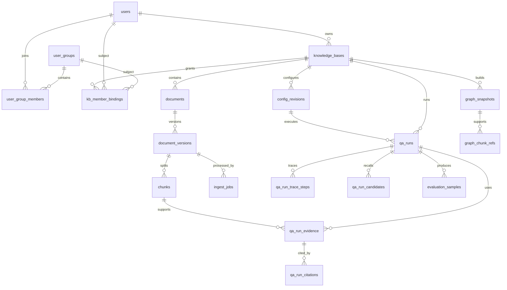

# 数据模型设计

## 1. 文档目的

本文档定义 RAG 调试平台的数据模型、跨存储关系、关键字段、状态字段、索引约束和数据生命周期策略。

本文档为 DDL 草案级设计，面向后续接口设计、后端开发、数据库迁移脚本编写和测试验收使用。本文档不包含可直接执行的 SQL 或 Alembic 迁移脚本。

## 2. 建模原则

### 2.1 命名与主键

- PostgreSQL 表名和字段名统一使用 `snake_case`。
- 主键默认使用 UUID，字段名使用 `{entity}_id`。
- 业务 API 可继续使用 `...Id` 风格，由 DTO 或 Adapter 负责映射。
- 外键字段必须显式命名，不依赖隐式业务编码关联。

### 2.2 PostgreSQL 真值原则

PostgreSQL 是业务主数据真值中心，保存：

- 系统字典、用户、用户组、权限和 ACL。
- 知识库、文档、文档版本、Chunk 正文。
- 配置模板、配置 Revision 和 Pipeline 定义。
- QA Run、Trace、候选、Evidence、Citation、反馈和评估样本。
- Ingest、索引同步、图构建等作业元数据。
- 审计日志和跨存储副本状态。

Chunk 正文必须保存在 PostgreSQL，不得只保存在 MinIO、Milvus、OpenSearch 或 Neo4j。

### 2.3 跨存储职责

| 存储 | 定位 | 保存内容 | 与 PostgreSQL 的关系 |
| --- | --- | --- | --- |
| PostgreSQL | 业务真值 | 主数据、权限、Chunk 正文、配置、QA 运行记录、审计 | 所有业务状态以 PostgreSQL 为准 |
| MinIO | 对象存储 | 原始文件、解析中间产物、大体积附件 | PostgreSQL `stored_files` 保存 bucket、object key、checksum、大小和归属 |
| Milvus | Dense 检索副本 | 向量、`chunk_id`、过滤字段 | 通过 `chunk_id` 回表 PostgreSQL 获取正文和最终授权结果 |
| OpenSearch | 文本检索副本 | Chunk 文本、关键词索引、过滤字段、回表键 | 通过 `chunk_id` 回表 PostgreSQL，不能作为正文真值 |
| Neo4j | 图结构主存 | Entity、Relation、Community、ChunkRef | 图增强结果必须通过 `chunk_id` 回落到 PostgreSQL Chunk |

### 2.4 审计字段

业务主表默认包含以下字段：

| 字段 | 类型 | 说明 |
| --- | --- | --- |
| `created_at` | timestamptz | 创建时间 |
| `created_by` | uuid | 创建人，引用 `users.user_id`，系统任务可为空 |
| `updated_at` | timestamptz | 最后修改时间 |
| `updated_by` | uuid | 最后修改人，引用 `users.user_id`，系统任务可为空 |

支持逻辑删除的表增加：

| 字段 | 类型 | 说明 |
| --- | --- | --- |
| `deleted_at` | timestamptz | 删除时间，为空表示未删除 |
| `deleted_by` | uuid | 删除人，引用 `users.user_id` |

历史事实表以追加为主，例如 `qa_runs`、`qa_run_trace_steps`、`ingest_jobs`、`audit_logs`，通常不做逻辑删除，只按保留策略归档。

### 2.5 字典与枚举

- 系统级稳定状态适合 CHECK 约束或数据库枚举，例如作业状态、QA Run 状态。
- 运营可配置或前端展示型枚举适合系统字典，例如密级显示、角色显示名、反馈标签、文档来源类型。
- 字段设计中会同时说明 CHECK 候选值和是否建议进入系统字典。

## 3. 实体关系

关键关系原则：

- `KnowledgeBase` 是业务工作空间，关联文档、配置、QA Run、成员和图快照。
- `Document` 与 `DocumentVersion` 分离，同一文档任一时刻只允许一个 active version。
- `Chunk` 归属于 `DocumentVersion`，是检索、Evidence 和 Citation 的最终回溯单位。
- `ConfigRevision` 与 `QARun` 为一对多关系，QA Run 必须记录执行时使用的 Revision。
- Milvus、OpenSearch 和 Neo4j 的召回结果不得直接进入最终输出，必须回表 PostgreSQL 并完成权限裁剪。

## 4. PostgreSQL 表设计草案

### 4.1 系统治理

#### 4.1.1 `system_dict_types`

用于定义系统字典类型。

| 字段名 | 类型 | 必填 | 说明 |
| --- | --- | --- | --- |
| `dict_type_id` | uuid | 是 | 主键 |
| `code` | varchar(64) | 是 | 字典类型编码，唯一 |
| `name` | varchar(128) | 是 | 字典类型名称 |
| `description` | text | 否 | 说明 |
| `status` | varchar(16) | 是 | `active` / `disabled` |
| `created_at` / `created_by` | timestamptz / uuid | 是/否 | 创建审计 |
| `updated_at` / `updated_by` | timestamptz / uuid | 是/否 | 修改审计 |
| `deleted_at` / `deleted_by` | timestamptz / uuid | 否 | 逻辑删除 |

约束与索引：

- 唯一约束：`uk_system_dict_types_code_active`，建议对未删除数据按 `code` 唯一。
- `status` 建议使用 CHECK，字典类型本身不再进入字典。

#### 4.1.2 `system_dict_items`

用于定义密级、角色显示名、反馈标签、文档来源类型等字典项。

| 字段名 | 类型 | 必填 | 说明 |
| --- | --- | --- | --- |
| `dict_item_id` | uuid | 是 | 主键 |
| `dict_type_id` | uuid | 是 | 引用 `system_dict_types.dict_type_id` |
| `code` | varchar(64) | 是 | 字典项编码 |
| `name` | varchar(128) | 是 | 展示名称 |
| `sort_order` | integer | 是 | 排序 |
| `status` | varchar(16) | 是 | `active` / `disabled` |
| `extra` | jsonb | 否 | 扩展属性，例如颜色、说明、前端提示 |
| `created_at` / `created_by` | timestamptz / uuid | 是/否 | 创建审计 |
| `updated_at` / `updated_by` | timestamptz / uuid | 是/否 | 修改审计 |
| `deleted_at` / `deleted_by` | timestamptz / uuid | 否 | 逻辑删除 |

约束与索引：

- 唯一约束：同一 `dict_type_id` 下未删除 `code` 唯一。
- 索引：`idx_system_dict_items_type_status_sort`。

#### 4.1.3 `audit_logs`

用于记录关键业务操作，不用于替代业务表字段。

| 字段名 | 类型 | 必填 | 说明 |
| --- | --- | --- | --- |
| `audit_log_id` | uuid | 是 | 主键 |
| `actor_id` | uuid | 否 | 操作者，系统任务可为空 |
| `action` | varchar(64) | 是 | 操作类型，如 `config.activate`、`document.switch_version` |
| `resource_type` | varchar(64) | 是 | 资源类型 |
| `resource_id` | uuid | 否 | 资源 ID |
| `kb_id` | uuid | 否 | 关联知识库 |
| `before_snapshot` | jsonb | 否 | 操作前摘要 |
| `after_snapshot` | jsonb | 否 | 操作后摘要 |
| `trace_id` | varchar(128) | 否 | 请求链路 ID |
| `ip_address` | varchar(64) | 否 | 操作来源 IP |
| `user_agent` | text | 否 | 客户端信息 |
| `created_at` | timestamptz | 是 | 创建时间 |

约束与索引：

- 索引：`idx_audit_logs_resource`、`idx_audit_logs_actor_time`、`idx_audit_logs_kb_time`。
- 删除策略：只追加，不逻辑删除；按审计保留策略归档。

### 4.2 用户与权限

#### 4.2.1 `users`

| 字段名 | 类型 | 必填 | 说明 |
| --- | --- | --- | --- |
| `user_id` | uuid | 是 | 主键 |
| `username` | varchar(64) | 是 | 登录名，唯一 |
| `display_name` | varchar(128) | 是 | 展示名 |
| `email` | varchar(255) | 否 | 邮箱 |
| `platform_role` | varchar(32) | 是 | `platform_admin` / `platform_user`，建议进入系统字典用于展示 |
| `security_level` | varchar(32) | 是 | 用户密级，建议进入系统字典 |
| `status` | varchar(16) | 是 | `active` / `disabled` |
| `last_login_at` | timestamptz | 否 | 最近登录时间 |
| `created_at` / `created_by` | timestamptz / uuid | 是/否 | 创建审计 |
| `updated_at` / `updated_by` | timestamptz / uuid | 是/否 | 修改审计 |
| `deleted_at` / `deleted_by` | timestamptz / uuid | 否 | 逻辑删除 |

删除策略：用户默认禁用或逻辑删除，不物理删除，以保留历史 QARun、文档和审计引用。

#### 4.2.2 `user_groups`

| 字段名 | 类型 | 必填 | 说明 |
| --- | --- | --- | --- |
| `group_id` | uuid | 是 | 主键 |
| `name` | varchar(128) | 是 | 用户组名称 |
| `description` | text | 否 | 说明 |
| `status` | varchar(16) | 是 | `active` / `disabled` |
| `created_at` / `created_by` | timestamptz / uuid | 是/否 | 创建审计 |
| `updated_at` / `updated_by` | timestamptz / uuid | 是/否 | 修改审计 |
| `deleted_at` / `deleted_by` | timestamptz / uuid | 否 | 逻辑删除 |

#### 4.2.3 `user_group_members`

| 字段名 | 类型 | 必填 | 说明 |
| --- | --- | --- | --- |
| `group_member_id` | uuid | 是 | 主键 |
| `group_id` | uuid | 是 | 引用 `user_groups.group_id` |
| `user_id` | uuid | 是 | 引用 `users.user_id` |
| `status` | varchar(16) | 是 | `active` / `inactive` |
| `joined_at` | timestamptz | 是 | 加入时间 |
| `left_at` | timestamptz | 否 | 移出时间 |
| `created_by` | uuid | 否 | 操作人 |

删除策略：成员关系建议逻辑失效，不直接物理删除，便于追踪授权变化。

#### 4.2.4 `kb_member_bindings`

| 字段名 | 类型 | 必填 | 说明 |
| --- | --- | --- | --- |
| `binding_id` | uuid | 是 | 主键 |
| `kb_id` | uuid | 是 | 引用 `knowledge_bases.kb_id` |
| `subject_type` | varchar(16) | 是 | `user` / `group` |
| `subject_id` | uuid | 是 | 用户或用户组 ID |
| `kb_role` | varchar(32) | 是 | `kb_owner` / `kb_editor` / `kb_operator` / `kb_viewer`，建议进入系统字典 |
| `status` | varchar(16) | 是 | `active` / `inactive` |
| `created_at` / `created_by` | timestamptz / uuid | 是/否 | 创建审计 |
| `updated_at` / `updated_by` | timestamptz / uuid | 是/否 | 修改审计 |

约束：

- 同一 `kb_id + subject_type + subject_id + kb_role` 未失效时唯一。

#### 4.2.5 `acl_rules`

用于文档或 Chunk 级细粒度授权。

| 字段名 | 类型 | 必填 | 说明 |
| --- | --- | --- | --- |
| `acl_rule_id` | uuid | 是 | 主键 |
| `resource_type` | varchar(32) | 是 | `document` / `document_version` / `chunk` |
| `resource_id` | uuid | 是 | 资源 ID |
| `subject_type` | varchar(16) | 是 | `user` / `group` |
| `subject_id` | uuid | 是 | 授权主体 ID |
| `effect` | varchar(16) | 是 | `allow` / `deny`，deny 优先 |
| `permission_code` | varchar(64) | 是 | 如 `kb.document.read`、`kb.chunk.read` |
| `status` | varchar(16) | 是 | `active` / `inactive` |
| `created_at` / `created_by` | timestamptz / uuid | 是/否 | 创建审计 |
| `updated_at` / `updated_by` | timestamptz / uuid | 是/否 | 修改审计 |

索引：

- `idx_acl_rules_resource`
- `idx_acl_rules_subject`
- `idx_acl_rules_permission_status`

#### 4.2.6 `permissions`

用于定义系统内稳定权限码，是角色授权和权限摘要计算的真值来源。

| 字段名 | 类型 | 必填 | 说明 |
| --- | --- | --- | --- |
| `permission_id` | uuid | 是 | 主键 |
| `permission_code` | varchar(64) | 是 | 权限码，如 `kb.qa.run`、`kb.config.manage` |
| `scope` | varchar(16) | 是 | `platform` / `kb` / `document` / `chunk` |
| `name` | varchar(128) | 是 | 权限名称 |
| `description` | text | 否 | 权限说明 |
| `status` | varchar(16) | 是 | `active` / `disabled` |
| `created_at` / `created_by` | timestamptz / uuid | 是/否 | 创建审计 |
| `updated_at` / `updated_by` | timestamptz / uuid | 是/否 | 修改审计 |

约束：

- `permission_code` 全局唯一。
- 权限码属于后端稳定契约，不建议由运营人员随意新增或删除。

#### 4.2.7 `role_permission_bindings`

用于定义平台角色、知识库角色到权限码的默认映射。

| 字段名 | 类型 | 必填 | 说明 |
| --- | --- | --- | --- |
| `role_permission_id` | uuid | 是 | 主键 |
| `role_scope` | varchar(16) | 是 | `platform` / `kb` |
| `role_code` | varchar(32) | 是 | 如 `platform_admin`、`kb_editor` |
| `permission_code` | varchar(64) | 是 | 引用 `permissions.permission_code` |
| `effect` | varchar(16) | 是 | `allow` / `deny`，deny 优先 |
| `status` | varchar(16) | 是 | `active` / `inactive` |
| `created_at` / `created_by` | timestamptz / uuid | 是/否 | 创建审计 |
| `updated_at` / `updated_by` | timestamptz / uuid | 是/否 | 修改审计 |

约束与索引：

- 唯一约束：`role_scope + role_code + permission_code + effect` 未失效时唯一。
- 索引：`idx_role_permission_bindings_role`、`idx_role_permission_bindings_permission`。

#### 4.2.8 `chunk_access_filters`

用于生成检索副本可使用的访问过滤摘要，避免 Dense、Sparse、Graph 在召回阶段完全绕过权限。该表不替代最终授权判断，最终输出仍必须回表 PostgreSQL 做权限裁剪。

| 字段名 | 类型 | 必填 | 说明 |
| --- | --- | --- | --- |
| `access_filter_id` | uuid | 是 | 主键 |
| `chunk_id` | uuid | 是 | 引用 `chunks.chunk_id` |
| `kb_id` | uuid | 是 | 知识库 ID |
| `permission_code` | varchar(64) | 是 | 通常为 `kb.chunk.read` |
| `allow_subject_keys` | jsonb | 是 | 允许访问主体摘要，如 `user:{id}`、`group:{id}`、`role:{code}` |
| `deny_subject_keys` | jsonb | 是 | 拒绝访问主体摘要，deny 优先 |
| `security_level` | varchar(32) | 是 | Chunk 密级 |
| `document_status` | varchar(16) | 是 | 文档状态快照 |
| `version_status` | varchar(16) | 是 | 版本状态快照 |
| `chunk_status` | varchar(16) | 是 | Chunk 状态快照 |
| `filter_hash` | varchar(128) | 否 | 过滤摘要 hash，用于判断副本是否需要同步 |
| `updated_at` | timestamptz | 是 | 更新时间 |

同步规则：

- 来源为 `kb_member_bindings`、`role_permission_bindings`、`acl_rules`、用户组成员、密级和 Chunk 状态。
- 文档 ACL、用户组、角色绑定或密级变化时，必须重新生成受影响 Chunk 的访问过滤摘要，并创建 `index_sync_jobs` 同步检索副本。
- 检索副本可使用 `allow_subject_keys`、`deny_subject_keys`、`security_level` 和状态字段进行召回前过滤；若目标检索组件不支持复杂主体过滤，应先在 PostgreSQL 计算候选 Chunk 范围，再传入检索 Provider。
- 该表只用于减少越权召回范围，不作为最终权限真值。

### 4.3 知识库

#### 4.3.1 `knowledge_bases`

| 字段名 | 类型 | 必填 | 说明 |
| --- | --- | --- | --- |
| `kb_id` | uuid | 是 | 主键 |
| `name` | varchar(128) | 是 | 知识库名称 |
| `description` | text | 否 | 描述 |
| `owner_id` | uuid | 是 | 负责人，引用 `users.user_id` |
| `default_security_level` | varchar(32) | 是 | 默认密级，建议进入系统字典 |
| `sparse_index_enabled` | boolean | 是 | 是否为该知识库维护 OpenSearch 文本索引副本 |
| `graph_index_enabled` | boolean | 是 | 是否为该知识库维护 Neo4j 图索引副本 |
| `sparse_required_for_activation` | boolean | 是 | Sparse 副本是否阻塞文档版本激活 |
| `graph_required_for_activation` | boolean | 是 | 图副本是否阻塞文档版本激活，默认建议为 false |
| `status` | varchar(16) | 是 | `draft` / `active` / `disabled` / `archived` |
| `active_config_revision_id` | uuid | 否 | 当前激活配置 Revision |
| `metadata` | jsonb | 否 | 扩展属性 |
| `created_at` / `created_by` | timestamptz / uuid | 是/否 | 创建审计 |
| `updated_at` / `updated_by` | timestamptz / uuid | 是/否 | 修改审计 |
| `deleted_at` / `deleted_by` | timestamptz / uuid | 否 | 逻辑删除 |

约束：

- 未删除知识库名称建议唯一或在业务层保证可检索不混淆。
- `active_config_revision_id` 必须指向同一知识库下状态为 `active` 的 Revision。
- `sparse_index_enabled` 和 `graph_index_enabled` 是文档处理阶段的索引能力开关，不等同于某次 QA Run 是否使用 Sparse 或 Graph Retrieval。
- `*_required_for_activation` 决定对应副本是否阻塞 active version 切换；图构建耗时较长，默认建议不阻塞 Dense / Sparse 基础 QA。

### 4.4 文件、文档与 Chunk

#### 4.4.1 `stored_files`

记录 MinIO 中的对象引用。

| 字段名 | 类型 | 必填 | 说明 |
| --- | --- | --- | --- |
| `file_id` | uuid | 是 | 主键 |
| `bucket` | varchar(128) | 是 | MinIO bucket |
| `object_key` | varchar(512) | 是 | MinIO object key |
| `file_name` | varchar(255) | 是 | 原始文件名 |
| `mime_type` | varchar(128) | 否 | MIME 类型 |
| `file_size` | bigint | 是 | 文件大小 |
| `checksum` | varchar(128) | 否 | 内容校验值 |
| `file_role` | varchar(32) | 是 | `source` / `parsed_artifact` / `attachment`，建议进入系统字典 |
| `status` | varchar(16) | 是 | `active` / `deleted` |
| `created_at` / `created_by` | timestamptz / uuid | 是/否 | 创建审计 |
| `deleted_at` / `deleted_by` | timestamptz / uuid | 否 | 逻辑删除 |

说明：

- MinIO 对象删除不得先于 PostgreSQL 状态变更。
- 对象实际清理由异步任务执行，并保留审计记录。

#### 4.4.2 `documents`

| 字段名 | 类型 | 必填 | 说明 |
| --- | --- | --- | --- |
| `document_id` | uuid | 是 | 主键 |
| `kb_id` | uuid | 是 | 引用 `knowledge_bases.kb_id` |
| `name` | varchar(255) | 是 | 文档名称 |
| `source_type` | varchar(32) | 是 | 文档来源类型，建议进入系统字典 |
| `security_level` | varchar(32) | 是 | 文档密级，建议进入系统字典 |
| `status` | varchar(16) | 是 | `active` / `disabled` / `archived` |
| `active_version_id` | uuid | 否 | 当前激活版本 |
| `metadata` | jsonb | 否 | 扩展属性 |
| `created_at` / `created_by` | timestamptz / uuid | 是/否 | 创建审计 |
| `updated_at` / `updated_by` | timestamptz / uuid | 是/否 | 修改审计 |
| `deleted_at` / `deleted_by` | timestamptz / uuid | 否 | 逻辑删除 |

约束：

- `active_version_id` 必须属于同一 `document_id`。
- 文档逻辑删除后，检索副本通过异步任务标记失效或清理。

#### 4.4.3 `document_versions`

| 字段名 | 类型 | 必填 | 说明 |
| --- | --- | --- | --- |
| `version_id` | uuid | 是 | 主键 |
| `document_id` | uuid | 是 | 引用 `documents.document_id` |
| `version_no` | integer | 是 | 文档内递增版本号 |
| `source_file_id` | uuid | 是 | 引用 `stored_files.file_id` |
| `status` | varchar(16) | 是 | `processing` / `active` / `inactive` / `failed` |
| `parse_status` | varchar(16) | 是 | `pending` / `running` / `success` / `failed` |
| `dense_index_status` | varchar(16) | 是 | `not_required` / `pending` / `running` / `success` / `failed` |
| `sparse_index_status` | varchar(16) | 是 | `not_required` / `pending` / `running` / `success` / `failed` |
| `graph_index_status` | varchar(16) | 是 | `not_required` / `pending` / `running` / `success` / `failed` |
| `retrieval_ready` | boolean | 是 | 是否满足知识库索引能力配置要求的 QA 检索门槛 |
| `chunk_count` | integer | 是 | Chunk 数量 |
| `token_count` | integer | 否 | 总 token 数 |
| `error_code` | varchar(64) | 否 | 失败错误码 |
| `error_message` | text | 否 | 失败原因 |
| `metadata` | jsonb | 否 | 解析参数、页数等 |
| `created_at` / `created_by` | timestamptz / uuid | 是/否 | 创建审计 |
| `updated_at` / `updated_by` | timestamptz / uuid | 是/否 | 修改审计 |

约束：

- 唯一约束：`document_id + version_no`。
- 同一 `document_id` 只允许一个 `status = active` 的版本，建议用部分唯一索引实现。
- `failed` 版本不得设为 active。
- 设置为 active 前，`parse_status` 必须为 `success`，且知识库中标记为 `required_for_activation` 的检索副本状态必须为 `success` 或 `not_required`。
- `retrieval_ready = true` 表示该版本已满足知识库中会阻塞激活的索引能力要求；例如知识库未启用 Sparse 索引能力时，`sparse_index_status = not_required` 不阻塞激活。
- Config Revision 或 QARun 的 Dense / Sparse / Graph 开关只影响运行时是否调用对应 Provider，不决定 `sparse_index_status` 或 `graph_index_status` 是否需要维护。

#### 4.4.4 `chunks`

Chunk 正文真值表。

| 字段名 | 类型 | 必填 | 说明 |
| --- | --- | --- | --- |
| `chunk_id` | uuid | 是 | 主键 |
| `version_id` | uuid | 是 | 引用 `document_versions.version_id` |
| `document_id` | uuid | 是 | 冗余回表字段，便于过滤 |
| `kb_id` | uuid | 是 | 冗余回表字段，便于过滤 |
| `chunk_index` | integer | 是 | 版本内序号 |
| `page_no` | integer | 否 | 页码 |
| `section` | varchar(255) | 否 | 章节 |
| `content` | text | 是 | Chunk 正文真值 |
| `content_hash` | varchar(128) | 否 | 正文 hash |
| `token_count` | integer | 否 | token 数 |
| `security_level` | varchar(32) | 是 | Chunk 密级，默认继承文档 |
| `status` | varchar(16) | 是 | `active` / `inactive` / `deleted` |
| `metadata` | jsonb | 否 | 页坐标、标题路径、解析器信息等 |
| `created_at` | timestamptz | 是 | 创建时间 |

约束与索引：

- 唯一约束：`version_id + chunk_index`。
- 索引：`idx_chunks_kb_version_status`、`idx_chunks_document_version`、`idx_chunks_security_level`。
- `metadata` 可按需要增加 GIN 索引。

删除策略：

- Chunk 历史版本不物理删除，随版本状态参与过滤。
- 若文档逻辑删除，Chunk 状态可异步标记为 `deleted`，历史 QA 引用仍可按权限和保留策略读取。

### 4.5 Ingest 与索引同步

#### 4.5.1 `ingest_jobs`

| 字段名 | 类型 | 必填 | 说明 |
| --- | --- | --- | --- |
| `job_id` | uuid | 是 | 主键 |
| `kb_id` | uuid | 是 | 知识库 ID |
| `document_id` | uuid | 否 | 文档 ID |
| `version_id` | uuid | 否 | 文档版本 ID |
| `job_type` | varchar(32) | 是 | `upload_parse` / `reparse` / `rebuild_index` / `build_graph` |
| `status` | varchar(16) | 是 | `queued` / `running` / `success` / `failed` / `cancelled` |
| `stage` | varchar(64) | 否 | 当前阶段 |
| `progress` | integer | 是 | 0-100 |
| `retry_of_job_id` | uuid | 否 | 被重试的旧作业 |
| `error_code` | varchar(64) | 否 | 错误码 |
| `error_message` | text | 否 | 错误信息 |
| `result_summary` | jsonb | 否 | 结果摘要 |
| `started_at` | timestamptz | 否 | 开始时间 |
| `finished_at` | timestamptz | 否 | 结束时间 |
| `created_at` / `created_by` | timestamptz / uuid | 是/否 | 创建审计 |

规则：

- 重试必须创建新 job，不能覆盖历史失败记录。
- 作业表只追加和状态更新，不逻辑删除。

#### 4.5.2 `index_sync_jobs`

记录向 Milvus、OpenSearch、Neo4j 同步或重建副本的批次任务。

| 字段名 | 类型 | 必填 | 说明 |
| --- | --- | --- | --- |
| `sync_job_id` | uuid | 是 | 主键 |
| `kb_id` | uuid | 是 | 知识库 ID |
| `target_store` | varchar(32) | 是 | `milvus` / `opensearch` / `neo4j` |
| `sync_type` | varchar(32) | 是 | `upsert` / `delete` / `rebuild` |
| `scope` | jsonb | 是 | 同步范围，如 versionIds、chunkIds |
| `required_for_activation` | boolean | 是 | 是否阻塞文档版本激活 |
| `status` | varchar(16) | 是 | `queued` / `running` / `success` / `failed` / `cancelled` |
| `error_message` | text | 否 | 错误信息 |
| `created_at` / `created_by` | timestamptz / uuid | 是/否 | 创建审计 |
| `started_at` / `finished_at` | timestamptz / timestamptz | 否 | 执行时间 |

#### 4.5.3 `index_sync_records`

记录单个 Chunk 或图对象的副本同步状态。

| 字段名 | 类型 | 必填 | 说明 |
| --- | --- | --- | --- |
| `sync_record_id` | uuid | 是 | 主键 |
| `sync_job_id` | uuid | 是 | 引用 `index_sync_jobs.sync_job_id` |
| `target_store` | varchar(32) | 是 | `milvus` / `opensearch` / `neo4j` |
| `resource_type` | varchar(32) | 是 | `chunk` / `graph_snapshot` |
| `resource_id` | uuid | 是 | 资源 ID |
| `operation` | varchar(16) | 是 | `upsert` / `delete` |
| `status` | varchar(16) | 是 | `success` / `failed` / `skipped` |
| `provider_payload` | jsonb | 否 | 外部存储返回摘要 |
| `error_message` | text | 否 | 错误信息 |
| `created_at` | timestamptz | 是 | 创建时间 |

### 4.6 配置

#### 4.6.1 `config_templates`

| 字段名 | 类型 | 必填 | 说明 |
| --- | --- | --- | --- |
| `template_id` | uuid | 是 | 主键 |
| `name` | varchar(128) | 是 | 模板名称 |
| `description` | text | 否 | 说明 |
| `pipeline_definition` | jsonb | 是 | 受约束 Pipeline 定义 |
| `default_params` | jsonb | 否 | 默认参数 |
| `status` | varchar(16) | 是 | `active` / `disabled` / `archived` |
| `created_at` / `created_by` | timestamptz / uuid | 是/否 | 创建审计 |
| `updated_at` / `updated_by` | timestamptz / uuid | 是/否 | 修改审计 |
| `deleted_at` / `deleted_by` | timestamptz / uuid | 否 | 逻辑删除 |

#### 4.6.2 `config_revisions`

| 字段名 | 类型 | 必填 | 说明 |
| --- | --- | --- | --- |
| `config_revision_id` | uuid | 是 | 主键 |
| `kb_id` | uuid | 是 | 引用 `knowledge_bases.kb_id` |
| `revision_no` | integer | 是 | 知识库内递增版本号 |
| `source_template_id` | uuid | 否 | 来源模板 |
| `status` | varchar(16) | 是 | `draft` / `saved` / `active` / `archived` / `invalid` |
| `pipeline_definition` | jsonb | 是 | 后端执行契约 |
| `validation_snapshot` | jsonb | 否 | 保存时校验摘要 |
| `activated_at` | timestamptz | 否 | 激活时间 |
| `activated_by` | uuid | 否 | 激活人 |
| `deactivated_at` | timestamptz | 否 | 被新 active Revision 替换的时间 |
| `deactivated_by` | uuid | 否 | 替换操作人 |
| `created_at` / `created_by` | timestamptz / uuid | 是/否 | 创建审计 |
| `updated_at` / `updated_by` | timestamptz / uuid | 是/否 | 修改审计 |
| `deleted_at` / `deleted_by` | timestamptz / uuid | 否 | 逻辑删除 |

约束：

- 唯一约束：`kb_id + revision_no`。
- 同一 `kb_id` 只允许一个 `status = active` 的 Revision，建议用部分唯一索引实现。
- `invalid` 不允许激活。
- 激活 Revision 必须在同一数据库事务中完成：将旧 active Revision 转为 `archived`，设置新 Revision 为 `active`，同步更新 `knowledge_bases.active_config_revision_id`，并写入审计日志。
- 如果事务中任一步失败，必须整体回滚，禁止出现 `knowledge_bases.active_config_revision_id` 与 `config_revisions.status` 不一致。

### 4.7 QA 调试与历史

#### 4.7.1 `qa_runs`

| 字段名 | 类型 | 必填 | 说明 |
| --- | --- | --- | --- |
| `run_id` | uuid | 是 | 主键 |
| `kb_id` | uuid | 是 | 知识库 ID |
| `config_revision_id` | uuid | 是 | 执行时锁定的配置 Revision |
| `source_run_id` | uuid | 否 | 回放来源 Run |
| `query` | text | 是 | 原始问题 |
| `rewritten_query` | text | 否 | 改写后问题 |
| `status` | varchar(16) | 是 | `draft` / `queued` / `running` / `success` / `partial` / `failed` / `cancelled` |
| `answer` | text | 否 | 最终回答 |
| `has_override` | boolean | 是 | 是否使用临时覆盖参数 |
| `override_snapshot` | jsonb | 否 | 临时覆盖参数快照 |
| `metrics` | jsonb | 否 | tokens、耗时、候选数等 |
| `feedback_status` | varchar(32) | 是 | `unrated` / `correct` / `partially_correct` / `wrong` / `citation_error` / `no_evidence`，建议进入系统字典 |
| `feedback_note` | text | 否 | 人工反馈说明 |
| `started_at` | timestamptz | 否 | 开始时间 |
| `finished_at` | timestamptz | 否 | 结束时间 |
| `created_at` / `created_by` | timestamptz / uuid | 是/否 | 创建审计 |
| `updated_at` / `updated_by` | timestamptz / uuid | 是/否 | 修改审计 |

删除策略：历史事实表，不逻辑删除；按保留策略归档。

#### 4.7.2 `qa_run_trace_steps`

| 字段名 | 类型 | 必填 | 说明 |
| --- | --- | --- | --- |
| `trace_step_id` | uuid | 是 | 主键 |
| `run_id` | uuid | 是 | 引用 `qa_runs.run_id` |
| `step_order` | integer | 是 | 步骤顺序 |
| `step_key` | varchar(64) | 是 | 如 `denseRetrieval`、`permissionFilter` |
| `status` | varchar(16) | 是 | `success` / `skipped` / `failed` / `partial` |
| `input_summary` | jsonb | 否 | 输入摘要，不保存未授权正文 |
| `output_summary` | jsonb | 否 | 输出摘要 |
| `metrics` | jsonb | 否 | 步骤指标 |
| `error_code` | varchar(64) | 否 | 错误码 |
| `error_message` | text | 否 | 错误信息 |
| `started_at` / `ended_at` | timestamptz / timestamptz | 否 | 执行时间 |
| `created_at` | timestamptz | 是 | 创建时间 |

#### 4.7.3 `qa_run_candidates`

记录 Dense、OpenSearch、Graph 等召回候选和裁剪原因。

| 字段名 | 类型 | 必填 | 说明 |
| --- | --- | --- | --- |
| `candidate_id` | uuid | 是 | 主键 |
| `run_id` | uuid | 是 | QA Run |
| `chunk_id` | uuid | 否 | 回表 Chunk，图候选可能先为空但最终使用前必须回落 |
| `source_type` | varchar(32) | 是 | `dense` / `sparse` / `graph` |
| `raw_score` | numeric(10,6) | 否 | 原始分数 |
| `rerank_score` | numeric(10,6) | 否 | 精排分数 |
| `rank_no` | integer | 否 | 排名 |
| `is_authorized` | boolean | 是 | 是否通过权限裁剪 |
| `drop_reason` | varchar(64) | 否 | 淘汰或裁剪原因 |
| `metadata` | jsonb | 否 | Provider 返回摘要 |
| `created_at` | timestamptz | 是 | 创建时间 |

#### 4.7.4 `qa_run_evidence`

| 字段名 | 类型 | 必填 | 说明 |
| --- | --- | --- | --- |
| `evidence_id` | uuid | 是 | 主键 |
| `run_id` | uuid | 是 | QA Run |
| `chunk_id` | uuid | 是 | 引用授权后的 `chunks.chunk_id` |
| `candidate_id` | uuid | 否 | 来源候选 |
| `evidence_order` | integer | 是 | 展示顺序 |
| `content_snapshot` | text | 否 | 运行时授权证据快照；按安全策略可为空或脱敏 |
| `content_snapshot_hash` | varchar(128) | 否 | 证据快照 hash，用于完整性校验 |
| `snapshot_policy` | varchar(32) | 是 | `full_encrypted` / `redacted` / `hash_only` |
| `redaction_status` | varchar(16) | 是 | `none` / `redacted` |
| `source_snapshot` | jsonb | 是 | 文档名、版本、页码等快照 |
| `created_at` | timestamptz | 是 | 创建时间 |

约束：

- Evidence 只能引用授权后的 PG Chunk。
- `content_snapshot` 用于历史回放，不替代 `chunks.content` 真值。
- 保存全文快照时必须采用加密存储，并在读取历史详情时再次校验当前用户对 `chunk_id` 的读取权限。
- 若部署环境要求权限收紧后不可继续展示历史正文，应使用 `redacted` 或 `hash_only` 策略，只保留来源、hash 和摘要。
- 用户权限、文档 ACL 或密级变化后，不修改历史事实记录，但历史详情接口必须按当前权限决定是否返回完整快照。

#### 4.7.5 `qa_run_citations`

| 字段名 | 类型 | 必填 | 说明 |
| --- | --- | --- | --- |
| `citation_id` | uuid | 是 | 主键 |
| `run_id` | uuid | 是 | QA Run |
| `evidence_id` | uuid | 是 | 引用 `qa_run_evidence.evidence_id` |
| `citation_order` | integer | 是 | 展示顺序 |
| `label` | varchar(64) | 否 | 引用标签 |
| `location_snapshot` | jsonb | 是 | 页码、章节、片段位置 |
| `created_at` | timestamptz | 是 | 创建时间 |

### 4.8 图检索元数据

#### 4.8.1 `graph_snapshots`

PostgreSQL 中的图快照元数据，不保存完整图结构。

| 字段名 | 类型 | 必填 | 说明 |
| --- | --- | --- | --- |
| `graph_snapshot_id` | uuid | 是 | 主键 |
| `kb_id` | uuid | 是 | 知识库 |
| `source_scope` | jsonb | 是 | 来源版本范围 |
| `status` | varchar(16) | 是 | `queued` / `running` / `success` / `failed` / `stale` |
| `neo4j_graph_key` | varchar(128) | 否 | Neo4j 图空间或标签前缀 |
| `stale_reason` | varchar(64) | 否 | 过期原因，如 `version_changed`、`acl_changed`、`chunk_deleted` |
| `stale_at` | timestamptz | 否 | 标记过期时间 |
| `entity_count` | integer | 否 | 实体数 |
| `relation_count` | integer | 否 | 关系数 |
| `community_count` | integer | 否 | 社区数 |
| `job_id` | uuid | 否 | 关联构建作业 |
| `error_message` | text | 否 | 失败原因 |
| `created_at` / `created_by` | timestamptz / uuid | 是/否 | 创建审计 |
| `updated_at` / `updated_by` | timestamptz / uuid | 是/否 | 修改审计 |

#### 4.8.2 `graph_chunk_refs`

记录图结构与 PG Chunk 的回溯关系摘要。

| 字段名 | 类型 | 必填 | 说明 |
| --- | --- | --- | --- |
| `graph_chunk_ref_id` | uuid | 是 | 主键 |
| `graph_snapshot_id` | uuid | 是 | 图快照 |
| `chunk_id` | uuid | 是 | 支撑 Chunk |
| `neo4j_node_key` | varchar(128) | 否 | Neo4j 节点或关系键 |
| `ref_type` | varchar(32) | 是 | `entity_support` / `relation_support` / `community_support` |
| `metadata` | jsonb | 否 | 摘要 |
| `created_at` | timestamptz | 是 | 创建时间 |

说明：

- Neo4j 是图结构主存，PostgreSQL 仅保存快照和回溯摘要。
- 图检索结果必须通过 `chunk_id` 做最终权限裁剪。
- 文档 active version 切换、重解析成功、Chunk 删除、ACL / 密级变化或图构建配置变化时，受影响 `GraphSnapshot` 必须标记为 `stale`。
- QA 运行默认只使用最新 `success` 且未 `stale` 的图快照；如业务允许使用 stale 快照，必须在 QARun Trace 中标记为部分降级。

### 4.9 评估样本

#### 4.9.1 `evaluation_samples`

| 字段名 | 类型 | 必填 | 说明 |
| --- | --- | --- | --- |
| `sample_id` | uuid | 是 | 主键 |
| `kb_id` | uuid | 是 | 知识库 |
| `source_run_id` | uuid | 否 | 来源 QA Run |
| `query` | text | 是 | 样本问题 |
| `expected_answer` | text | 否 | 期望答案 |
| `expected_evidence` | jsonb | 否 | 关键证据，包含 chunk_id 列表和说明 |
| `status` | varchar(16) | 是 | `active` / `archived` |
| `metadata` | jsonb | 否 | 标签、难度、场景 |
| `created_at` / `created_by` | timestamptz / uuid | 是/否 | 创建审计 |
| `updated_at` / `updated_by` | timestamptz / uuid | 是/否 | 修改审计 |
| `deleted_at` / `deleted_by` | timestamptz / uuid | 否 | 逻辑删除 |

## 5. Milvus Collection 草案

Milvus 只作为 Dense 检索副本，不保存 Chunk 正文真值。

建议 Collection：`rag_chunk_embeddings`

| 字段 | 类型 | 说明 |
| --- | --- | --- |
| `chunk_id` | varchar / uuid string | 回表 PostgreSQL 的主键 |
| `kb_id` | varchar / uuid string | 知识库过滤 |
| `document_id` | varchar / uuid string | 文档过滤 |
| `version_id` | varchar / uuid string | 文档版本过滤 |
| `security_level` | varchar | 密级过滤 |
| `document_status` | varchar | 文档状态过滤 |
| `version_status` | varchar | 版本状态过滤 |
| `chunk_status` | varchar | Chunk 状态过滤 |
| `embedding` | float vector | 向量 |
| `updated_at` | int64 / timestamp | 副本更新时间 |

同步规则：

- 来源为 PostgreSQL `chunks` 和文档状态字段。
- 查询时先按 `kb_id`、`version_id`、`security_level`、状态字段过滤，再向量召回。
- 召回后必须使用 `chunk_id` 回表 PostgreSQL，执行最终权限裁剪和正文读取。

## 6. OpenSearch Index 草案

OpenSearch 是可选文本检索副本，仅在知识库或部署启用 Sparse 索引能力时需要，不作为正文真值来源。单次 QA Run 是否启用 Sparse 或 Hybrid 检索，不决定文档处理阶段是否写入 OpenSearch。

建议 Index：`rag_chunks`

| 字段 | 类型 | 说明 |
| --- | --- | --- |
| `chunk_id` | keyword | 回表 PostgreSQL 的主键 |
| `kb_id` | keyword | 知识库过滤 |
| `document_id` | keyword | 文档过滤 |
| `version_id` | keyword | 版本过滤 |
| `content` | text | Chunk 文本检索副本 |
| `title` | text / keyword | 文档标题 |
| `section` | text / keyword | 章节 |
| `page_no` | integer | 页码 |
| `security_level` | keyword | 密级过滤 |
| `document_status` | keyword | 文档状态 |
| `version_status` | keyword | 版本状态 |
| `chunk_status` | keyword | Chunk 状态 |
| `metadata` | object | 扩展过滤字段 |
| `updated_at` | date | 副本更新时间 |

同步规则：

- 来源为 PostgreSQL `chunks`、`documents`、`document_versions`。
- 删除、停用和版本切换以 PostgreSQL 状态为准，通过 `index_sync_jobs` 同步。
- 搜索结果必须通过 `chunk_id` 回表 PostgreSQL 做权限裁剪、正文确认和 Citation 构建。

## 7. Neo4j 图模型草案

Neo4j 保存图结构主数据，但不能直接提供最终 Citation。

建议节点：

| 节点 | 关键属性 | 说明 |
| --- | --- | --- |
| `Entity` | `entity_key`、`name`、`type`、`aliases`、`kb_id`、`graph_snapshot_id` | 图实体 |
| `Community` | `community_key`、`summary`、`kb_id`、`graph_snapshot_id` | 社区摘要 |
| `Document` | `document_id`、`name`、`kb_id` | 文档引用节点 |
| `ChunkRef` | `chunk_id`、`kb_id`、`version_id`、`summary` | Chunk 回表引用，不保存最终正文 |

建议关系：

| 关系 | 起点 -> 终点 | 说明 |
| --- | --- | --- |
| `RELATED_TO` | `Entity` -> `Entity` | 实体关系 |
| `SUPPORTED_BY` | `Entity` / `RELATED_TO` / `Community` -> `ChunkRef` | 支撑 Chunk |
| `BELONGS_TO` | `ChunkRef` -> `Document` | 文档归属 |
| `HAS_ENTITY` | `Community` -> `Entity` | 社区实体 |

安全规则：

- 图检索输出必须回落到 `ChunkRef.chunk_id`。
- `ChunkRef.summary` 仅用于诊断摘要，不作为最终证据正文。
- 无权限 Chunk 支撑的实体或关系不得进入 answer、Evidence、Citation。

## 8. 状态字段与字典建议

| 字段 | 候选值 | 建议实现 |
| --- | --- | --- |
| `users.status` | `active`、`disabled` | CHECK |
| `knowledge_bases.status` | `draft`、`active`、`disabled`、`archived` | CHECK |
| `documents.status` | `active`、`disabled`、`archived` | CHECK |
| `document_versions.status` | `processing`、`active`、`inactive`、`failed` | CHECK |
| `document_versions.parse_status` | `pending`、`running`、`success`、`failed` | CHECK |
| `document_versions.*_index_status` | `not_required`、`pending`、`running`、`success`、`failed` | CHECK |
| `ingest_jobs.status` | `queued`、`running`、`success`、`failed`、`cancelled` | CHECK |
| `index_sync_jobs.status` | `queued`、`running`、`success`、`failed`、`cancelled` | CHECK |
| `config_revisions.status` | `draft`、`saved`、`active`、`archived`、`invalid` | CHECK |
| `qa_runs.status` | `draft`、`queued`、`running`、`success`、`partial`、`failed`、`cancelled` | CHECK |
| `graph_snapshots.status` | `queued`、`running`、`success`、`failed`、`stale` | CHECK |
| `security_level` | 按组织定义 | 系统字典 |
| `platform_role` | `platform_admin`、`platform_user` | CHECK + 系统字典展示 |
| `kb_role` | `kb_owner`、`kb_editor`、`kb_operator`、`kb_viewer` | CHECK + 系统字典展示 |
| `feedback_status` | `unrated`、`correct`、`partially_correct`、`wrong`、`citation_error`、`no_evidence` | 系统字典 |

## 9. 索引与约束汇总

### 9.1 唯一约束

- `users.username` 未删除唯一。
- `system_dict_types.code` 未删除唯一。
- `system_dict_items.dict_type_id + code` 未删除唯一。
- `document_versions.document_id + version_no` 唯一。
- `config_revisions.kb_id + revision_no` 唯一。
- `chunks.version_id + chunk_index` 唯一。

### 9.2 部分唯一索引

- `document_versions(document_id)` where `status = 'active'`，保证同一文档只有一个 active version。
- `config_revisions(kb_id)` where `status = 'active'`，保证同一知识库只有一个 active revision。

### 9.3 查询索引

- `knowledge_bases(owner_id, status)`
- `documents(kb_id, status, updated_at)`
- `document_versions(document_id, status, created_at)`
- `chunks(kb_id, version_id, status, chunk_index)`
- `ingest_jobs(kb_id, status, created_at)`
- `index_sync_jobs(kb_id, target_store, status, created_at)`
- `qa_runs(kb_id, status, created_at)`
- `qa_runs(created_by, created_at)`
- `qa_run_candidates(run_id, source_type, rank_no)`
- `qa_run_evidence(run_id, evidence_order)`
- `acl_rules(resource_type, resource_id, status)`
- `acl_rules(subject_type, subject_id, permission_code, status)`
- `audit_logs(resource_type, resource_id, created_at)`

### 9.4 JSONB 索引

以下字段可按查询需求增加 GIN 索引：

- `chunks.metadata`
- `config_revisions.pipeline_definition`
- `qa_runs.metrics`
- `qa_run_trace_steps.metrics`
- `index_sync_jobs.scope`

## 10. 删除与保留策略

### 10.1 默认策略

- 默认优先逻辑删除，避免破坏历史引用和审计链路。
- 只有临时、无审计价值、无历史引用的数据才允许物理删除。
- 外部副本删除不能作为业务删除真值，必须由 PostgreSQL 状态驱动。

### 10.2 按表分类

| 类型 | 表 | 删除策略 |
| --- | --- | --- |
| 系统配置 | `system_dict_types`、`system_dict_items` | 逻辑删除 |
| 主业务对象 | `users`、`user_groups`、`knowledge_bases`、`documents`、`config_templates`、`config_revisions` | 逻辑删除或归档 |
| 关系授权 | `user_group_members`、`kb_member_bindings`、`acl_rules` | 建议逻辑失效，记录审计 |
| 文档版本与 Chunk | `document_versions`、`chunks` | 不物理删除，按状态和保留策略归档 |
| 历史事实 | `qa_runs`、`qa_run_trace_steps`、`qa_run_candidates`、`qa_run_evidence`、`qa_run_citations`、`ingest_jobs`、`audit_logs` | 只追加或归档，不逻辑删除 |
| 外部副本 | MinIO、Milvus、OpenSearch、Neo4j | 由 PG 状态驱动异步清理或重建 |

### 10.3 跨存储重建

- Milvus 可由 PostgreSQL `chunks` 重新计算 embedding 后重建。
- OpenSearch 可由 PostgreSQL `chunks`、`documents`、`document_versions` 重建。
- Neo4j 可由 PostgreSQL Chunk 真值和 MinIO 解析产物重新抽取构建。
- MinIO 原始文件丢失会影响重新解析，因此 `stored_files.checksum` 和对象备份策略必须纳入运维方案。

## 11. 验证关注点

- 业务实体覆盖：User、Group、KB、Document、Version、Chunk、Ingest、ConfigRevision、QARun、Evidence、Citation、Trace、GraphSnapshot、EvaluationSample 均有模型承接。
- 系统治理覆盖：字典、审计字段、创建修改人、逻辑删除策略均有统一说明。
- 跨存储关系：MinIO、Milvus、OpenSearch、Neo4j 均能回溯 PostgreSQL 真值。
- 权限安全：检索副本包含过滤字段，最终输出仍回表 PostgreSQL 做权限裁剪。
- 可恢复性：Milvus、OpenSearch、Neo4j 可由 PostgreSQL Chunk 真值和 MinIO 产物重建。
