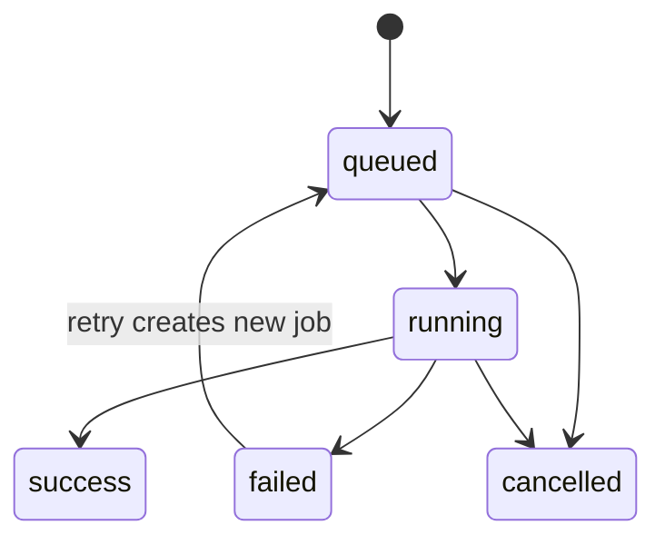
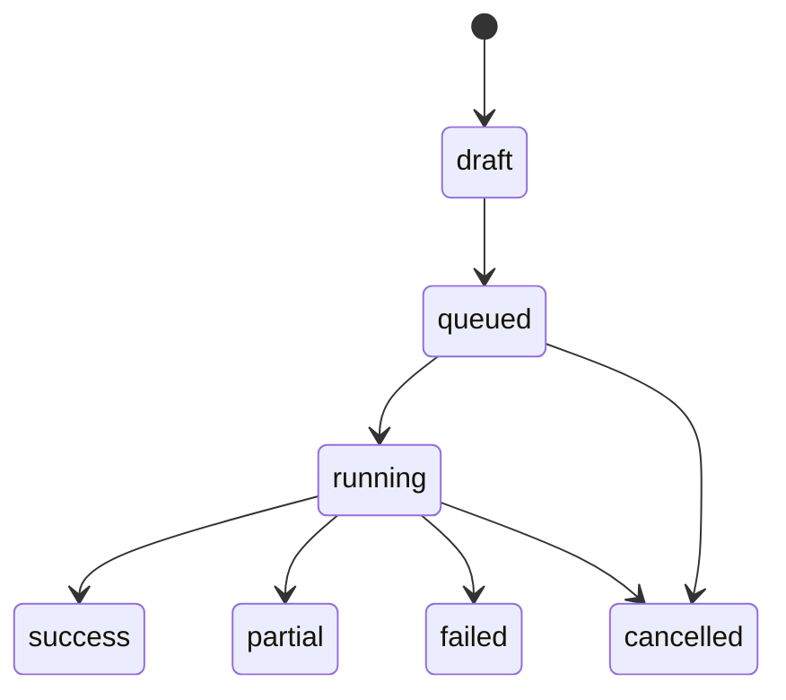

# 详细设计说明书

## 1. 文档目的

在总体设计基础上，细化 RAG 调试平台各模块的职责、关键对象、页面与接口映射、核心流程、状态流转、异常处理和权限约束，为后续接口设计、数据模型设计、研发拆分和测试验收提供执行依据。

## 2. 设计范围

本文覆盖以下模块：

- 用户与权限模块
- 知识库模块
- 文档与 Ingest 模块
- 配置与受约束 Pipeline 编排模块
- QA 调试模块
- QA 历史与评估模块
- 图检索分析模块
- 通用接口抽象、状态流转、异常处理和安全权限处理

本文不展开具体数据库 DDL、完整 API 入参与出参、部署脚本和模型提示词全文，这些内容分别由数据模型设计、接口设计说明和实施阶段配置文档承接。

## 3. 模块详细设计

### 3.0 接口抽象与可替换性约束

本项目允许后续替换 UI 组件库、检索后端、模型服务和图数据库，因此详细设计必须遵守接口抽象优先原则。当前原型仍以设计稿组件为准，但研发实现时页面组件、业务状态、后端 DTO、外部服务实现之间不得直接耦合。

#### 3.0.1 前端接口抽象与 ViewModel 设计

前端建议分为页面层、组件层、业务适配层和服务调用层：

| 层级 | 职责 | 不应承担 |
| --- | --- | --- |
| 页面层 | 组合布局、管理局部交互状态、触发业务动作 | 不直接拼接后端 DTO，不直接写 API 路径 |
| 组件层 | 接收稳定 props 并渲染 UI | 不直接调用后端接口，不感知 Milvus、OpenSearch、Neo4j 等实现 |
| 业务适配层 | 将后端 DTO 转为页面 ViewModel | 不承载真实权限判断和业务真值计算 |
| 服务调用层 | 封装 API 请求、错误码和鉴权上下文 | 不泄漏给基础 UI 组件 |

推荐前端代码结构：

| 路径 | 说明 |
| --- | --- |
| `types/pipeline.ts` | `PipelineDefinition`、节点类型、校验结果等稳定类型 |
| `services/pipelineService.ts` | Revision、Pipeline 校验、保存、激活 API |
| `adapters/pipelineAdapter.ts` | 后端 DTO 到页面 ViewModel 的转换 |
| `components/pipeline/*` | Pipeline 画布、节点卡片、Inspector、Validation 等展示组件 |

关键 ViewModel：

| ViewModel | 用途 |
| --- | --- |
| `PipelineNodeViewModel` | P08 画布节点展示，不等同于后端节点 DTO |
| `PipelineValidationResult` | P08 Validation 面板展示 |
| `RevisionSummary` | P08 Revision 列表展示 |
| `QARunTraceViewModel` | P09 Executed Pipeline Trace 展示 |
| `RetrievalCandidateViewModel` | P09 候选列表展示 |
| `EvidenceCitationViewModel` | P09 Evidence 和 Citation 展示 |

实现约束：

- 页面 JSX 中不得散落后端字段名和 API 路径。
- 组件不得直接依赖后端枚举、数据库名、模型厂商名或服务实现类。
- `pipelineDefinition` 是业务契约，画布 ViewModel 是展示契约，二者必须通过 Adapter 转换。
- 替换 Card、Button、Drawer、Canvas 等 UI 组件时，不应修改 API 调用和 DTO 适配逻辑。

#### 3.0.2 后端 Provider / Adapter 设计

后端服务层必须依赖能力抽象，而不是具体组件实现。QA 编排服务只依赖统一 Provider 接口，具体 Milvus、pgvector、OpenSearch、Neo4j 或模型厂商差异由 Provider 实现负责。

推荐 Provider 分组：

| Provider | 说明 |
| --- | --- |
| `LlmProvider` | 问题重写、回答生成等 LLM 调用 |
| `EmbeddingProvider` | 文档和 query 向量化 |
| `RerankProvider` | 候选精排 |
| `DenseRetrievalProvider` | 向量检索，可由 Milvus 或 pgvector 实现 |
| `SparseRetrievalProvider` | 关键词检索，可由 OpenSearch 或其他文本索引实现 |
| `GraphRetrievalProvider` | 图检索增强，可由 Neo4j 或后续图组件实现 |

实现约束：

- QA 编排主流程不得直接调用 Milvus、OpenSearch、Neo4j 或具体模型 SDK。
- `pipelineDefinition` 记录能力类型、参数和约束，不记录 UI 组件名称。
- Provider 返回统一候选、证据、错误和降级状态，供后续 Fusion、Permission Filter、Citation Builder 使用。
- 替换后端组件时，应优先新增或替换 Provider 实现，不修改前端页面主体和 QA 编排主流程。

### 3.1 用户与权限模块

- 功能说明：提供登录态识别、用户管理、用户组管理、平台角色控制，以及知识库角色和文档 ACL 的授权基础。
- 关键页面：P01 登录页、P03 用户管理、P04 用户组管理、P12 成员与权限。
- 关键接口：登录、退出、当前用户、用户 CRUD、用户组 CRUD、组成员维护、知识库成员绑定、权限摘要查询。
- 关键状态：用户启用、用户禁用、用户组有效、成员绑定有效、授权冲突。

#### 3.1.1 用户对象设计

| 对象 | 说明 | 关键字段 |
| --- | --- | --- |
| `User` | 系统用户主体 | userId、username、displayName、email、platformRole、securityLevel、status |
| `UserGroup` | 用户组 | groupId、name、description、status |
| `UserGroupMember` | 组成员关系 | groupId、userId、joinedAt |
| `KbMemberBinding` | 知识库成员绑定 | kbId、subjectType、subjectId、kbRole |
| `AclRule` | 文档或 Chunk 级授权规则 | resourceType、resourceId、subjectType、subjectId、effect |
| `Permission` | 稳定权限码 | permissionCode、scope、status |
| `RolePermissionBinding` | 角色默认权限 | roleScope、roleCode、permissionCode、effect |
| `ChunkAccessFilter` | 检索阶段访问过滤摘要 | chunkId、allowSubjectKeys、denySubjectKeys、securityLevel、filterHash |

#### 3.1.2 权限判定流程

1. 验证用户登录态，未登录直接拒绝。
2. 读取 `permissions` 和 `role_permission_bindings`，将平台角色解析为平台权限码。
3. 对知识库资源读取 `KbMemberBinding`，合并用户和用户组角色，并解析为知识库权限码。
4. 对文档和 Chunk 读取密级、状态和 ACL，叠加用户、用户组和角色来源的 allow / deny 结果。
5. 若 allow 与 deny 同时命中，按 deny 优先处理。
6. 为检索链路生成或读取 `ChunkAccessFilter`，将用户、用户组、角色、密级和状态转换为召回前可用的过滤摘要。
7. 返回权限摘要给前端展示，但最终授权结果以后端判定为准。

#### 3.1.3 设计约束

- 前端可以隐藏按钮或显示无权限态，但不能作为最终权限边界。
- 禁用用户后，不删除历史 QARun、文档和审计记录中的用户引用。
- 用户组变更后，后续访问即时按新授权计算；历史运行记录保留当时发起人信息。
- 用户组、角色权限、ACL 或密级变化后，必须刷新受影响 Chunk 的访问过滤摘要，并同步到检索副本。

### 3.2 知识库模块

- 功能说明：维护知识库基础信息、状态、负责人、默认密级、成员绑定和知识库入口工作台。
- 关键页面：P02 平台工作台 / 知识库列表、P05 知识库概览、P12 成员与权限。
- 关键接口：知识库创建、编辑、停用、列表查询、详情查询、成员绑定、成员移除、概览统计。
- 关键状态：draft、active、disabled、archived。

#### 3.2.1 知识库对象设计

| 对象 | 说明 | 关键字段 |
| --- | --- | --- |
| `KnowledgeBase` | 知识库工作空间 | kbId、name、description、ownerId、defaultSecurityLevel、status |
| `KbMemberBinding` | 成员绑定 | kbId、subjectType、subjectId、kbRole |
| `KbSummary` | 概览统计 ViewModel | docCount、chunkCount、activeRevisionId、recentRunCount、failedJobCount |

#### 3.2.2 知识库创建流程

1. 平台管理员或具备权限的用户提交知识库名称、描述、负责人、默认密级。
2. 后端校验名称、权限和默认密级合法性。
3. 创建 `KnowledgeBase`，状态默认为 `active`。
4. 自动创建负责人绑定，角色为 `kb_owner`。
5. 前端跳转到 P05 知识库概览。

#### 3.2.3 设计约束

- 无权限用户不应在列表中看到不可访问知识库。
- 停用知识库后，不允许新增文档、执行 QA、激活配置，但历史数据仍可按权限查看。
- 知识库默认密级只作为新文档初始值，不替代文档级 ACL。

### 3.3 文档与 Ingest 模块

- 功能说明：管理文档上传、文档版本、Chunk、重解析、Ingest 作业、Dense/Sparse/Graph 副本构建。
- 关键页面：P06 文档中心、P07 文档详情、P05 知识库概览中的最近作业区。
- 关键接口：文档上传、文档列表、文档详情、版本列表、切换 active version、Chunk 查询、Chunk 详情、重解析、IngestJob 查询、失败重试。
- 关键状态：文档 active / disabled，版本 processing / active / inactive / failed，作业 queued / running / success / failed / cancelled。

#### 3.3.1 文档对象设计

| 对象 | 说明 | 关键字段 |
| --- | --- | --- |
| `Document` | 文档主对象 | docId、kbId、name、securityLevel、status、activeVersionId |
| `DocumentVersion` | 文档版本 | versionId、docId、versionNo、sourceFileId、parseStatus、isActive |
| `Chunk` | 文档切块真值 | chunkId、versionId、pageNo、section、content、tokenCount、metadata |
| `IngestJob` | 入库作业 | jobId、kbId、docId、versionId、type、status、progress、errorMessage |
| `GraphSnapshot` | 图构建快照 | graphSnapshotId、kbId、versionScope、jobId、status |

#### 3.3.2 上传与入库流程

1. 用户在 P06 上传文档。
2. 后端先创建 `Document` 和 `DocumentVersion`，并保存原始文件到对象存储。
3. 创建 `IngestJob`，状态为 `queued`。
4. Worker 解析文档、生成 Chunk，并将 Chunk 真值写入 PostgreSQL。
5. Worker 生成 embedding，写入 Dense Provider 对应副本。
6. 若配置启用 Sparse，则写入 Sparse Provider 对应副本。
7. 若配置启用图构建，则抽取实体、关系、社区摘要并写入 Graph Provider。
8. 作业成功后更新版本状态；失败时保留错误信息和重试入口。

#### 3.3.3 Active Version 切换

- 同一 `Document` 任一时刻只允许一个 active version。
- 切换 active version 前必须校验用户权限，并提示会影响后续检索和 QA。
- 目标版本的解析状态必须为成功，并且当前 active Revision 所需的 Dense / Sparse / Graph 副本必须已完成或标记为 `not_required`。
- 切换后不删除旧版本、旧 Chunk 和旧索引副本；旧副本可异步清理或保留供历史回放使用。
- 如果图快照因版本切换变为 `stale`，后续 QA 应默认跳过图增强或按部分降级处理。

#### 3.3.4 设计约束

- Chunk 正文真值必须在 PostgreSQL，不得只存在向量库、OpenSearch、对象存储或 Neo4j。
- Ingest 失败不得回滚文档对象，否则前端无法追踪失败原因。
- 重试作业必须生成新的作业记录，不覆盖历史失败记录。
- Chunk 详情读取必须经过 `kb.chunk.read` 权限校验。

### 3.4 配置与受约束 Pipeline 编排模块

- 功能说明：管理模板、受约束 Pipeline、节点参数、配置 Revision、Active Revision 切换和 Pipeline 校验。
- 关键页面：P08 配置中心。
- 关键接口：模板查询、模板应用、Pipeline 校验、Revision 保存、Revision 列表、Revision Diff、Revision 激活、Revision 草稿创建。
- 关键状态：draft、saved、active、archived、invalid。

#### 3.4.1 ConfigRevision.pipelineDefinition

`ConfigRevision` 需要保存一份受控的 `pipelineDefinition`。该对象不是自由 DAG，而是固定阶段 Pipeline 的配置描述，用于保证前端可视化编排与后端执行顺序一致。

`pipelineDefinition` 是后端保存和执行的业务契约，不等同于 P08 画布节点 ViewModel。前端展示需要通过 Adapter 转换，不允许页面组件直接修改后端契约对象。

建议字段：

| 字段 | 类型 | 说明 |
| --- | --- | --- |
| `version` | string | Pipeline 定义版本，例如 `1.0` |
| `constraintsVersion` | string | 编排约束版本，用于后续兼容升级 |
| `mode` | string | 固定为 `constrained-stage-pipeline` |
| `stages` | array | 固定阶段列表，按执行顺序排列 |
| `nodes` | array | 节点定义，包含节点类型、阶段、启用状态、锁定状态与参数 |
| `templateId` | string | 来源模板，可为空 |
| `validationSnapshot` | object | 保存时的校验摘要，便于审计和问题定位 |
| `providerBindings` | object | 可选，记录能力类型到 Provider 配置的绑定关系，不绑定 UI 组件 |

节点最小字段：

| 字段 | 类型 | 说明 |
| --- | --- | --- |
| `id` | string | 节点实例 ID |
| `type` | enum | 节点类型 |
| `stage` | enum | 所属固定阶段 |
| `enabled` | boolean | 是否启用 |
| `locked` | boolean | 是否系统锁定，不允许删除或禁用 |
| `params` | object | 节点参数 |

#### 3.4.2 Pipeline 节点类型枚举

| 节点类型 | 所属阶段 | 是否可禁用 | 说明 |
| --- | --- | --- | --- |
| `input` | preprocess | 否 | 接收 query、kbId、revision 上下文 |
| `queryRewrite` | preprocess | 是 | 问题重写，若启用必须在检索前执行 |
| `denseRetrieval` | retrieval | 是 | 向量召回 |
| `sparseRetrieval` | retrieval | 是 | 关键词召回 |
| `graphRetrieval` | retrieval | 是 | 图检索增强 |
| `fusion` | fusion | 否 | 多路候选融合和去重 |
| `permissionFilter` | fusion | 否 | 权限裁剪安全边界 |
| `rerank` | fusion | 是 | 候选精排 |
| `contextBuilder` | generation | 否 | 构造进入 LLM 的上下文 |
| `generation` | generation | 否 | LLM 生成 |
| `citation` | generation | 否 | 引用构建 |
| `output` | diagnostics | 否 | Answer、Evidence、Trace、Metrics 输出 |

#### 3.4.3 Pipeline 最小校验规则

- Query Rewrite 如果启用，必须位于 Retrieval 阶段之前。
- Dense、Sparse、Graph 至少启用一路。
- Fusion 只能接收 Retrieval 阶段输出。
- Permission Filter 必须存在，且必须在最终上下文进入 Generation 之前。
- Graph Retrieval 输出必须回落到授权 Chunk / Evidence。
- Citation 必须来自授权 Evidence。
- 不允许循环、不允许跨阶段反向依赖、不允许绕过安全过滤节点。
- 前端校验只作为交互提示，后端保存和执行前必须再次校验。
- Pipeline 校验不得依赖前端组件状态，应基于 `pipelineDefinition` 和 Provider 能力声明执行。

#### 3.4.4 Revision 保存与激活

1. 用户在 P08 编辑 Pipeline 或应用模板。
2. 前端调用 Pipeline 校验接口，展示 `PipelineValidationResult`。
3. 校验通过后保存为新的 `ConfigRevision`，状态为 `saved`。
4. 保存不等于生效；Active Revision 保持不变。
5. 用户在 Revision 历史中选择目标版本并二次确认。
6. 后端在同一事务中将旧 active Revision 转为 archived，将目标 Revision 设为 active，更新 `knowledge_bases.active_config_revision_id`，并记录审计日志。
7. 后续 QARun 默认使用新的 active revision。

#### 3.4.5 设计约束

- P08 不执行单次 QA，不展示单次召回 Chunk。
- Revision 激活必须可审计，至少记录操作者、时间、旧 revision、新 revision。
- 激活事务失败时必须整体回滚，禁止出现知识库 active 指针和 Revision 状态不一致。
- `providerBindings` 只绑定能力和 Provider 配置，不绑定前端组件名称。

### 3.5 QA 调试模块

- 功能说明：基于 Active Revision 或临时覆盖参数执行单次 QA 实验，展示实际执行 Trace、候选、Evidence、Citation 与诊断指标。
- 关键页面：P09 QA 调试。
- 关键接口：创建 QARun、查询运行结果、保存运行记录、沉淀 Revision 草稿、打开 Citation 来源。
- 关键状态：draft、queued、running、success、partial、failed、cancelled。

#### 3.5.1 P09 与 P08 的边界

- P09 展示 `Executed Pipeline Trace`，即本次 QARun 实际执行过的链路。
- P09 可以临时覆盖 Query Rewrite、Dense/Sparse/Graph、Fusion、Rerank 和 Generation 参数。
- P09 不允许修改正式 Pipeline 拓扑；需要长期生效的变更必须沉淀为 Revision 草稿后回到 P08 保存和激活。
- QARun 必须记录使用的 `configRevisionId`、是否存在覆盖参数、覆盖参数快照和运行时 Trace。
- P09 页面组件只消费 `QARunTraceViewModel`、`RetrievalCandidateViewModel`、`EvidenceCitationViewModel` 等展示模型，不直接消费后端 QARun DTO。

#### 3.5.2 QARun 执行流程

1. 前端提交 `kbId`、`query`、运行模式和可选临时覆盖参数。
2. 后端校验 `kb.qa.run` 权限和知识库状态。
3. 后端创建 `QARun`，状态为 `queued`，并立即返回 `runId`、状态轮询地址和详情地址。
4. Worker 或后台执行器锁定本次使用的 active `ConfigRevision`。
5. 合并临时覆盖参数，但不得修改 active revision。
6. 执行 Query Rewrite。
7. 执行 Dense、Sparse、Graph 检索，允许部分通道失败后降级。
8. 对候选进行去重、融合、Rerank。
9. 执行 Permission Filter，裁剪未授权候选。
10. 构造上下文并调用 LLM 生成。
11. 构建 Citation 和 Evidence。
12. 持久化 Trace、Metrics、候选摘要和最终结果。

MVP 阶段统一采用轮询模式：

- 创建 QARun 接口不直接返回 Answer、Evidence、Citation、Trace。
- 前端通过状态接口展示 `queued / running / success / partial / failed / cancelled` 和当前阶段。
- 前端在 `detailReady = true` 或终态后调用详情接口读取完整结果。
- 后续如引入 WebSocket 或 Server-Sent Events，只作为状态推送优化，不改变创建和详情接口的基本契约。

#### 3.5.3 Trace 设计

Trace 至少记录：

| 字段 | 说明 |
| --- | --- |
| `stepKey` | queryRewrite、denseRetrieval、fusion、permissionFilter 等 |
| `status` | success、skipped、failed、partial |
| `startedAt` / `endedAt` | 步骤耗时 |
| `inputSummary` | 输入摘要，不保存敏感正文全文 |
| `outputSummary` | 输出摘要 |
| `errorCode` / `errorMessage` | 失败原因 |
| `metrics` | tokens、候选数、过滤数等 |

#### 3.5.4 设计约束

- Dense、Sparse、Graph 全部关闭时不得运行。
- Graph 检索失败可降级，但需要在 Trace 和页面提示中明确。
- 权限裁剪发生后，不得在 answer、evidence、citation 中暴露被裁剪 Chunk 正文。
- 临时覆盖参数必须写入 QARun 快照，保证历史回放可复现。

### 3.6 QA 历史与评估模块

- 功能说明：查询历史 QARun、查看运行详情、人工标注质量、回放到 P09、沉淀回归样本。
- 关键页面：P10 QA 历史 / 监测页。
- 关键接口：历史列表、运行详情、人工标注、失败归因、回放上下文、加入评估集、同 query 对比。
- 关键状态：run 成功、部分降级、失败；反馈未标注、正确、部分正确、错误、引用错误、无证据。

#### 3.6.1 历史列表设计

历史列表按知识库维度查询，默认展示用户有权查看的记录。列表字段包括 runId、query 摘要、发起人、状态、revision、是否使用临时覆盖、耗时、tokens、创建时间和反馈状态。

#### 3.6.2 运行详情设计

运行详情应包含：

- 原始 query 和改写 query。
- 使用的 ConfigRevision 和临时覆盖参数快照。
- Answer、Evidence、Citation。
- Executed Pipeline Trace。
- Retrieval Candidate 和淘汰原因。
- Metrics 和失败 / 降级诊断。
- 人工反馈和失败归因。

#### 3.6.3 回放与评估样本

- 回放不是简单跳转，而是将 query、sourceRunId、revision、覆盖参数和场景上下文带回 P09。
- 加入评估集时生成 `EvaluationSample`，记录预期答案、关键 Evidence、来源 runId 和创建人。
- 后续回归验证应基于 EvaluationSample 执行，不直接覆盖原始 QARun。

### 3.7 图检索分析模块

- 功能说明：查看图构建状态、实体关系、图检索扩展路径、支撑 Chunk 回落情况和图增强诊断。
- 关键页面：P11 图检索分析页。
- 关键接口：图快照查询、实体搜索、关系路径查询、社区摘要查询、支撑 Chunk 查询、图构建状态查询。
- 关键状态：graphSnapshot queued、running、success、failed、stale。

#### 3.7.1 图对象设计

| 对象 | 说明 | 关键字段 |
| --- | --- | --- |
| `GraphSnapshot` | 图构建快照 | graphSnapshotId、kbId、status、sourceVersionScope |
| `GraphEntity` | 图实体 | entityId、name、type、aliases、supportChunkIds |
| `GraphRelation` | 图关系 | relationId、sourceEntityId、targetEntityId、relationType、supportChunkIds |
| `GraphCommunity` | 社区摘要 | communityId、summary、supportChunkIds |

#### 3.7.2 图检索安全约束

- Neo4j 中的实体、关系和社区摘要不能直接作为最终证据。
- 图检索输出必须回落到授权 Chunk / Evidence。
- 无权限 Chunk 支撑的关系可以参与内部诊断，但不得进入最终 answer、evidence、citation。
- 图构建失败不应阻塞 Dense / Sparse 基础 QA 能力，但必须展示降级原因。

### 3.8 任务与作业模块

- 功能说明：统一管理异步任务，包括文档解析、向量写入、Sparse 索引、图构建、重解析和批量重建。
- 关键页面：P05 概览、P06 文档中心、P07 文档详情。
- 关键接口：作业创建、作业列表、作业详情、失败重试、取消作业。
- 关键状态：queued、running、success、failed、cancelled。

#### 3.8.1 作业执行原则

- 前台请求只创建任务，不执行重型处理。
- Worker 更新进度、阶段、错误原因和结果摘要。
- 重试创建新 job，并引用原 jobId。
- 作业状态变化应可被前端轮询或订阅。

## 4. 页面到接口映射

| 页面编号 | 页面名称 | 主要操作 | 对应接口域 | 备注 |
| --- | --- | --- | --- | --- |
| P01 | 登录页 | 登录、获取当前用户 | Auth | 登录失败不暴露安全细节 |
| P02 | 平台工作台 / 知识库列表 | 查询知识库、创建知识库、停用知识库 | KnowledgeBases | 仅返回授权可见知识库 |
| P03 | 用户管理 | 新增用户、禁用用户、查看用户详情 | Users | 平台管理员权限 |
| P04 | 用户组管理 | 创建用户组、添加成员、移除成员 | Groups | 用户组用于 KB 授权与 ACL |
| P05 | 知识库概览 | 查看统计、进入子页面、查看最近作业 | KnowledgeBases、IngestJobs、QA History | 汇总接口可按需聚合 |
| P06 | 文档中心 | 上传文档、批量重解析、筛选文档、查看作业 | Documents、IngestJobs | 上传后立即生成文档对象 |
| P07 | 文档详情 | 查看版本、查看 Chunk、切换 active version、重试作业 | Documents、DocumentVersions、Chunks、IngestJobs | Chunk 正文受权限控制 |
| P08 | 配置中心 | 应用模板、校验 Pipeline、保存 Revision、激活 Revision | Templates、ConfigRevisions | 保存与激活分离 |
| P09 | QA 调试 | 开始调试、查看结果、保存 run、沉淀草稿 | QA Runs、ConfigRevisions | 临时覆盖不修改 active revision |
| P10 | QA 历史 | 查询历史、查看详情、标注、回放、加入评估集 | QA History、Evaluations | 回放需带上下文 |
| P11 | 图检索分析 | 查看图状态、路径、支撑 Chunk | Graph、GraphSnapshots、Chunks | 图结果必须回落 Chunk |
| P12 | 成员与权限 | 绑定成员、移除成员、查看权限摘要 | Members、Policies | 后端最终授权 |

## 5. 状态流转

### 5.1 IngestJob

状态说明：

- `queued`：作业已创建，等待 Worker 处理。
- `running`：Worker 正在执行，需更新阶段和进度。
- `success`：全部必要产物写入完成。
- `failed`：作业失败，需保留错误码、错误信息和失败阶段。
- `cancelled`：用户或系统取消，不能直接视为失败。

### 5.2 DocumentVersion

- `processing`：版本已创建，正在解析或索引。
- `active`：当前检索和 QA 默认使用的版本。
- `inactive`：历史版本，保留用于追溯。
- `failed`：版本处理失败，保留失败原因。

状态约束：

- 同一 Document 任一时刻只能有一个 active version。
- failed version 不得设为 active。
- active 切换必须写审计日志。

### 5.3 ConfigRevision

- `draft`：用户正在编辑或从 P09 沉淀来的草稿。
- `saved`：已保存为 Revision，但未生效。
- `active`：当前知识库默认运行配置。
- `archived`：历史版本，仅用于回放、对比和审计。
- `invalid`：校验未通过，不允许保存或激活。

状态约束：

- 保存 Revision 不等于激活 Revision。
- 激活 Revision 必须经过二次确认并写入审计记录。
- 只有通过 Pipeline 校验的 Revision 才允许进入 `saved` 或 `active` 状态。

### 5.4 QARun

状态说明：

- `draft`：前端准备运行参数，尚未提交执行。
- `queued`：后端已创建 run，等待执行。
- `running`：正在执行 Pipeline。
- `success`：完整执行成功。
- `partial`：部分通道失败但答案可生成，例如 Graph 超时降级。
- `failed`：无法生成有效结果。
- `cancelled`：用户或系统取消。

### 5.5 GraphSnapshot

- `queued`：等待图构建。
- `running`：正在抽取实体、关系或社区摘要。
- `success`：图结构可用于图检索增强。
- `failed`：图构建失败。
- `stale`：存在更新文档版本后，图快照已不是最新。

`stale` 判定规则：

- 文档 active version 切换、重解析成功、Chunk 删除、文档密级变化、ACL 变化或图构建配置变化时，相关图快照必须标记为 `stale`。
- QA 运行默认使用最新 `success` 且未 `stale` 的图快照。
- 若配置允许使用 stale 图快照进行诊断，运行状态应标记为 `partial`，Trace 中必须说明 stale 原因。

## 6. 异常处理

### 6.1 通用异常模型

所有业务接口应返回统一错误模型，至少包含：

| 字段 | 说明 |
| --- | --- |
| `code` | 稳定错误码 |
| `message` | 面向用户或前端的摘要 |
| `detail` | 可选，调试信息 |
| `traceId` | 链路追踪 ID |
| `fields` | 可选，字段级错误 |

### 6.2 模块异常处理

| 场景 | 处理方式 |
| --- | --- |
| 未登录访问 | 返回未认证错误，前端跳转登录 |
| 无资源权限 | 返回无权限或空结果，不暴露敏感对象细节 |
| 文档上传失败 | 不创建版本；若文件已写对象存储需异步清理 |
| 文档解析失败 | 保留 DocumentVersion 和 IngestJob 失败状态 |
| Chunk 无权限 | 正文脱敏，metadata 可按权限摘要展示 |
| Pipeline 校验失败 | 返回字段级错误和规则说明，前端禁用保存或提示修复建议 |
| 检索通道全关闭 | 阻止保存和运行，提示至少启用 Dense、Sparse、Graph 中一路 |
| 锁定节点被禁用或删除 | 后端拒绝保存，前端提示该节点属于系统护栏 |
| Graph 无法回落 Chunk | 图结果不得进入生成上下文，运行可按部分降级处理 |
| Citation 引用未授权 Evidence | 后端拒绝构建引用并记录安全告警 |
| QARun 部分通道失败 | 标记 partial，保留失败通道 Trace |
| Provider 超时 | 按节点配置决定重试、降级或失败 |

### 6.3 重试与补偿

- IngestJob 失败可重试，重试生成新 job，不能覆盖原 job。
- Provider 调用超时可按配置进行有限重试，重试次数和耗时需进入 Trace。
- Dense/Sparse/Graph 副本丢失时，应基于 PostgreSQL Chunk 真值和对象存储重建。
- 图构建失败不影响文档主数据和 Dense 基础检索。

## 7. 安全与权限处理

### 7.1 权限原则

- 后端授权为准，前端只做提示和交互优化。
- 默认拒绝，未命中授权即不可访问。
- Deny 优先于 Allow。
- 检索阶段和输出阶段都必须执行权限裁剪。

### 7.2 关键权限点

| 权限点 | 控制对象 | 说明 |
| --- | --- | --- |
| `platform.user.manage` | User / UserGroup | 平台用户与用户组管理 |
| `kb.view` | KnowledgeBase | 查看知识库 |
| `kb.manage` | KnowledgeBase | 编辑知识库基础信息 |
| `kb.member.manage` | KbMemberBinding | 管理知识库成员 |
| `kb.document.upload` | Document | 上传文档 |
| `kb.document.read` | Document | 查看文档摘要 |
| `kb.document.download` | 原始文件 | 下载原始文档 |
| `kb.chunk.read` | Chunk | 查看 Chunk 正文 |
| `kb.config.manage` | ConfigRevision | 保存和激活配置 |
| `kb.qa.run` | QARun | 执行 QA 调试 |
| `kb.qa.history.read` | QARun | 查看 QA 历史 |
| `kb.evaluation.manage` | EvaluationSample | 管理评估样本 |

### 7.3 检索与输出安全

- Permission Filter 是 Pipeline 的强制节点，不允许删除、禁用或移动到生成之后。
- Dense、Sparse、Graph 检索都必须携带知识库、版本、密级、状态和用户权限过滤条件；用户权限过滤条件来自后端生成的 `ChunkAccessFilter`，不能由前端自行拼接。
- 如果检索组件不支持主体级过滤，Provider 必须先从 PostgreSQL 获取授权 Chunk 范围，再限制召回范围；禁止先全库召回后仅在页面层隐藏结果。
- Graph Retrieval 的实体、关系或摘要不能直接作为最终证据，必须回落到授权 Chunk / Evidence。
- Citation Builder 只能使用权限过滤后的 Evidence。
- Trace 中不得泄露未授权 Chunk 正文；可展示“命中但被权限裁剪”的摘要状态。
- 历史 QARun 详情读取 Evidence 快照时，仍需按当前用户权限二次校验；无权限时仅返回来源摘要、hash 或脱敏说明。

## 8. 测试与验收关注点

| 模块 | 重点场景 |
| --- | --- |
| 用户与权限 | 未登录、无权限、用户组授权、deny 优先 |
| 知识库 | 创建、停用、不可见资源过滤 |
| 文档 | 上传成功、解析失败、重试、active version 切换 |
| Chunk | 有权限查看、无权限脱敏、分页查询 |
| 配置 | Pipeline 校验、保存 Revision、激活 Revision、非法节点操作 |
| QA 调试 | 成功、部分降级、权限裁剪、临时覆盖、Trace 完整性 |
| QA 历史 | 详情查看、人工标注、回放、加入评估集 |
| 图检索 | 图构建成功/失败、路径查询、支撑 Chunk 回落 |
| 可替换性 | 替换 UI 组件、替换 Provider、DTO 变更只改 Adapter |

## 9. 后续待细化项

- 数据库表结构、索引、唯一约束和外键策略。
- 完整 API 路径、请求体、响应体和错误码。
- Provider 接口方法签名与超时重试策略。
- Pipeline DSL 的 JSON Schema。
- 权限矩阵与角色默认授权表。
- EvaluationSample 的回归执行方式和评分规则。
