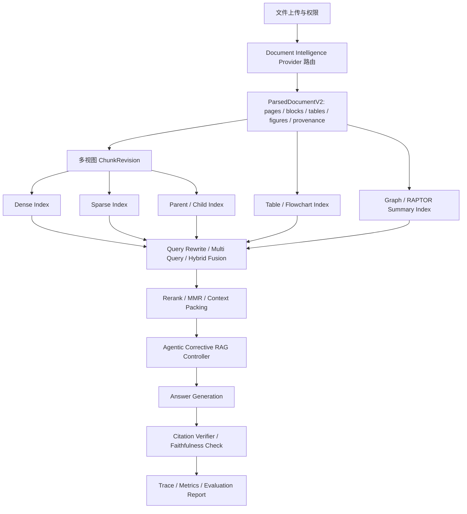

# 高质量 RAG 核心优化实施计划

> 用途：本文件是 E34 高质量 RAG 核心优化的开发计划入口，供后续 agent 按 Sprint 和 Backlog 逐条开发。当前 Backlog 状态以 `docs/04-迭代与交付/产品待办清单.md` 为准。
>
> **For agentic workers:** 执行本计划时先阅读对应 Backlog 的 spec 文件，再按 Sprint 文档实施。涉及生产代码改动时必须先写或补齐失败测试；涉及真实 Provider、文档解析、向量库、OpenSearch、Neo4j 或 LLM 的能力，不得用 mock 结果宣称真实通过。

**Goal:** 将当前 RAG 平台从“可配置的基础检索问答”升级为“高质量、可解释、可验收的底层 RAG 能力平台”，覆盖配置真实生效、文档高保真解析、多视图分块、大小 Chunk 检索、结构化表格/流程图理解、Agentic/Corrective RAG、多跳推理、答案引用校验和质量评测闭环。

**Architecture:** 保持 PostgreSQL 为业务真值中心；Milvus、OpenSearch、Neo4j、RAPTOR/摘要索引和结构化表格索引均为可重建检索副本。新增能力按 `Document Intelligence -> ParsedDocumentV2 -> Multi-view Chunk/Index -> Retrieval/Fusion -> Agentic RAG Controller -> Answer/Citation Verifier -> Evaluation` 分层落地。所有节点配置必须能在运行时被读取、执行、追踪并进入验收报告；暂不支持的配置应在 UI 与 API 中显式标记为“规划中”。

**Tech Stack:** FastAPI、SQLAlchemy、Alembic、PostgreSQL、Milvus、OpenSearch、Neo4j、现有 QA Run Pipeline、文档解析服务、LLM Provider、React、Vite、TypeScript、pytest、评测脚本。

---

## 1. 关键假设

- 本计划不替代 E33 员工培训 Agent 计划；它提供平台级 RAG 底座能力，员工培训、SOP 助手、文件合规性检查和内部客服后续复用。
- “配置真实生效”定义为：配置项被后端执行链读取，改变运行结果或执行路径，并能在 trace / metrics / API 响应中证明。
- “高质量解析”不要求一次性绑定某个商业解析服务，但必须通过 Provider 路由和统一输出契约支持升级。
- LLM 可以大量用于质量提升，但必须有缓存、成本统计、失败回退和离线评测口径。
- 权限过滤仍是不可跳过的安全门禁；任何图谱、表格、视觉或摘要证据都必须回落到授权文档块或授权业务对象。

## 2. 现有节点与配置项真实生效评估

| 节点 | 已真实生效的配置 | 弱生效或未生效配置 | 当前判断 | 后续任务 |
| --- | --- | --- | --- | --- |
| `queryRewrite` | `enabled`、是否进入 LLM 改写 | `promptVersion`、`rewriteStrategy`、`expansionCount` 未驱动不同策略或多条改写 | 可用但策略配置偏展示 | B-316、B-317 |
| `multiQuery` | 与原始 query 的简单追加有关 | `queryCount`、`mergeStrategy` 未形成真正多查询与融合策略 | 节点存在但质量收益有限 | B-317、B-322 |
| `denseRetrieval` | `topK`、`scoreThreshold`、`fusionWeight` | `embeddingModel` 不按节点选择；`metadataFilter` 未完整执行 | 真实可用，配置不完整 | B-316、B-317 |
| `sparseRetrieval` | `topK`、`scoreThreshold`、`fusionWeight` | `matchMode`、`metadataFilter` 未形成明确策略 | 真实可用，检索能力基础 | B-316、B-322 |
| `graphRetrieval` | `topK`、部分扩展限制、fallback 校验 | `graphDepth`、`pathMode`、`maxNodes` 未形成真正多跳路径推理 | 真实接入但浅层 | B-326 |
| `fusion` | 候选数量、向量/关键词/图谱权重 | `method=rrf`、`rrfK`、`dedupBy=source` 未真正改变算法 | 融合可用但算法单一 | B-317、B-322 |
| `permissionFilter` | PostgreSQL 权限过滤、最终证据过滤 | Provider 侧预过滤覆盖不足 | 关键安全能力真实有效 | B-316、B-327 |
| `rerank` | `enabled`、`topN`、`scoreThreshold`、HTTP reranker 或 identity fallback | `model` 未按节点切换；`keepRejectedReason` 追踪不足 | 可用但可解释不足 | B-316、B-322 |
| `contextPacking` | `maxContextTokens` 的粗粒度预算 | `chunkWindow`、`packingStrategy`、`citationPolicy` 未形成邻近扩展和策略差异 | 可用但上下文连贯性不足 | B-323 |
| `generation` | `temperature`、LLM 调用 | `model`、`maxOutputTokens`、`citationPolicy` 未完整绑定 Provider 参数 | 可用但模型参数不透明 | B-317、B-327 |
| `citation` | 基础引用生成 | `minEvidence`、`citationPolicy`、`enableGraphLinks` 未严格约束输出 | 基础可用，可信度不足 | B-327 |
| `output` | trace、metrics、运行记录 | 质量评测和配置命中解释不足 | 可用但验收闭环不足 | B-316、B-327 |

补充风险：

- App Runtime evidence retrieve 链路存在调用参数与 provider 签名不一致风险，可能静默退回到低质量 ILIKE 检索；该问题进入 B-317。
- 当前文档解析以文本抽取为主，PDF/DOCX 的版面、表格、段落定位、页码和 bbox 保真不足；该问题进入 B-318/B-319。
- 当前分块以固定长度为主，无法稳定支持小 Chunk 精准命中和大 Chunk 上下文连贯；该问题进入 B-320/B-323。

## 3. 目标架构

## 4. Sprint 与 Backlog 拆分

| Sprint | Backlog | 主题 | Spec |
| --- | --- | --- | --- |
| Sprint 63 | B-316 | RAG 节点配置真实生效审计与可视化标识 | [Spec](../specs/2026-05-30-rag-config-effectiveness-audit-spec.md) |
| Sprint 63 | B-317 | RAG 关键配置真实执行修复 | [Spec](../specs/2026-05-30-rag-config-runtime-fix-spec.md) |
| Sprint 64 | B-318 | 高质量文档解析 Provider 路由 | [Spec](../specs/2026-05-30-rag-parser-routing-document-intelligence-spec.md) |
| Sprint 64 | B-319 | ParsedDocumentV2 与证据定位 Provenance | [Spec](../specs/2026-05-30-rag-parsed-document-v2-provenance-spec.md) |
| Sprint 65 | B-320 | 多视图 ChunkRevision 与分块策略 | [Spec](../specs/2026-05-30-rag-multiview-chunking-spec.md) |
| Sprint 65 | B-321 | Contextual Chunking 与 Late Chunking 预留 | [Spec](../specs/2026-05-30-rag-contextual-chunking-late-chunking-spec.md) |
| Sprint 66 | B-322 | 真 Multi Query、RRF/MMR 与融合可解释 | [Spec](../specs/2026-05-30-rag-true-multi-query-fusion-spec.md) |
| Sprint 66 | B-323 | 大小 Chunk / Parent-child 检索与上下文打包 | [Spec](../specs/2026-05-30-rag-parent-child-retrieval-context-packing-spec.md) |
| Sprint 67 | B-324 | 表格与流程图结构化检索 | [Spec](../specs/2026-05-30-rag-table-flowchart-retrieval-spec.md) |
| Sprint 67 | B-325 | Agentic / Corrective RAG 重检索控制器 | [Spec](../specs/2026-05-30-rag-agentic-corrective-rag-spec.md) |
| Sprint 68 | B-326 | Graph 多跳与 RAPTOR 层级摘要 | [Spec](../specs/2026-05-30-rag-graph-multihop-raptor-spec.md) |
| Sprint 68 | B-327 | Answer/Citation Verifier 与高质量 RAG E2E 验收 | [Spec](../specs/2026-05-30-rag-answer-citation-verifier-spec.md)、[E2E Spec](../specs/2026-05-30-rag-quality-e2e-acceptance-spec.md) |

## 5. 重点文件范围

后续开发优先检查并按需修改以下文件，实际改动以各 spec 为准：

- `backend/app/services/default_pipeline.py`：默认节点定义、配置默认值、配置生效标识。
- `backend/app/services/qa_run_service.py`：QA Pipeline 执行、节点 trace、检索融合、上下文打包、生成与引用。
- `backend/app/services/qa_providers.py`：Milvus/OpenSearch/Neo4j/LLM/rerank provider 调用契约。
- `backend/app/services/document_parsing.py`：解析 provider 路由、解析输出结构。
- `backend/app/services/document_service.py`：入库、分块、重分块、索引写入。
- `backend/app/schemas/binding.py`：Pipeline、QA Run、Chunk 策略和节点配置 DTO。
- `backend/app/tables.py` 与 `backend/migrations/versions/*`：ParsedDocumentV2、ChunkRevision、结构化证据、评测记录。
- `frontend/src/app/pages/P08_ConfigCenter.tsx`：节点配置 UI、生效状态和配置说明。
- `backend/app/tests/integration/*rag*`、`backend/app/tests/unit/*rag*`：质量能力和回归测试。

## 6. 通用开发注意项点

- 配置项没有运行时代码、trace 证据和测试覆盖前，不得在 UI 中标记为“已生效”。
- 节点中的 `model` 类配置必须绑定真实 provider alias；若当前 provider 不支持运行时切换，应显示为只读或规划中。
- 不引入无边界 autonomous agent；Agentic RAG 控制器必须有最大迭代次数、动作白名单、证据阈值和完整 trace。
- 文档解析结果要版本化；重新解析、重新分块、重新索引必须能追溯到具体 `parseVersion` 和 `chunkRevisionId`。
- 页码、段落、bbox、表格单元格、流程图节点等定位信息只能来自解析证据，不能由 LLM 凭空生成。
- LLM 生成的 contextual chunk 摘要、表格摘要、图谱摘要和答案校验必须按文档 hash、prompt 版本和模型版本缓存。
- 表格、流程图、图谱和摘要索引不能绕过权限过滤；输出引用必须能回落到授权文档块或授权结构化证据。
- 每引入一种检索增强能力，都要增加至少一组可复现评测样例，覆盖命中率、引用准确性和失败回退。
- 大文件解析、OCR、表格识别、图谱构建和 RAPTOR 摘要必须走异步任务或后台作业，避免阻塞上传请求。
- 质量优先于功能数量；每个 Sprint 必须交付可验证能力，不把“节点存在”当作“质量提升”。

## 7. 完成定义

E34 完成时应满足：

- 所有 RAG 节点配置项都有 `effective / partiallyEffective / planned` 状态，且状态由后端能力清单驱动。
- PDF、DOCX、图片和 Markdown 至少能进入统一 `ParsedDocumentV2` 契约，保留页码、段落和块级 provenance。
- 平台支持固定、标题、语义、父子、表格感知等多视图分块，并可按知识库选择策略。
- 检索链路支持真正多查询、RRF/MMR、大小 Chunk 上下文扩展和结构化证据混合。
- 证据不足时可以受控重检索，不能无限循环或绕过安全边界。
- 多跳、表格、流程图和层级摘要能力都有明确适用边界、trace 和回退策略。
- 答案引用经过校验，能拒绝无证据答案或降级为“资料不足”。
- 有一套高质量 RAG E2E 评测集，用于比较配置变更前后的质量收益。
