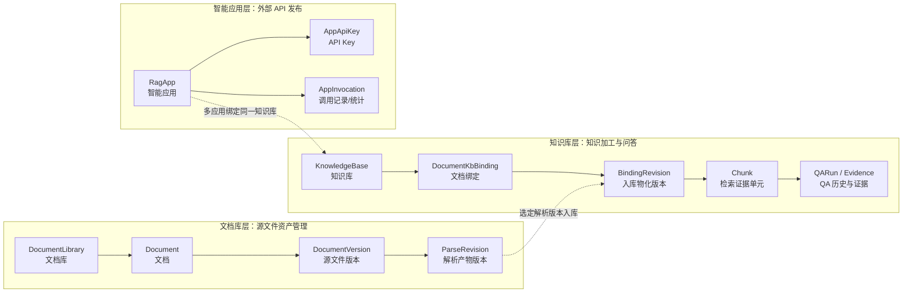
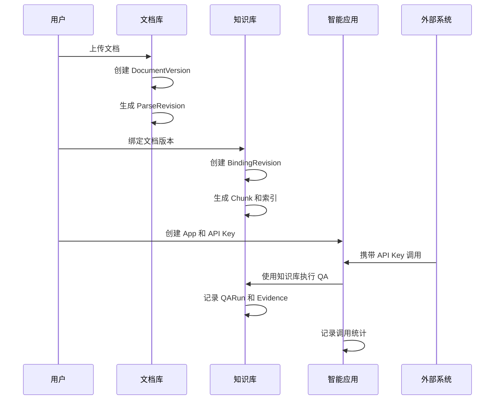
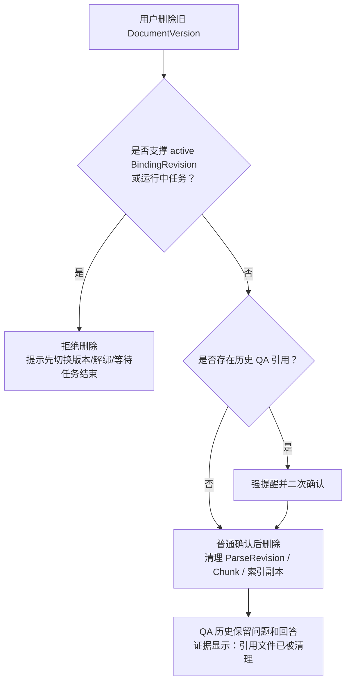

# 文档库-知识库-智能应用三层架构讲解材料

本文档用于支持系统设计汇报和后续开发沟通，重点说明文档库、知识库、智能应用三层框架的定位、关联关系、权限模型、版本与 Chunk 管理，以及后续可扩展方向。

## 1. 汇报目标

本次汇报建议围绕一个核心结论展开：

> 文档库负责“源文件资产管理”，知识库负责“将指定文档版本加工成可检索、可问答的知识资产”，智能应用负责“把知识库能力通过 API Key 对外发布，并进行调用监控和治理”。

三层不是简单的父子目录关系，而是面向不同治理目标的三个边界：

- 文档库解决文件归属、分类、版本、下载和基础权限问题。
- 知识库解决文档版本选择、解析结果入库、Chunk、索引、QA 和历史回溯问题。
- 智能应用解决外部调用入口、API Key、统计、调用记录和未来应用级扩展问题。

## 2. 建议讲解大纲

适合 15 到 25 分钟汇报。

| 顺序 | 主题 | 建议时间 | 讲解重点 |
| --- | --- | --- | --- |
| 1 | 为什么拆成三层 | 3 分钟 | 文件管理、知识加工、外部调用是三类不同问题，需要不同边界 |
| 2 | 三层对象关系 | 5 分钟 | 文档库到知识库是多对多；应用到知识库是多对一 |
| 3 | 权限模型 | 5 分钟 | 平台角色和资源角色分离；用户和用户组权限取并集；跨资源分别校验 |
| 4 | 版本、解析和 Chunk | 5 分钟 | DocumentVersion、ParseRevision、BindingRevision、Chunk 的职责边界 |
| 5 | 删除、禁用和 QA 历史 | 4 分钟 | 不破坏当前检索；历史 QA 保留运行事实；引用源被清理时明确展示 |
| 6 | 后续扩展 | 3 分钟 | 应用层、治理层、质量评估、生命周期策略可逐步扩展 |

## 3. 一页讲稿

可以按下面口径直接讲：

我们把系统拆成文档库、知识库、智能应用三层，核心原因是它们解决的问题不同。

文档库是源文件资产层。用户上传的文件、文件版本、预览、下载、重复文件提醒、文档归类和文档库权限，都在这一层处理。文档库本身不代表这些文件一定会进入问答，它只是把源文件管好。

知识库是知识加工层。它从文档库中选择具体文档版本和解析版本，生成 Chunk、索引副本和 QA 能力。知识库和文档是多对多关系，同一个文档可以进入多个知识库，一个知识库也可以绑定多个文档。为了支持版本切换和历史回溯，知识库不直接复制完整文档正文，而是通过 BindingRevision 记录某次入库物化结果，通过 Chunk 作为检索和 QA 引用的最小证据单元。

智能应用是对外发布层。当前它主要是在知识库上增加 API Key、调用记录和统计监控。虽然现在能力比较轻，但保留这一层是必要的，因为未来应用会承载限流、配额、外部调用协议、不同业务场景配置、应用级审计和商业化统计。应用和知识库是多对一关系：多个应用可以调用同一个知识库，但一个应用默认只绑定一个知识库，保证运行边界清晰。

权限上，我们采用平台角色和资源角色分离。平台角色只决定用户是否能进入系统、是否能做全局管理；具体能不能操作某个文档库、知识库或应用，要看资源角色。用户直接授权和用户组授权在同一个资源内取并集。跨资源操作必须分别校验，例如把文档绑定到知识库，既要有源文档库的绑定权限，也要有目标知识库的绑定权限。

版本和删除上，我们重点保护当前线上可用性。文档版本删除前会做影响分析：如果该版本正在支撑某个知识库的 active BindingRevision，或者有运行中任务，就禁止删除；如果只是被历史 QA 引用，可以强确认删除。删除后当前检索和智能应用不受影响，历史 QA 仍可查看问题、回答和运行记录，但引用证据展示“引用文件已被清理”。

整体上，这个设计的价值是：文件资产、知识加工和对外服务三个边界清楚；权限可控；版本可追踪；历史可解释；并且为后续应用治理和知识库质量优化留下扩展空间。

## 4. 三层关系总览



## 5. 三层定位与边界

| 层级 | 核心定位 | 主要对象 | 重点能力 | 不负责什么 |
| --- | --- | --- | --- | --- |
| 文档库 | 源文件资产层 | DocumentLibrary、Document、DocumentVersion、StoredFile、ParseRevision | 上传、预览、下载、版本管理、重复提醒、文档库权限、可绑定授权 | 不直接提供 QA Runtime |
| 知识库 | 知识加工层 | KnowledgeBase、DocumentKbBinding、BindingRevision、Chunk、QARun | 绑定文档版本、切块、索引、重建、QA、历史回溯 | 不保存完整解析文本副本，不直接暴露 API Key |
| 智能应用 | 外部发布层 | RagApp、AppApiKey、AppInvocation | API Key、外部调用、统计、调用记录、试运行、应用状态 | 不管理源文件版本，不突破知识库状态 |

## 6. 关键关联关系

### 6.1 用户与文档库

- 每个用户可以创建或参与多个文档库。
- 文档库用于文件分类、权限隔离和资产治理。
- 文档库之间允许出现重复文件，上传时可以通过 hash 做重复提醒，但不强制阻止。

### 6.2 文档与知识库

文档和知识库是多对多关系：

```text
一个文档可以进入多个知识库
一个知识库可以绑定多个文档
绑定时必须明确使用哪个 DocumentVersion / ParseRevision
```

这样设计的原因：

- 同一个制度文件可以进入“客服知识库”和“内部培训知识库”。
- 不同知识库可以选择同一文档的不同版本。
- 文档库版本切换不自动影响已经入库的知识库，避免无意破坏线上检索。

### 6.3 知识库与智能应用

智能应用和知识库是多对一关系：

```text
多个智能应用 -> 一个知识库
一个智能应用 -> 默认绑定一个知识库
```

这样设计可以支持：

- 同一个知识库对外发布多个 API Key 或业务应用。
- 不同应用有不同调用统计、限流、审计和密钥生命周期。
- 后续扩展应用级配置时，不需要破坏知识库模型。

## 7. 权限模型

### 7.1 权限总原则

权限采用“平台角色 + 资源角色 + 权限码”的模型：

```text
用户 / 用户组
  -> 资源角色
  -> 权限码集合
  -> 后端业务操作校验
```

关键规则：

- `platform_user` 只是普通平台用户，不自动拥有任何具体资源权限。
- `platform_admin` 是超级管理员，可以旁路资源权限，但必须记录审计日志。
- 用户直接角色和用户组角色在同一资源内取 allow 并集。
- 首版不引入显式 deny，避免权限模型过早复杂化。
- 跨资源操作必须分别校验每个资源的权限。
- 前端隐藏按钮只是体验优化，后端必须执行最终权限判断。

### 7.2 平台角色

| 角色 | 定位 |
| --- | --- |
| `platform_admin` | 超级管理员，可管理用户、用户组、资源、权限和审计 |
| `platform_user` | 普通用户，可登录平台，可创建被允许创建的资源 |

### 7.3 文档库角色

| 角色 | 权限定位 |
| --- | --- |
| `library_owner` | 全部文档库权限，可转移 owner、删除或归档文档库、管理成员 |
| `library_manager` | 除转移 owner、删除整个文档库外的全部权限 |
| `library_editor` | 上传、更新、版本管理、绑定、删除文档、下载 |
| `library_binder` | 查看、预览、下载、绑定到知识库 |
| `library_viewer` | 查看、预览、下载 |

### 7.4 知识库角色

| 角色 | 权限定位 |
| --- | --- |
| `kb_owner` | 全部知识库权限，可转移 owner、删除或归档知识库、管理成员 |
| `kb_manager` | 除转移 owner、删除整个知识库外的全部权限 |
| `kb_editor` | 绑定文档、解绑、重建索引、管理配置、运行 QA、查看历史 |
| `kb_viewer` | 查看知识库、文档摘要、Chunk 摘要和 QA 历史 |
| `kb_qa_runner` | 只能运行 QA，查看自己的 QA 运行结果 |

### 7.5 应用角色

| 角色 | 权限定位 |
| --- | --- |
| `app_owner` | 管理 App、Key、统计、调用记录，可转移 owner、删除或归档 App |
| `app_operator` | 管理 Key、查看调用记录、查看统计、试运行 |
| `app_viewer` | 查看统计和调用记录 |

### 7.6 典型权限校验示例

绑定文档到知识库：

```text
校验源文档库 library.document.bind
-> 校验目标知识库 kb.document.bind
-> 校验文档版本解析成功
-> 创建或更新 DocumentKbBinding
-> 创建 BindingRevision、Chunk 和检索副本
```

创建智能应用：

```text
校验目标知识库 kb.app.manage
-> 校验知识库 active
-> 创建 RagApp
-> 创建者成为 app_owner
```

App Runtime 调用：

```text
校验 App API Key
-> 校验 App active
-> 校验 KnowledgeBase active
-> 使用绑定知识库执行 QA
-> 写入调用记录和 QA 历史
```

## 8. 文档版本、解析版本和 Chunk

### 8.1 四个版本对象

| 对象 | 含义 | 何时产生 |
| --- | --- | --- |
| DocumentVersion | 源文件版本 | 上传新文件、替换源文件、用户明确作为新版本上传 |
| ParseRevision | 解析产物版本 | 同一源文件重新解析、解析器版本变化、OCR 或表格策略变化 |
| BindingRevision | 知识库入库物化版本 | 知识库绑定到新的文档版本、解析版本或切块策略变化 |
| Chunk | 检索和 QA 证据单元 | BindingRevision 构建时生成 |

### 8.2 Chunk 回溯链路

QA 结果绑定 Chunk，而不是直接绑定 ParseRevision：

```text
QARunEvidence
  -> Chunk
  -> BindingRevision
  -> ParseRevision
  -> DocumentVersion
  -> Document
```

这么设计的好处：

- QA 历史可以精确说明当时引用了哪个证据片段。
- Chunk 可以追溯到当时的文档版本和解析版本。
- 文档重解析或版本切换不会改写历史 QA 事实。
- 删除源数据后，历史 QA 仍可保留运行记录。

### 8.3 知识库不保存完整解析文本副本

ParseRevision 可以保存完整 Markdown 或 TXT。Chunk 只保存定位、摘要、hash、页码、章节等字段，不保存完整正文副本。

这样可以避免三份数据源同时存在：

```text
源文件
解析正文
知识库完整副本
```

系统只保留：

```text
源文件 + ParseRevision 解析正文 + Chunk 定位/摘要/索引元数据
```

## 9. 版本切换和删除影响

### 9.1 知识库版本切换

知识库切换文档版本建议采用先构建后切换：

```text
创建新 BindingRevision(building)
-> 基于目标 ParseRevision 生成新 Chunk
-> 写入向量库、全文索引、图结构等检索副本
-> 全部成功后事务切换为 active
-> 旧 BindingRevision 和旧 Chunk 进入 retired
-> 异步清理旧检索副本
```

如果新版本构建失败，旧 active BindingRevision 继续服务，不影响线上 QA 和智能应用。

### 9.2 删除文档版本

删除文档版本前必须做影响分析。

禁止删除：

- 正在支撑某个知识库 active BindingRevision。
- 存在 pending、running、building 状态任务。
- 正在被绑定、清理或权限流程锁定。

允许强确认删除：

- 只被 retired BindingRevision 使用。
- 只被历史 QA 引用。
- 不影响当前知识库检索和智能应用调用。

删除后级联清理：

- DocumentVersion 下的 ParseRevision。
- 对应 BindingRevision。
- 对应 Chunk。
- 向量库、全文索引和图结构副本。

### 9.3 QA 历史影响

QA 历史的运行事实不因上游文档清理而删除：

- 问题保留。
- 回答保留。
- 运行时间保留。
- 调用应用保留。
- 运行配置快照保留。

如果引用源被清理，证据区展示：

```text
引用文件已被清理
```

这是一种明确的产品取舍：允许用户治理存储膨胀，同时保留历史运行记录的可审计性。

## 10. 知识库启停对智能应用的影响

知识库是智能应用运行的上游能力源。建议规则如下：

| 状态 | App 和 Key | Runtime 调用 | 调用记录 |
| --- | --- | --- | --- |
| 知识库 active | 保持原状态 | 正常调用 | 正常记录 |
| 知识库 disabled | App 和 Key 不自动删除 | 拒绝新调用，返回稳定错误 | 历史记录可读 |
| 知识库恢复 active | 未停用且未过期的 App 和 Key 可恢复 | 可重新调用 | 继续记录 |

这样可以避免知识库临时停用时误删外部集成配置，也能保证停用期间不会继续对外提供过期知识能力。

## 11. 可直观演示的流程

### 11.1 从上传到对外调用



### 11.2 删除旧版本后的历史展示



## 12. 领导可能关心的问题

### 12.1 为什么不直接让知识库管理文件？

因为文件资产管理和问答知识加工是两类问题。文件可能属于不同部门、不同权限边界，也可能被多个知识库复用。如果让知识库直接管理文件，会导致文件重复上传、权限边界混乱、版本治理困难。

### 12.2 为什么文档和知识库要多对多？

同一个文档常常服务多个业务场景，一个知识库也一定会包含多个文档。多对多可以复用源文件，同时允许不同知识库选择不同版本和不同解析策略。

### 12.3 为什么还要保留智能应用层？

虽然当前智能应用主要是 API Key 和统计，但它代表外部调用边界。未来限流、配额、调用审计、应用级配置、不同业务方隔离、商业化计量都会落在这一层。如果现在去掉，后续会把外部调用逻辑混进知识库，边界会变得很难拆。

### 12.4 删除历史版本会不会破坏 QA 历史？

不会破坏运行记录。系统保留问题、回答、运行时间、调用应用和配置快照；但如果用户强确认删除了源版本或解析产物，就不再保留原文证据片段，历史详情会显示“引用文件已被清理”。

### 12.5 用户组和用户个人权限冲突怎么办？

首版没有冲突概念，只做 allow 并集。同一资源内，用户直接授权和用户组授权合并。这样实现简单、可解释，适合当前阶段。将来如果需要更严格管控，再引入 deny，并采用 deny 优先。

## 13. 后续优化和扩展点

以下内容不是首版必须完成，但建议作为长期演进方向保留设计空间。

### 13.1 应用层增强

- 应用级限流、配额和调用预算。
- API Key 轮换、过期、白名单和调用来源限制。
- 应用级 Prompt、回答格式和安全策略。
- 同一知识库面向不同业务方发布多个应用。
- 应用版本管理，支持灰度发布和回滚。

### 13.2 知识库治理增强

- 知识库质量评估，包括命中率、引用覆盖率、无答案率、用户反馈。
- Chunk 质量诊断，包括过长、过短、重复、高频无效命中。
- 索引健康检查和自动重建建议。
- 文档绑定影响分析，例如某个版本升级会影响哪些应用和历史 QA。
- 支持跨版本对比检索，但作为高级能力独立开关，不影响默认检索。

### 13.3 文档资产治理增强

- 跨文档库重复文件检测和相似文件提示。
- 文档生命周期策略，例如长期未使用版本清理建议。
- 自动归档低频访问版本。
- 文件密级、标签和数据来源治理。
- 解析器版本升级后的批量重解析建议。

### 13.4 权限模型演进

- 在首版 RBAC 稳定后，再考虑 ABAC，例如按部门、密级、标签、数据域做策略控制。
- 引入显式 deny，但只在确有业务需要时启用。
- 增加权限模拟和影响分析工具，帮助管理员理解某个用户为什么有权限。
- 强化审计报表，覆盖成员变更、Key 操作、删除确认和 Runtime 调用。

### 13.5 可观测性和审计

- 以 App 为维度统计调用量、延迟、错误率和费用。
- 以知识库为维度统计命中文档、Chunk 使用率和无答案问题。
- 以文档为维度统计被哪些知识库、应用和 QA 历史引用。
- 对高风险操作提供审计日志和影响快照。

## 14. 建议落地优先级

首版建议优先保证主链路闭环：

1. 文档库上传、版本管理、重复提醒、基础权限。
2. 知识库绑定文档版本、生成 Chunk、重建索引、运行 QA。
3. 智能应用创建、API Key、调用记录和统计。
4. 跨资源权限校验和用户组授权。
5. 文档版本删除影响分析和 QA 历史回溯提示。

第二阶段再做治理增强：

1. 应用限流、Key 轮换和调用来源控制。
2. Chunk 质量分析和知识库健康检查。
3. 文档生命周期清理建议。
4. 更细粒度权限策略和审计报表。

## 15. 相关设计文档

- `2026-05-20-permission-role-model-design.md`
- `2026-05-21-document-version-parse-revision-deletion-design.md`
- `2026-05-21-knowledge-base-chunk-management-design.md`
