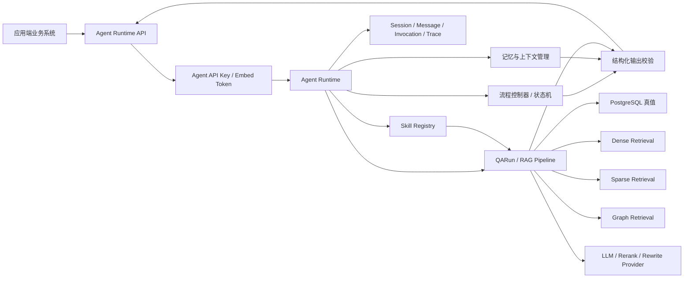
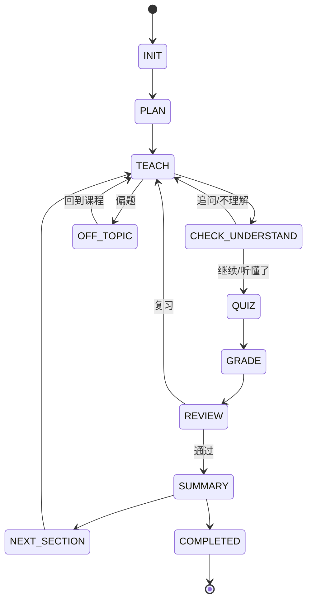

# Agent 场景化应用架构设计规范

> 本文是员工培训、SOP 作业助手、文件合规性检查和内部客服四类场景的上层架构规范，属于后续实现的活文档。本文定义平台端与应用端边界、统一 Agent Runtime、记忆上下文、Skill、状态机和结构化输出原则；员工培训的细化实现继续承接现有平台侧与外部应用设计规范。

## 1. 背景与目标

RAG 平台需要支持在某个知识库下创建一个或多个可对外调用的 Agent 智能体。智能体不是自由搭建的通用工作流，而是平台内嵌的固定场景流程；外部业务系统通过 API Key 调用这些智能体，并在自己的页面中渲染对话、按钮、题目、报告或其他结构化结果。

首批场景包括：

- 员工培训：学习计划、交互式教学、题库生成、测验和主观题评分。
- SOP 作业助手：细节待补，预期以作业步骤、过程确认和异常处理为主。
- 文件合规性检查：细节待补，预期以文件检查、规则命中、风险分级和整改建议为主。
- 内部客服：基于知识库的一问一答，支持记忆和上下文管理，答案必须说明出处并遵守安全边界。

设计目标：

- 统一四类场景的 Agent 创建、API Key、调用审计、会话记忆和运行追溯模型。
- 平台端负责 RAG、Agent、状态机、Skill、权限裁剪和结构化输出。
- 应用端负责自身用户体系、业务页面和结构化结果渲染，不直接访问模型、向量库或内部 Trace。
- 每次 Agent 输出都能追溯到知识库、配置版本、检索证据、Agent 会话和调用审计。

## 2. 关键假设

- 本文中的 `ReAct` 指 Agent 的推理与工具调用模式，即观察上下文、选择 Skill、调用工具、归纳结果并输出结构化动作；不指前端 React 框架。
- 平台内置场景流程优先于自由编排。用户可以创建和配置 Agent 实例，但不能在首版自定义任意 DAG。
- `pipelineDefinition` 仍是后端 RAG 执行契约，不等同于 Agent 场景状态机或页面 ViewModel。
- PostgreSQL 继续作为业务真值中心；向量库、OpenSearch 和图数据库是检索副本或图结构存储，不能替代业务真值。
- 本文是上层架构，SOP 和文件合规性检查只定义预留边界，待业务流程补充后再扩展细化规范。

## 3. 责任边界

### 3.1 平台端

平台端负责：

- 在知识库下创建、配置、停用和归档 Agent 智能体。
- 维护 Agent Template、Agent Instance、Agent API Key、Agent Session、Agent Message 和 Agent Invocation。
- 执行 RAG 检索、Evidence、Citation、权限裁剪、Trace 和 Metrics。
- 执行场景固定流程、状态机、ReAct 控制、Skill 调用和结构化输出校验。
- 管理短期上下文、摘要记忆、业务记忆和断线续接。
- 对外提供稳定 API，并保证所有调用可审计、可限流、可回放。

平台端不负责：

- 外部业务系统的完整用户管理、组织架构、员工档案、工单系统、证书系统或 UI 页面。
- 直接替代外部应用的业务主数据系统。
- 向外部应用暴露 Prompt、Provider 密钥、完整 Trace、未授权候选正文或内部配置明细。

### 3.2 应用端

应用端负责：

- 管理自己的用户、角色、页面路由、业务记录和展示状态。
- 保存平台 Agent 绑定信息和必要的业务映射，例如员工与学习计划、工单与会话、文件与检查任务。
- 通过服务端持有 API Key 调用平台 Agent；浏览器端不得直接保存长期 API Key。
- 渲染平台返回的文本、Citation、`uiActions`、题目、按钮、风险项和进度。
- 将用户点击、文字输入、审核结果、答题结果或文件检查事件回传平台。

应用端不负责：

- 调用 LLM、Embedding、Rerank 或 RAG Provider。
- 访问向量库、OpenSearch、Neo4j 或平台内部 Chunk 正文。
- 自行推进平台权威状态机。
- 修改平台 Agent 的内部流程和安全策略。

## 4. 统一对象模型

建议在现有 `RagApp` 基础上逐步演进为更明确的 Agent 模型。若短期仍沿用 `RagApp` 表，也应在 DTO、服务层和文档中使用 Agent 语义收口。

| 对象 | 说明 | 关键字段 |
| --- | --- | --- |
| `AgentTemplate` | 平台内置场景模板 | `templateId`、`scenarioType`、`name`、`defaultConfig`、`allowedSkills`、`outputSchemas` |
| `AgentInstance` | 某知识库下创建的智能体 | `agentId`、`kbId`、`templateId`、`defaultConfigRevisionId`、`status`、`metadata` |
| `AgentApiKey` | 对外调用凭据 | `apiKeyId`、`agentId`、`keyHash`、`status`、`expiresAt`、`lastUsedAt` |
| `AgentSession` | 一次对话、课堂、检查或作业任务 | `sessionId`、`agentId`、`externalUserId`、`state`、`contextSummary`、`status` |
| `AgentMessage` | 用户、助手或系统事件消息 | `messageId`、`sessionId`、`role`、`content`、`qaRunId`、`metadata` |
| `AgentInvocation` | 单次 Runtime 调用审计 | `invocationId`、`agentId`、`sessionId`、`messageId`、`qaRunId`、`status`、`errorCode` |
| `AgentRun` | Agent 层运行事实 | `agentRunId`、`sessionId`、`qaRunId`、`stateBefore`、`stateAfter`、`skillCalls`、`output` |

短期兼容关系：

- `AgentInstance` 可先映射到现有 `RagApp`。
- `AgentApiKey` 可先映射到现有 `RagAppApiKey`。
- `AgentSession` 可先映射到现有 `AppConversation`，但员工培训课堂、SOP 作业和合规检查建议后续独立出场景会话表。
- `AgentMessage` 可先映射到现有 `AppMessage`。
- `AgentInvocation` 可先映射到现有 `AppInvocation`。

## 5. 总体架构



执行链路：

1. 应用端携带 API Key 或短期 Token 调用 Agent Runtime。
2. 平台解析 Agent、知识库、配置版本、外部用户和会话。
3. 流程控制器读取当前状态，判断本次输入是点击事件、文本问题、文件事件还是审核事件。
4. 记忆模块构造短期上下文、摘要记忆和业务上下文。
5. ReAct 控制器选择允许的 Skill，并调用 RAG、题库、评分、意图识别或检查工具。
6. 平台对 Agent 输出做 schema 校验、权限校验和状态流转校验。
7. 写入会话、消息、调用审计、QARun 和 AgentRun。
8. 返回结构化响应给应用端渲染。

## 6. Agent Runtime 能力

### 6.1 ReAct 控制

Agent 可以基于当前输入、状态、上下文和可用 Skill 生成执行计划，但必须遵守以下边界：

- Agent 只能建议下一步动作，不能直接修改权威状态。
- Skill 调用必须来自白名单，不能由模型自由构造任意工具。
- Skill 输入必须经过 schema 校验，输出必须归一化后进入 Agent 输出。
- 所有重要动作必须写入 `AgentRun.skillCalls` 或等价审计字段。

### 6.2 流程控制器

流程控制器是程序组件，负责：

- 校验当前状态是否允许接收某类事件。
- 调用意图识别 Skill，将用户自然语言归类为追问、继续、结束、偏题、答题等意图。
- 根据状态机和意图决定是否推进状态、保持状态或拒绝操作。
- 将状态、用户输入和业务上下文交给 Agent 生成内容。
- 对 Agent 返回的 `suggestedNextState` 和 `uiActions` 做最终校验。

### 6.3 结构化输出

所有面向应用端的响应统一采用结构化 envelope：

```json
{
  "sessionId": "uuid",
  "messageId": "uuid",
  "agentRunId": "uuid",
  "qaRunId": "uuid-or-null",
  "visibleContent": "展示给用户的文本",
  "state": "TEACH",
  "uiActions": [],
  "citations": [],
  "control": {
    "canProceed": true,
    "requiresInput": false,
    "allowedEvents": []
  },
  "progressUpdate": {},
  "metadata": {}
}
```

原则：

- 应用端只根据结构化字段渲染，不解析自然语言中的隐藏标记。
- `visibleContent` 可以为空，但 `uiActions`、`state`、`control` 必须明确。
- Citation 只能来自授权 Evidence。
- 失败响应也应结构化，包含稳定 `errorCode` 和可展示 `message`。

## 7. 记忆与上下文管理

记忆分三层：

| 层级 | 用途 | 数据来源 | 使用方式 |
| --- | --- | --- | --- |
| 短期上下文 | 当前连续对话或任务窗口 | 最近 N 条 `AgentMessage`、当前状态、当前文档、小节、输入事件 | 注入 Agent prompt 或 Skill 输入 |
| 摘要记忆 | 长会话压缩和断线续接 | `contextSummary`、阶段总结、未完成动作 | 超过上下文窗口后替代完整历史 |
| 业务记忆 | 业务事实和进度 | 学习计划、学习进度、题目、答题、SOP 步骤、合规检查结果 | 由程序读取，不依赖模型记忆 |

管理规则：

- 记忆必须属于某个 `AgentSession`，不能跨 Agent 或跨应用随意复用。
- 短期上下文应限制轮数和 token，避免历史噪声污染当前任务。
- 摘要记忆由平台生成和更新，必须标注生成时间、覆盖范围和来源消息。
- 业务记忆是权威事实，优先从数据库读取；模型不能凭对话历史自行认定员工已完成学习或题目已通过。
- 断线续接时，平台应返回当前状态、最近消息、摘要记忆、待处理动作和允许事件。

## 8. Skill 管理

Skill 是平台内置能力，不等同于外部插件市场。首版建议用代码注册表维护：

| Skill | 用途 | 适用场景 |
| --- | --- | --- |
| `retrieveDocuments` | 检索相关文档和 Chunk | 全部场景 |
| `classifyIntent` | 判断用户输入意图 | 员工培训、SOP、客服 |
| `buildLearningPlanDraft` | 生成学习计划草稿 | 员工培训 |
| `generateQuestionDrafts` | 生成题目草稿 | 员工培训 |
| `teachDocumentSection` | 讲解单个文档或小节 | 员工培训 |
| `gradeObjectiveAnswer` | 客观题评分 | 员工培训 |
| `gradeSubjectiveAnswer` | 主观题辅助评分 | 员工培训 |
| `checkSopStep` | 校验 SOP 步骤输入 | SOP 作业助手 |
| `runComplianceCheck` | 执行文件合规检查 | 文件合规性检查 |
| `answerWithCitation` | 基于证据回答问题 | 内部客服 |
| `safetyCheck` | 越权、偏题和敏感输出检查 | 全部场景 |

Skill 调用约束：

- 每个 `AgentTemplate` 只能使用配置中允许的 Skill。
- Skill 输入输出必须有 schema。
- Skill 不能直接返回最终业务真值，必须经服务层校验和落库。
- 高风险 Skill 需要记录输入摘要、输出摘要、耗时、错误和调用者。

## 9. 员工培训场景

### 9.1 管理员流程

1. 管理员在应用端输入岗位名称和岗位描述。
2. 应用端调用平台员工培训 Agent 的学习规划接口。
3. 平台基于知识库检索相关文档，生成结构化学习计划草稿。
4. 应用端展示草稿，管理员可增删文档、调整顺序、调整能力分组和难易度。
5. 审核通过后，平台冻结学习计划版本。
6. 应用端将员工与岗位或学习计划绑定。
7. 管理员对单个文档触发 AI 出题。
8. 平台返回结构化题目草稿，题型支持判断、选择、主观题。
9. 管理员二次审核修改，最终入题库。

学习计划草稿核心字段：

- `jobTitle`
- `jobDescriptionSummary`
- `abilityGroups`
- `documents`
- `difficultyGroups`
- `readingOrder`
- `evidenceChunkIds`
- `recommendReason`

题目草稿核心字段：

- `questionType`
- `category`
- `stem`
- `options`
- `correctAnswer`
- `explanation`
- `rubric`
- `evidenceChunkIds`
- `difficulty`

### 9.2 员工学习流程

1. 员工登录应用端后查看绑定的学习计划。
2. 员工选择文档开始学习，应用端创建平台课堂 `AgentSession`。
3. 平台从 `INIT` 进入 `PLAN`，返回学习目标和当前文档结构。
4. 平台进入 `TEACH`，按小节讲解文档内容。
5. 讲解后进入 `CHECK_UNDERSTAND`，返回结构化按钮和追问入口。
6. 员工点击继续或输入继续，进入 `QUIZ`。
7. 员工追问时保持教学阶段，平台结合当前文档、已学内容和历史上下文补充解释。
8. 测验提交后进入 `GRADE`，客观题程序评分，主观题由 Agent 按 rubric 辅助评分。
9. 未通过进入 `REVIEW` 纠错复习，通过后进入 `SUMMARY`。
10. 仍有下一小节时进入 `NEXT_SECTION`，否则进入 `COMPLETED`。

### 9.3 教学状态机



控制规则：

- Agent 讲解完成后只返回 `suggestedNextState` 和 `uiActions`，状态是否推进由 Controller 决定。
- 用户点击“继续”时，Controller 校验当前状态后推进到 `QUIZ` 或下一允许状态。
- 用户输入“继续”时，先经 `classifyIntent` 判断，若等价于继续按钮，再推进状态。
- 用户输入“某内容不清楚”时，Controller 保持当前教学状态，调用 Agent 补充讲解。
- 用户输入“本节课结束”等越权指令时，Controller 直接拒绝，不交给 Agent 自由推进。
- 偏题时进入 `OFF_TOPIC`，返回可展示提示，并允许用户回到当前课程。

### 9.4 异常与续接

- LLM 或 Provider 失败：返回结构化错误，保留当前状态，允许重试。
- 题目生成失败：可回退到草稿失败状态，不生成可发布题库。
- 用户中断后续接：读取 `AgentSession.state`、`contextSummary`、最近消息、当前文档、小节进度和待处理动作。
- 重复点击按钮：使用事件幂等键避免重复推进状态。
- 应用端超时：平台保留 `AgentInvocation` 状态，允许按 `sessionId` 查询最新状态。

## 10. 内部客服场景

内部客服是最轻量的 Agent Template：

- 输入为用户问题和可选 `conversationId`。
- 平台检索绑定知识库，返回答案和 Citation。
- 支持短期上下文和摘要记忆，用于理解连续追问。
- 无可靠证据时拒答或建议人工渠道。
- 不执行写操作，不推进复杂业务状态。
- 不暴露内部 Trace、未授权 Chunk、系统提示词和 Provider 信息。

建议状态：

- `ACTIVE`
- `WAITING_USER`
- `ESCALATED`
- `CLOSED`

输出字段：

- `answer`
- `citations`
- `suggestedQuestions`
- `handoffSuggestion`
- `safetyNotice`

## 11. SOP 作业助手预留

SOP 作业助手待补业务细节，首版预留以下方向：

- 以作业任务为 `AgentSession`。
- 以 SOP 步骤为状态机节点或业务进度。
- 支持步骤讲解、操作确认、异常上报、材料或照片附件说明。
- Agent 可以解释步骤和检查输入，但不能替代程序确认关键操作完成。
- 高风险步骤需要应用端或平台端保留人工确认记录。

待补充问题：

- SOP 是否需要绑定设备、工单、班组或地点。
- 作业步骤是否来自知识库文档解析，还是来自结构化 SOP 表。
- 是否允许上传现场图片、日志或表单作为 Agent 输入。
- 哪些步骤必须强制人工确认，哪些可以由 AI 辅助判断。

## 12. 文件合规性检查预留

文件合规性检查待补业务细节，首版预留以下方向：

- 以一次文件检查任务为 `AgentSession`。
- 输入可以是知识库既有文档、应用端上传文件引用或文档版本。
- 平台按规则集执行分段检查，输出结构化问题清单。
- 每个问题必须包含风险等级、命中规则、证据位置、整改建议和置信度。
- AI 只能辅助判断和生成建议，最终合规结论需要程序规则或人工审核确认。

待补充问题：

- 合规规则来自固定规则库、知识库文档，还是人工配置。
- 文件类型范围和解析方式。
- 检查结果是否需要生成正式报告。
- 风险等级和整改闭环是否需要应用端流程承接。

## 13. API 草案

统一 Agent 管理接口：

- `GET /api/v1/agent-templates`
- `POST /api/v1/knowledge-bases/{kbId}/agents`
- `GET /api/v1/knowledge-bases/{kbId}/agents`
- `GET /api/v1/agents/{agentId}`
- `PATCH /api/v1/agents/{agentId}`
- `POST /api/v1/agents/{agentId}/disable`
- `POST /api/v1/agents/{agentId}/api-keys`
- `DELETE /api/v1/agents/{agentId}/api-keys/{apiKeyId}`

统一 Runtime 接口：

- `POST /api/v1/agent-runtime/sessions`
- `GET /api/v1/agent-runtime/sessions/{sessionId}`
- `POST /api/v1/agent-runtime/sessions/{sessionId}/events`
- `POST /api/v1/agent-runtime/chat-messages`
- `POST /api/v1/agent-runtime/feedback`

员工培训专用接口可在统一 Runtime 之上保留清晰语义：

- `POST /api/v1/training/plans/drafts`
- `POST /api/v1/training/plans/{planId}/review`
- `POST /api/v1/training/questions/drafts`
- `POST /api/v1/training/questions/{questionId}/review`
- `POST /api/v1/training/classroom/sessions`
- `POST /api/v1/training/classroom/sessions/{sessionId}/events`

字段约定：

- API 请求和响应使用 `camelCase`。
- 数据库字段使用 `snake_case`。
- 外部响应不返回完整内部 Trace。
- 所有写事件建议支持 `X-Request-Id` 或业务幂等键。

## 14. 安全与审计

- Agent API Key 明文只在创建时返回，平台只保存 hash 和摘要。
- 浏览器嵌入或前端直连场景必须使用短期 Token，不暴露长期 API Key。
- Agent Runtime 必须校验 Agent、知识库、配置版本、会话和外部用户上下文。
- 检索候选进入生成前必须回表 PostgreSQL 做最终权限裁剪。
- Graph 结果必须回落到授权 Chunk 后才能进入回答上下文。
- 外部应用不能通过 `sessionId`、`messageId` 或 `qaRunId` 读取其他 Agent 的历史。
- 每次调用必须写入 Invocation，包含状态、错误码、耗时和响应摘要。
- 高风险输出必须记录 Skill 调用摘要和安全检查结果。

## 15. 与现有设计的关系

- 本文上承总体设计、详细设计和接口设计中的 RAG App Runtime、QARun、Provider 抽象和权限裁剪原则。
- 员工培训细化继续参考 `2026-05-26-employee-training-agent-platform-design.md`。
- 外部培训应用边界继续参考 `2026-05-26-external-training-app-design.md`。
- 当前已有 `builtin_employee_training_v1` 和 `builtin_knowledge_qa_v1` 可视为 `AgentTemplate` 的早期形态。
- 后续若从 `RagApp` 迁移到 `AgentInstance`，应通过兼容 DTO 和迁移脚本逐步完成，不应破坏既有 App Runtime 调用。

## 16. 验收标准

- 平台可在同一知识库下创建多个不同场景 Agent。
- 每个 Agent 可独立发放和撤销 API Key。
- 应用端可以通过 API Key 调用 Agent，并获得结构化输出。
- Agent 输出可追溯到 Agent、Session、Message、Invocation、QARun、ConfigRevision 和 Evidence。
- 员工培训课堂状态由程序 Controller 控制，Agent 不能越权推进状态。
- 内部客服回答必须带 Citation，无证据时拒答或提示人工渠道。
- 外部应用不访问 LLM、Embedding、向量库、OpenSearch、Neo4j、Prompt 或内部 Trace。
- 断线续接能恢复当前状态、上下文摘要、最近消息和允许操作。
