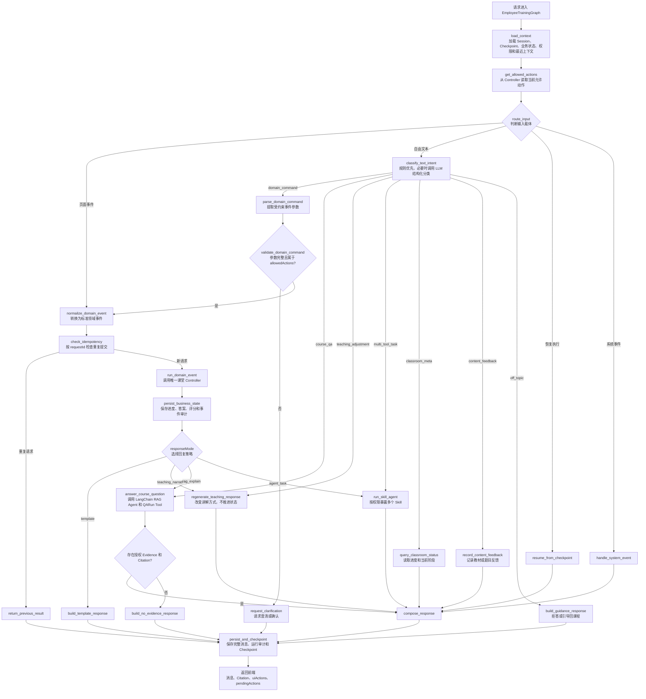
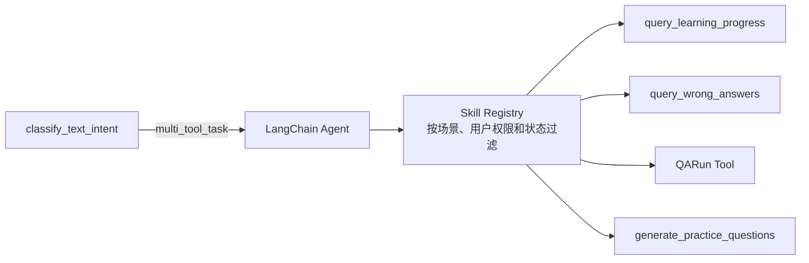

# 员工培训课堂 Graph 完整编排设计规范

> 用途：本文是员工培训课堂接入 LangGraph 时的详细编排规范，属于 E35 / B-329 的设计依据。本文细化 `2026-06-01-langchain-langgraph-agent-runtime-spec.md` 中的课堂 Graph 边界，不替代平台级规范，不维护 Backlog、Sprint 或 Release 当前状态。

## 1. 背景

现有 `training_classroom_service.py` 已具备可运行的课堂 Controller：

- `CLASSROOM_TRANSITIONS` 定义课堂状态转移。
- `submit_classroom_event()` 处理按钮事件、追问、答题、评分、复习、章节推进和完成判定。
- `_is_continue_intent()`、`_is_illegal_command()` 和 `_is_off_topic()` 使用轻量规则处理少量自由文本。
- `_answer_query_with_agent()` 调用现有 App Runtime 完成课程追问。
- `training_classroom_messages` 保存完整消息，`training_classroom_events` 保存课堂事件。

现有培训 Skill Registry 已登记 `classifyIntent`，但当前实现只使用该名称记录审计，没有真正执行结构化意图分类。

平台接入 LangGraph 后，课堂不应只区分“按钮事件”和“文本追问”。自然语言还可能表达状态推进命令、讲解调节、课堂状态查询、内容纠错反馈和多工具任务。若没有统一路由，容易出现以下问题：

- 用户输入“下一节”时无法复用页面按钮对应的领域校验。
- 用户输入“我选 B”时被误当成普通知识问答。
- 页面点击推进状态后，只返回固定文本，无法按需触发教学讲解。
- LLM、Skill 或 Graph 节点绕过 Controller 直接改写进度或评分。
- 同一条自然语言在不同课堂状态下被错误解释。

## 2. 目标

建设一套 `EmployeeTrainingGraph`，统一处理课堂请求：

1. 页面事件直接转换为标准领域事件，不调用意图识别模型。
2. 自由文本先通过确定性规则，再按需调用 LLM 结构化分类器。
3. 自然语言领域命令转换为标准领域事件，与页面事件汇入同一个 Controller 入口。
4. Controller 继续作为状态推进、评分、进度和权限校验的唯一实现。
5. Controller 返回响应策略，Graph 按策略决定固定反馈、课程问答、讲解生成或多 Skill 编排。
6. LangGraph 保存运行态和恢复点，PostgreSQL 继续保存完整消息和业务真值。
7. 每次分类、模型调用、Tool 调用、状态推进和降级均可审计。

## 3. 非目标

本文不做以下事项：

- 不复制第二套课堂状态机。
- 不让 LLM、LangChain Agent 或 Skill 直接写入课堂进度、评分和完成状态。
- 不把所有页面点击都交给 LLM 判断。
- 不让 `classifyIntent` 以 Agent 形式循环调用 Tool。
- 不在本阶段开发 SOP Graph 或文件合规检查 Graph。
- 不以 LangGraph Checkpoint 替代业务表、完整消息日志或审计表。
- 不要求每次按钮点击都调用 LLM。

## 4. 核心原则

### 4.1 Graph 是课堂编排器

`EmployeeTrainingGraph` 是员工培训课堂的完整运行编排，不是新的业务真值来源。它负责：

- 加载课堂 Session、Checkpoint、当前状态和权限。
- 区分页面事件、自由文本、恢复事件和系统事件。
- 调用意图分类器、QARun Tool、LangChain Agent 和现有课堂 Controller。
- 根据 Controller 的响应策略生成教学回复。
- 保存完整消息、审计关联和 Checkpoint。

### 4.2 Controller 是唯一状态机

所有会修改课堂业务状态的操作都必须进入现有 Controller：

```text
标准领域事件
  -> Controller 校验当前状态
  -> Controller 执行业务更新
  -> PostgreSQL 保存权威事实
```

禁止以下链路：

```text
classify_text_intent -> 直接更新课堂状态
LangChain Agent      -> 直接修改评分
Skill                -> 绕过 Controller 完成课程
Graph 条件边         -> 自行维护第二套状态转移表
```

### 4.3 语义理解和业务授权分开

LLM 可以判断用户文本“可能想做什么”，但不能判断该操作“是否允许执行”。最终执行必须经过程序 Schema 校验、允许动作校验和 Controller 校验。

## 5. 完整编排图



## 6. 输入模型

### 6.1 页面事件

页面按钮提交结构化事件：

```json
{
  "eventType": "submit_quiz",
  "requestId": "REQ-001",
  "payload": {
    "questionId": "Q-1024",
    "answer": "B"
  }
}
```

页面事件已经有明确语义，不经过 LLM。Graph 只做 Schema 校验、幂等检查和标准化，然后调用 Controller。

### 6.2 自由文本

自由文本提交：

```json
{
  "eventType": "query",
  "requestId": "REQ-002",
  "query": "这道题我选 B"
}
```

Graph 先识别文本意图。如果结果为 `domain_command`，则转换为标准领域事件：

```json
{
  "eventType": "submit_quiz",
  "requestId": "REQ-002",
  "payload": {
    "questionId": "Q-1024",
    "answer": "B"
  },
  "source": "natural_language"
}
```

页面点击和自然语言命令最终汇入相同的 `run_domain_event` 节点。

## 7. 意图分类

### 7.1 混合分类链路

分类采用四层机制：

```text
页面结构化事件
  -> 不调用分类模型

自由文本
  -> 安全拦截规则
  -> 高置信度快捷规则
  -> LLM 结构化分类
  -> 程序校验
  -> Controller 校验
```

其中：

- 安全拦截规则用于识别明确越权命令，例如“跳过测验”“直接完成课程”。
- 快捷规则只处理少量语义稳定的文本，例如“退出课堂”“重复一下”。
- “继续”“下一步”必须结合当前 `allowedActions` 判断。只有一个安全解释时才自动转换，否则要求用户确认。
- 其余自由文本调用一次结构化分类模型。

### 7.2 分类结果 Schema

```python
class TextIntentResult(BaseModel):
    """自由文本分类结果；只描述用户意图，不授予业务执行权限。"""

    intent: Literal[
        "domain_command",
        "course_qa",
        "teaching_adjustment",
        "multi_tool_task",
        "classroom_meta",
        "content_feedback",
        "off_topic",
    ]
    command: DomainCommand | None = None
    confidence: float = Field(ge=0, le=1)
    reason: str
```

### 7.3 分类器输入

分类器至少接收：

- 用户文本。
- 当前课程名称、章节和知识点摘要。
- 当前课堂状态。
- Controller 返回的 `allowedActions`。
- 当前题目和选项摘要。
- 最近少量对话和已压缩摘要。
- 当前可用 Skill 的能力摘要。
- 七类意图定义和正反例。

分类器不得接收：

- Provider 密钥。
- 未授权 Chunk。
- 其他学员的进度和成绩。
- 可绕过 Controller 的数据库连接或内部函数。

### 7.4 意图类别

| 意图 | 判断标准 | 示例 | 后续节点 |
| --- | --- | --- | --- |
| `domain_command` | 用户要求推进课堂、提交答案或执行明确课堂动作 | “下一节”“我选 B”“重新学习” | `parse_domain_command` |
| `course_qa` | 用户询问课程材料中的知识、术语或流程 | “制动系统有哪些组成部分？” | `answer_course_question` |
| `teaching_adjustment` | 用户要求改变讲解方式，但不推进进度 | “讲简单一点”“再举个例子” | `regenerate_teaching_response` |
| `multi_tool_task` | 请求需要组合检索、错题、进度或题目生成能力 | “根据错题推荐复习章节并出三道题” | `run_skill_agent` |
| `classroom_meta` | 用户查询自己的课堂进度或当前阶段 | “我学到哪里了？” | `query_classroom_status` |
| `content_feedback` | 用户反馈教材、题目或答案可能存在问题 | “这道题答案可能不对” | `record_content_feedback` |
| `off_topic` | 请求与当前培训目标无关 | “帮我写一封请假邮件” | `build_guidance_response`，需要进入 `OFF_TOPIC` 时仍调用 Controller |

越权请求不等同于普通 `off_topic`。权限检查应在分类前后都执行，拒绝结果写入安全审计。

### 7.5 置信度策略

模型输出的 `confidence` 只用于辅助保护，不视为业务授权：

| 条件 | 处理 |
| --- | --- |
| 页面事件 | 不看模型置信度，直接执行程序校验 |
| 快捷规则唯一匹配且属于 `allowedActions` | 直接转换为标准领域事件 |
| LLM 识别为只读意图且 `confidence >= 0.60` | 执行只读节点 |
| LLM 识别为 `domain_command` 且 `confidence >= 0.85`，参数完整并属于 `allowedActions` | 转换为标准领域事件 |
| LLM 识别为 `domain_command` 但存在多个解释、参数缺失或不属于 `allowedActions` | 请求澄清或确认 |
| `confidence < 0.60` | 请求澄清，不推进状态 |

## 8. `classifyIntent` 与 Skill 的关系

`classifyIntent` 是受控分类能力，不是拥有流程控制权的 Agent：

```text
EmployeeTrainingGraph
  -> classify_text_intent
      -> LangChain ChatModel.with_structured_output(TextIntentResult)
      -> 写入 training_skill_calls 审计
```

它不调用 Tool，不修改数据库业务状态，也不自行循环推理。

`multi_tool_task` 分支才进入 LangChain Agent：



Skill 调用规则：

- 只读 Skill 可以由 Agent 在白名单范围内调用。
- 写操作 Skill 必须经过领域服务校验。
- 影响进度、评分、完成状态或审核结果的 Skill 必须回到对应 Controller。
- 高风险写操作需要显式确认或 LangGraph `interrupt()`。

## 9. Controller 与响应策略

### 9.1 Controller 输出

Controller 执行标准领域事件后，返回内部结果：

```python
class ClassroomDomainResult(BaseModel):
    """课堂领域事件结果；Graph 依据 responseMode 选择回复节点。"""

    eventType: str
    resultState: str
    responseMode: Literal["template", "teaching_narration", "rag_explain", "agent_task"]
    responseContext: dict[str, Any] = Field(default_factory=dict)
    uiActions: list[ClassroomUiActionDTO] = Field(default_factory=list)
    citations: list[ClassroomCitationDTO] = Field(default_factory=list)
    progressUpdate: ClassroomProgressUpdateDTO | None = None
```

`responseMode` 由确定性领域策略生成，不由模型自由决定。

### 9.2 页面事件如何触发模型回复

| 页面事件 | Controller 更新 | `responseMode` | 后续行为 |
| --- | --- | --- | --- |
| `start` | `INIT -> PLAN` | `template` | 展示学习计划 |
| `continue` from `PLAN` | `PLAN -> TEACH` | `teaching_narration` | 基于当前章节生成开场讲解 |
| `continue` from `TEACH` | `TEACH -> CHECK_UNDERSTAND` | `template` | 展示理解确认按钮 |
| `submit_quiz` 且答错 | 保存答案和评分，进入 `GRADE` | `rag_explain` | 基于课程证据解释错因 |
| `submit_quiz` 且答对 | 保存答案和评分，进入 `GRADE` | `template` | 返回简短反馈 |
| `retry_teach` | `REVIEW -> TEACH` | `teaching_narration` | 根据薄弱点重新讲解 |
| `next_section` | 推进章节并进入 `TEACH` | `teaching_narration` | 生成新章节讲解 |
| 重复 `requestId` | 不重复更新 | `template` | 返回首次处理结果 |

不是每次点击都调用模型。只有需要教学内容生成或基于证据解释时才调用。

## 10. 状态、消息和 Checkpoint

### 10.1 领域状态

PostgreSQL 领域表继续保存：

- 当前章节和课堂状态。
- 答题记录、评分、通过线和复习结果。
- 学习进度和完成状态。
- 完整课堂消息。
- 课堂事件和 Skill 调用审计。

### 10.2 Graph 运行状态

LangGraph Checkpoint 保存：

- `thread_id = classroom_session_id`。
- 当前 Graph 节点和恢复点。
- 最近模型上下文、摘要和待确认命令。
- 本次 `requestId`、意图分类结果和 Tool 调用中间态。

Checkpoint 不替代 PostgreSQL 业务状态。恢复时必须重新读取领域表。

### 10.3 幂等

`ClassroomEventSubmitRequest` 增加可选 `requestId`。有副作用的页面事件和自然语言领域命令应携带该值：

- 相同 `sessionId + requestId` 只执行一次领域更新。
- 首次事件保存最小响应快照，重复请求直接返回该快照。
- LangGraph 恢复或重放时先执行 `check_idempotency`。
- QARun 问答和纯只读查询可以记录调用，但不得重复修改业务状态。

## 11. 异常与降级

| 异常 | 行为 |
| --- | --- |
| 分类模型失败 | 回退到安全规则；无法判断时请求用户使用页面按钮或补充说明 |
| 分类结果 Schema 非法 | 不执行领域命令，记录审计并请求澄清 |
| 自然语言命令不属于 `allowedActions` | 不执行，返回当前可用操作 |
| QARun 无授权 Evidence | 明确说明课程材料中未找到可靠依据 |
| QARun 或模型超时 | 保留当前业务状态，允许重试 |
| Skill 超时 | 返回部分结果或失败提示，不隐式修改进度 |
| Checkpoint 写入失败 | 记录运行异常；有副作用节点不得自动重复执行 |
| 重复页面提交 | 返回首次处理结果 |

## 12. 首期实施边界

首期必须实现：

1. 页面事件与自然语言领域命令汇入同一个 Controller。
2. 混合意图路由：安全规则、快捷规则、结构化 LLM 分类和程序复核。
3. `domain_command`、`course_qa`、`teaching_adjustment`、`classroom_meta`、`content_feedback` 和 `off_topic`。
4. `multi_tool_task` 路由和 Skill 白名单边界；首期只接入已存在且有真实用途的 Skill。
5. Controller 响应策略和页面事件后的按需模型讲解。
6. `requestId` 幂等保护、Checkpoint 恢复和完整消息保留。
7. 分类、状态推进、Tool、Skill、降级和耗时审计。

首期不要求：

- 开放任意 Skill 动态编排。
- 自动修改学习计划或题库发布状态。
- 使用 Agent 自行决定课堂状态。
- 实现 SOP Graph。

## 13. 验收标准

- 页面按钮不调用意图分类模型。
- “下一节”和“我选 B”可转换为领域事件，并经过与页面按钮一致的 Controller 校验。
- 含义不明确的“继续”在存在多个安全解释时要求确认。
- `classifyIntent` 真实使用 LangChain 结构化输出，并写入审计。
- 自由文本分类失败时不推进课堂状态。
- 页面点击进入新章节或错题复习后，可按 `responseMode` 触发模型讲解。
- 模型、Skill 和 Graph 条件边均不能绕过 Controller 修改进度、评分或完成状态。
- 相同 `sessionId + requestId` 不会重复推进状态。
- QARun 无授权 Evidence 时稳定返回无依据说明。
- Checkpoint 恢复后不会重复执行已有副作用的节点。
- `training_classroom_messages` 继续保留完整消息，不因摘要压缩删除记录。
