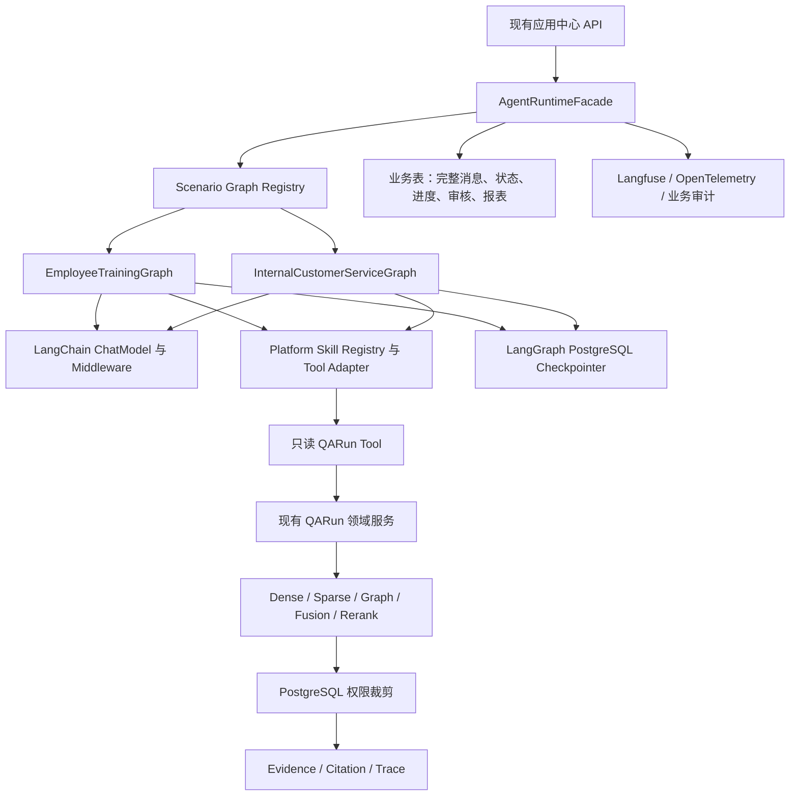
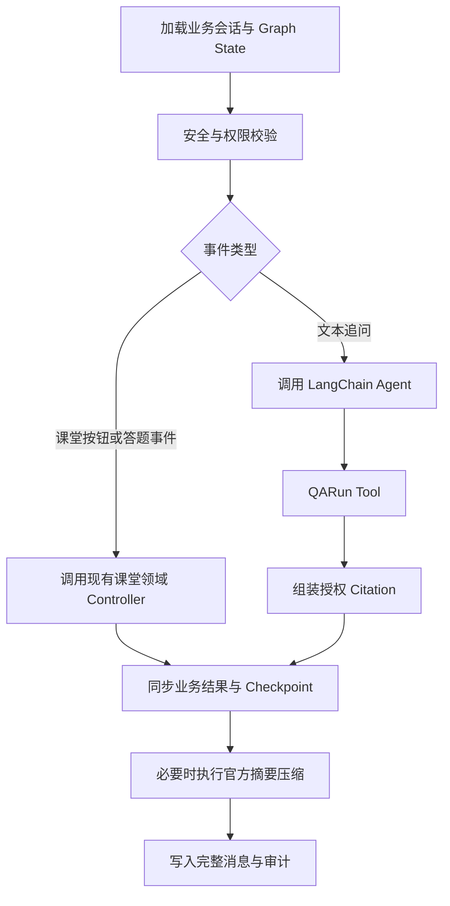
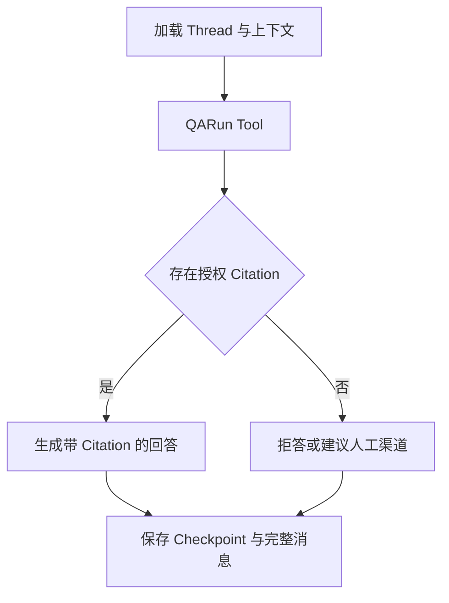

# LangChain 与 LangGraph 平台 Agent Runtime 渐进接入设计规范

> 用途：本文是平台级 Agent Runtime 框架接入的设计规范，属于后续实施计划的设计依据。当前 Backlog、Sprint 和 Release 状态仍以 `docs/04-迭代与交付/产品待办清单.md`、`docs/04-迭代与交付/sprints/README.md` 和 `docs/04-迭代与交付/releases/README.md` 为准。
>
> 本文只定义 LangChain 与 LangGraph 的接入边界、过渡策略、评审门禁和验收口径，不直接修改现有业务实现。

## 1. 背景

当前平台已经具备：

- 自研 `QARun` 受控 RAG Pipeline，覆盖多路检索、融合、重排、权限裁剪、上下文打包、生成、Evidence、Citation 和 Trace。
- RAG App Runtime，覆盖 API Key、会话、消息、调用审计和反馈回流。
- 员工培训课堂状态机，覆盖学习计划、教学、追问、测验、评分、复习、章节推进、完成判定、权限隔离和报表。
- 完整消息落库能力，以及课堂 `context_summary` 字段和轻量预览摘要。

当前主要缺口是通用 Agent Runtime 能力仍以场景内手写逻辑为主：

- 课堂追问仅拼接固定条数的最近消息，没有 token 预算、自动摘要压缩和可靠恢复点。
- 模型访问存在多处直接 HTTP 调用，结构化输出、重试、Fallback 和 Provider 能力判断尚未形成统一适配层。
- Skill Registry 已有员工培训专用实现，但尚未形成平台级 Tool、Middleware 和 MCP 接入边界。
- 新增内部客服、SOP 或合规检查场景时，存在继续复制上下文管理、会话恢复和工具调用逻辑的风险。

## 2. 目标

采用 `LangChain + LangGraph` 建设平台级 Agent Runtime，按渐进方式接入现有系统：

1. 保留现有 `QARun`，封装为只读 Tool。
2. 优先使用 LangGraph 接管 Agent Session 运行态、Checkpoint 和断线恢复。
3. 优先使用 LangChain 提供模型适配、结构化输出、摘要压缩、Tool、Middleware 和未来 MCP 接入能力。
4. 以员工培训课堂作为首个复杂场景，以内部客服作为最小对照场景。
5. 保留审核发布、进度、评分、权限和报表等领域服务。
6. 暂不开发 SOP 作业助手和文件合规检查，但平台 Runtime 不得写死课堂语义。

## 3. 非目标

本轮不做以下事项：

- 不删除或重写现有 `QARun` Pipeline。
- 不让 Agent 直接访问 Milvus、OpenSearch、Neo4j 或未裁剪 Chunk。
- 不用 LangGraph Checkpoint 替代 PostgreSQL 业务表、完整消息日志或审计表。
- 不在首轮迁移中删除现有 HTTP Provider，旧路径保留为受控回退和对照基线。
- 不同时引入 LlamaIndex 生产链路。
- 不开发 SOP 作业助手和文件合规检查业务流程。
- 不将平台改造成用户可自由编排任意 DAG 的工作流产品。

## 4. 核心原则

### 4.1 单一业务真值

PostgreSQL 业务表继续保存权威事实：

- 完整消息日志。
- 课堂当前状态、章节和待处理动作。
- 学习计划、题库、审核发布、评分、进度和报表。
- App、知识库、配置版本、权限和审计。
- `QARun`、Evidence、Citation 和检索配置快照。

LangGraph Checkpoint 只保存 Agent 执行运行态：

- `thread_id`。
- 当前 Graph 节点和恢复点。
- 模型上下文窗口和摘要压缩结果。
- Tool 调用中间状态。
- 中断、恢复和回放所需的 Graph State。

Checkpoint 不得成为业务状态唯一来源。业务 API 返回结果必须以领域服务和业务表为准。

### 4.2 单一能力主实现

过渡期允许保留旧路径，但同一会话内每项能力只能有一个主实现。禁止同一请求先后经过两套会修改状态的实现。

| 能力 | 过渡期主实现 | 目标主实现 | 禁止事项 |
| --- | --- | --- | --- |
| RAG 查询执行 | 现有 `QARun` | 现有 `QARun`，通过只读 Tool 调用 | Agent 直接访问检索 Provider |
| 完整消息日志 | 现有业务表 | 现有业务表 | 只保存 Checkpoint，不保存完整消息 |
| Agent 运行态恢复 | 旧会话恢复逻辑 | LangGraph Checkpointer | 两套恢复逻辑同时推进状态 |
| 上下文窗口与摘要压缩 | 固定消息窗口 | LangChain 官方摘要中间件 | 新增另一套手写截断摘要作为目标实现 |
| 课堂状态推进 | 现有领域 Controller | 现有领域 Controller，由 Graph 节点调用 | 模型或 Graph 边直接绕过领域校验改状态 |
| 模型访问 | 现有 HTTP Provider | LangChain ChatModel Adapter | 新场景继续新增零散 `httpx.post()` |
| Tool 与 Skill 调用 | 现有培训 Skill Registry | 平台 Skill Registry + LangChain Tool Adapter | 模型调用未登记白名单的任意函数 |
| 审核、评分、进度、报表 | 现有领域服务 | 现有领域服务 | 将业务真值放入 Prompt 或 Checkpoint |

### 4.3 框架能力必须真实使用

不得仅新增一层名为 `LangGraph` 的包装器，内部仍全部走旧的固定窗口和手写流程。最终验收必须能够提供以下证据：

- 真实创建并使用 LangGraph `thread_id` 和 PostgreSQL Checkpointer。
- 真实执行 LangGraph 节点和条件路由，Checkpoint 可恢复到最近稳定节点。
- 真实使用 LangChain ChatModel Adapter 调用模型。
- 真实使用 LangChain Tool 封装调用 `QARun`。
- 真实使用 LangChain 官方摘要中间件管理长对话上下文。
- 真实使用 LangChain `create_agent()` 构建课堂和客服共用的 RAG Agent，并挂载模型调用限额与 Tool 调用限额中间件。
- 真实记录 Tool 调用、模型调用、摘要压缩和 Graph 节点耗时。
- 课堂场景没有重复维护第二份状态机。

若 Provider 不支持 Tool Calling 或原生 Structured Output，允许适配层采用 LangChain 支持的兼容模式并保留 JSON Parse 回退；该限制必须通过 Provider 能力测试记录，不得静默退化为新的手写主链路。

## 5. 总体架构



### 5.1 平台 Runtime 模块

新增平台级目录：

```text
backend/app/services/agent_runtime/
  model_adapter.py
  qa_run_tool.py
  checkpoint_service.py
  memory_service.py
  skill_adapter.py
  rag_agent_factory.py
  scenario_registry.py
  runtime_facade.py
  graphs/
    employee_training_graph.py
    internal_customer_service_graph.py
```

职责如下：

| 模块 | 职责 |
| --- | --- |
| `model_adapter.py` | 统一创建 LangChain ChatModel，集中配置 `base_url`、模型、超时、重试和 Provider 能力 |
| `qa_run_tool.py` | 将现有 `QARun` 封装为只读 LangChain Tool，只返回授权后的答案、Citation 和必要指标 |
| `checkpoint_service.py` | 创建 PostgreSQL Checkpointer，管理 `thread_id` 和 Checkpoint 生命周期 |
| `memory_service.py` | 配置 LangChain 官方摘要中间件，将成功压缩结果同步到业务摘要字段 |
| `skill_adapter.py` | 将平台 Skill Registry 中允许的 Skill 转换为 LangChain Tool，并统一权限、超时和审计 |
| `rag_agent_factory.py` | 使用 LangChain `create_agent()` 统一组装 ChatModel、只读 QARun Tool、官方摘要、模型调用限额和 Tool 调用限额 |
| `scenario_registry.py` | 按 `scenarioType` 返回对应 Graph，不写死课堂逻辑 |
| `runtime_facade.py` | 作为业务服务唯一调用入口，负责版本路由、Graph 执行、审计关联和降级 |
| `employee_training_graph.py` | 编排课堂运行态、恢复点、追问 Tool 和领域 Controller 调用 |
| `internal_customer_service_graph.py` | 编排轻量问答、Citation、摘要记忆和无证据拒答 |

### 5.2 课堂 Graph 边界

员工培训 Graph 首版只负责编排，不复制课堂状态机规则：



领域 Controller 仍负责：

- 校验课堂状态流转。
- 判断通过分、章节完成和复习路径。
- 更新进度和答题记录。
- 生成结构化 `uiActions`。
- 拒绝越权结束、跳过测验和跨 App 调用。

Graph 负责：

- 绑定 `thread_id = classroom_session_id`。
- 构建模型上下文。
- 触发 Tool 调用。
- 保存 Checkpoint。
- 恢复最近稳定运行态。
- 记录 Graph 节点耗时、Tool 耗时和摘要压缩事件。

### 5.3 内部客服 Graph 边界

内部客服用于验证 Runtime 没有写死课堂语义：



内部客服不引入课堂进度、题库、审核和评分依赖。

## 6. 数据与标识映射

| 平台对象 | LangGraph 对象 | 规则 |
| --- | --- | --- |
| `training_classroom_sessions.session_id` | `thread_id` | 课堂会话创建后固定绑定，不允许请求中途切换 |
| `app_conversations.conversation_id` | `thread_id` | 内部客服会话创建后固定绑定 |
| `training_classroom_messages` / `app_messages` | 完整消息日志 | 永久保存原始消息，不因压缩删除 |
| `context_summary` | 业务摘要镜像 | 仅在官方摘要压缩成功后更新；失败时保留旧值 |
| `qa_runs.run_id` | Tool 调用结果关联 | Tool 返回 `runId`，审计可跳转到 QARun |
| `app_invocations` / 场景调用审计 | Runtime 调用事实 | 记录 Graph 版本、Checkpoint、Tool 和失败信息 |

新增 Graph Checkpoint 表由 LangGraph PostgreSQL Checkpointer 管理，不手写与框架内部结构重复的表。

## 7. 双轨过渡策略

### 7.1 Runtime 版本固定

每个新建会话必须记录 `runtimeVersion`：

| 值 | 含义 |
| --- | --- |
| `legacy_v1` | 使用当前实现，作为回归基线 |
| `langgraph_shadow_v1` | 主响应仍来自旧路径；Graph 仅执行无副作用的状态镜像、上下文构建和差异记录 |
| `langgraph_primary_v1` | Graph 成为运行态主路径；旧路径仅保留显式回退入口 |

约束：

- 会话创建后固定 `runtimeVersion`，禁止单次请求在新老路径之间来回切换。
- Shadow 模式不得重复调用真实 LLM、真实 `QARun` 或写业务状态，避免双倍成本和副作用。
- Primary 模式中不得先执行旧逻辑再执行 Graph。
- 回退必须生成审计记录，包含原因、入口和影响范围。

### 7.2 退出旧路径的条件

旧路径只有在以下条件全部满足后才能退出默认主链路：

1. LangGraph Primary 模式通过课堂 E2E、长会话压缩、断线恢复、权限隔离和并发回归。
2. 内部客服通过连续追问、Citation、无证据拒答和恢复测试。
3. 新老路径在固定数据集上的回答状态、Citation 数量、课堂状态和错误码差异已人工复核。
4. Graph Checkpoint、LangChain Tool、摘要压缩和 ChatModel 调用均可从 Trace 中定位。
5. 性能基线没有出现不可接受退化。
6. Code Review 已确认没有新增长期使用的手写上下文窗口或第二套课堂状态机。

旧路径退出默认主链路后仍可保留一个版本周期，用于紧急回滚。

## 8. 上下文与摘要压缩

### 8.1 三层记忆

| 层级 | 数据来源 | 用途 |
| --- | --- | --- |
| 短期上下文 | LangGraph State 中最近消息、当前状态、当前文档和事件 | 当前模型调用 |
| 摘要记忆 | LangChain 官方摘要中间件输出与业务摘要镜像 | 长对话压缩和断线续接 |
| 业务记忆 | PostgreSQL 中的计划、题库、进度、答题和权限 | 权威事实 |

### 8.2 压缩规则

- 使用 token 预算触发压缩，不再以固定消息条数作为目标策略。
- 压缩只影响下一次模型调用上下文，不删除完整消息。
- 压缩结果必须记录生成时间、覆盖消息范围、来源会话和摘要版本。
- 摘要失败时使用旧摘要和最近窗口继续运行，不阻断课堂。
- 压缩失败必须写入可检索 Trace 和业务审计。
- 业务完成状态不得由模型摘要推断，必须从数据库读取。

## 9. Tool、Skill 与 MCP

### 9.1 QARun Tool

`QARun Tool` 是首个必须落地的平台 Tool：

- 输入：`query`、`appId`、`endUserId`、场景上下文和允许的配置版本。
- 内部：调用现有 App Runtime 或 `QARun` 服务。
- 输出：`runId`、授权后的回答、Citation、Evidence 摘要和必要指标。
- 禁止：返回未授权候选、Provider 密钥、完整内部 Trace 或底层数据库连接。

### 9.2 Skill Registry

平台 Skill Registry 至少包含：

- Skill 名称和版本。
- 描述。
- 输入输出 Schema。
- 允许场景。
- 允许 Agent。
- 读写等级。
- 超时、重试和预算。
- 审计要求。

课堂现有 `buildLearningPlanDraft`、`generateQuestionDrafts`、`gradeSubjectiveAnswer` 和 `classifyIntent` 先通过 Adapter 暴露，不在迁移中重写领域实现。

### 9.3 MCP 预留

本轮只定义 MCP Adapter 边界，不接入外部 MCP Server。后续 MCP Tool 必须先进入 Skill Registry，再按 Agent、场景和用户权限筛选后暴露给模型。

## 10. 可观测性与性能

### 10.1 Trace 关联

一次 Runtime 调用至少可关联：

- `agentInvocationId`
- `threadId`
- `checkpointId`
- `scenarioType`
- `runtimeVersion`
- `qaRunId`
- `skillCallId`
- `modelCallId`
- `summaryVersion`

框架 Trace 用于诊断运行时拓扑和性能；现有 `QARun` Trace 用于诊断 RAG 链路；业务审计用于长期追责。三者可以关联，但不能互相替代。

### 10.2 性能基线

每阶段都必须记录：

- P50、P95 总响应耗时。
- Graph 节点耗时。
- Tool 调用耗时。
- LLM 调用次数和 token 使用量。
- 摘要压缩触发次数、成功率和额外耗时。
- Checkpoint 读写耗时。
- 回退次数和原因。

Shadow 模式不执行第二次真实 LLM 或 `QARun`，避免性能数据被双重执行污染。

## 11. Code Review 门禁

每个子计划至少执行一次独立 Code Review。高风险改动必须分段评审，不等待整个 Epic 完成后统一检查。

### 11.1 P1 平台 Runtime 基座评审

必须检查：

- 新增依赖版本和许可证。
- LangChain ChatModel Adapter 没有复制新的 HTTP 客户端。
- QARun Tool 只返回授权结果。
- Checkpointer 使用官方实现，没有手写平行 Checkpoint 表。
- Skill Adapter 有白名单、Schema、超时和审计。
- Trace 能串联 Graph、Tool 和 `QARun`。

### 11.2 P2 员工培训接入评审

必须检查：

- `thread_id` 与课堂 `session_id` 固定绑定。
- Graph 调用现有课堂领域 Controller，没有复制第二套课堂状态机。
- Primary 模式不重复执行旧路径。
- 长对话由官方摘要中间件压缩。
- 摘要失败不会阻断课堂。
- 跨 App、跨员工和越权状态推进仍被拒绝。

### 11.3 P3 内部客服接入评审

必须检查：

- 客服 Graph 不依赖课堂模块。
- 无 Evidence 时拒答。
- 连续追问使用 Checkpoint 和摘要记忆。
- Citation 仍来自授权 `QARun`。
- 通用 Runtime API 没有出现客服专用或课堂专用硬编码。

### 11.4 收口评审

最终评审必须逐项确认：

- 不存在仅包装未使用的 LangChain/LangGraph 模块。
- 不存在新增长期使用的手写摘要实现。
- 不存在第二套课堂状态机。
- 不存在绕过 `QARun` 的直接检索。
- 不存在仅写 Checkpoint 而遗漏完整消息的路径。
- 不存在无法通过 Trace 定位的模型、Tool 或摘要调用。

## 12. 测试策略

### 12.1 测试层次

| 层级 | 目标 | 重点 |
| --- | --- | --- |
| 单元测试 | 验证适配层行为 | Tool Schema、Skill 白名单、摘要降级、版本路由、无副作用 Shadow |
| 集成测试 | 验证 PostgreSQL 和领域服务协同 | Checkpoint、完整消息、业务摘要、QARun 关联、权限隔离 |
| 场景 E2E | 验证用户流程 | 课堂完整链路、客服连续追问、断线恢复、无证据拒答 |
| 回归测试 | 保证旧功能稳定 | 现有 QARun、培训、App Runtime 和前端构建 |
| 性能测试 | 识别运行时瓶颈 | P50/P95、Checkpoint、Tool、摘要压缩额外耗时 |
| Provider 网络验证 | 验证真实兼容性 | Tool Calling、Structured Output、摘要模型和超时 |

### 12.2 双轨对照测试

固定相同输入分别运行 `legacy_v1` 和 `langgraph_primary_v1`，比较：

- 课堂状态。
- `uiActions`。
- 错误码。
- Citation 数量和授权范围。
- `qaRunId` 是否存在。
- 完整消息数量。
- 摘要覆盖范围。
- 总耗时和模型调用次数。

允许回答文字存在合理差异，但状态推进、权限边界和 Evidence 授权范围必须一致。

### 12.3 框架利用率验收测试

新增验收测试必须证明：

1. 创建会话后存在对应 LangGraph Checkpoint。
2. 同一 `thread_id` 可从最近 Checkpoint 恢复。
3. 长对话超过 token 阈值后触发 LangChain 官方摘要中间件。
4. 摘要压缩后完整消息数量不减少。
5. 摘要模型失败时会话仍可继续，旧摘要不丢失。
6. 文档追问通过 LangChain Tool 调用现有 `QARun`。
7. Tool 返回结果包含 `qaRunId` 和授权 Citation。
8. Trace 可关联 Graph 节点、模型调用、Tool 调用和 `QARun`。
9. Shadow 模式不会触发第二次真实模型或 `QARun` 调用。
10. 课堂 Graph 和客服 Graph 均通过同一 `AgentRuntimeFacade` 获取运行时能力。

## 13. 分阶段实施

### 13.1 P1 平台 Agent Runtime 基座

目标：

- 引入依赖。
- 建立平台目录。
- 实现 ChatModel Adapter、PostgreSQL Checkpointer、官方摘要中间件、Skill Adapter、只读 QARun Tool、Trace 关联和 Runtime 版本路由。
- 保持现有业务入口默认走 `legacy_v1`。

验收：

- 适配层单元测试通过。
- 官方 Checkpointer 可写入和恢复。
- QARun Tool 可返回授权 Citation。
- Shadow 模式无副作用。
- 现有 QARun 和 App Runtime 回归通过。

### 13.2 P2 员工培训课堂首个接入

目标：

- 新建课堂 Graph。
- 固定绑定课堂 `session_id` 与 `thread_id`。
- 使用 Graph 编排课堂追问、Checkpoint、摘要压缩和恢复。
- 调用现有课堂领域 Controller 处理状态推进。
- 完成 Shadow、Primary 和回退演练。

验收：

- 课堂完整 E2E 通过。
- 长对话、摘要失败、断线恢复和跨 App 隔离通过。
- Primary 模式 Trace 可定位 Graph、Tool、摘要和 `QARun`。
- 现有课堂领域测试保持通过。

### 13.3 P3 内部客服最小对照接入

目标：

- 新建客服 Graph。
- 复用同一 Runtime、ChatModel、Checkpointer、摘要和 QARun Tool。
- 实现连续追问、带 Citation 回答和无证据拒答。

验收：

- 客服 Graph 不依赖课堂服务。
- 连续追问和断线恢复通过。
- 无 Evidence 时稳定拒答。
- Trace 和性能指标完整。

## 14. 实施计划拆分

本文批准后应生成三份独立实施计划：

1. `docs/04-迭代与交付/plans/2026-06-01-agent-runtime-platform-foundation.md`
2. `docs/04-迭代与交付/plans/2026-06-01-agent-runtime-training-classroom.md`
3. `docs/04-迭代与交付/plans/2026-06-01-agent-runtime-internal-customer-service.md`

每份计划都必须包含：

- 精确修改文件。
- TDD 步骤。
- 阶段内 Code Review 清单。
- 回归命令。
- 性能记录要求。
- 框架利用率验收证据。
- 回滚方式。

## 15. 完成定义

只有同时满足以下条件，平台级 LangChain 与 LangGraph 接入才算完成：

- `QARun` 继续作为受控 RAG 领域服务和审计外壳。
- LangGraph 真实承担课堂和客服的 Session 运行态、Checkpoint、恢复和节点编排。
- LangChain 真实承担模型适配、Tool 和官方摘要压缩。
- 完整消息日志、权限真值、业务状态和审计记录继续落库。
- 课堂没有重复状态机，客服没有课堂耦合。
- Shadow、Primary 和回退路径均有测试证据。
- Provider 真实网络验证记录 Tool Calling、Structured Output 和摘要兼容性。
- Code Review 确认不存在框架空壳、平行自研上下文管理或无法追踪的调用路径。
- 性能基线和框架 Trace 足以定位 Checkpoint、模型、Tool、摘要和 `QARun` 的耗时。
