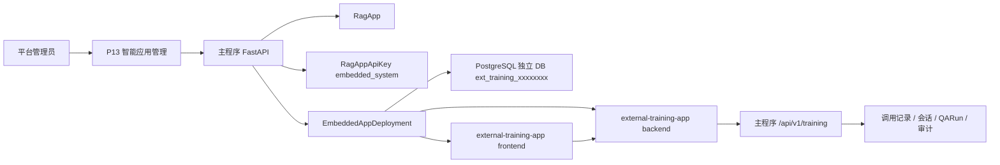
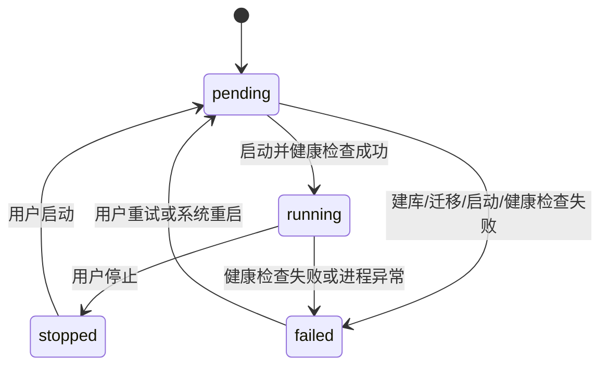

# 内置培训应用托管设计规范

> 本文是内置 `external-training-app` 托管能力的设计规范，属于后续实现的活文档。本文只定义设计边界、数据契约、部署契约和验收标准，不代表当前已经执行数据库迁移、创建子程序数据库或启动任何子程序进程。
>
> 关联计划：[内置培训应用托管实施计划](../plans/2026-07-02-内置培训应用托管实施计划.md)。

## 1. 背景

当前主程序已经具备智能应用、App API Key、员工培训三方接口、调用记录、会话和 QARun 追溯能力。`external-training-app` 是一个无 LLM、无 Embedding、无 RAG Provider 的外部培训应用，它通过平台员工培训接口调用主程序智能能力。

本规范新增的能力是：在主程序创建员工培训智能应用时，如果用户勾选“嵌入页”，平台自动为该应用托管一个内置 `external-training-app` 实例。该实例使用主程序同一 PostgreSQL 实例中的独立数据库，使用系统自动生成的内置 App API Key 调用主程序，并在主程序中保留可观测的部署状态。

## 2. 目标

- 支持员工培训智能应用创建时按嵌入页开关决定是否托管内置培训应用。
- 支持自动生成系统管理 API Key，并注入 `external-training-app/backend/.env` 或实例级 `.env`。
- 支持在同一 PostgreSQL 实例中新建独立数据库，不使用 schema。
- 支持记录子程序 DB、端口、进程、健康检查、错误信息和运行状态。
- 支持 API Key 身份状态和子程序 deployment 运行状态分离。
- 支持后续运维监控页展示并操作子程序启动、停止、重启和健康检查。

## 3. 非目标

- 不把 `external-training-app` 改造成 LLM、Embedding 或 RAG 应用。
- 不让浏览器端持有 `EXT_TRAINING_PLATFORM_API_KEY`。
- 不在关闭嵌入页或停用子程序时删除内置系统 Key。
- 不使用 PostgreSQL schema 承载多实例隔离。
- 不要求主程序进程长期持有子程序进程；子程序通过 Docker / Docker Compose 独立运行。
- 不在本文档阶段执行生产数据库迁移。

## 4. 总体架构



架构原则：

- 主程序是智能应用身份、API Key、调用审计和 RAG/Agent 能力真值中心。
- `external-training-app` 是可选托管子程序，只保存培训应用本地业务数据。
- 子程序数据库独立，便于迁移、备份、删除和恢复。
- 子程序进程独立，主程序挂掉不主动杀掉子程序。
- 子程序智能能力依赖主程序 API，主程序不可用时子程序应展示调用失败或降级提示。

## 5. 创建模式

### 5.1 仅 API 接入

触发条件：

```text
scenarioType = employee_training
publishChannels.embed = false
embedSettings.enabled = false
```

行为：

- 创建 `RagApp`。
- 可创建普通用户管理 API Key。
- 不创建 `embedded_app_deployments` 记录。
- 不创建 external-training 独立 DB。
- 不启动 external-training 后端或前端。

### 5.2 API 接入 + 内置嵌入页

触发条件：

```text
scenarioType = employee_training
and (
  publishChannels.embed = true
  or embedSettings.enabled = true
)
```

行为：

1. 创建 `RagApp`。
2. 自动创建一枚 `embedded_system` 类型 App API Key。
3. 创建 `embedded_app_deployments` 记录，初始状态为 `pending`。
4. 分配后端端口和前端端口。
5. 生成子程序数据库名。
6. 后续部署执行器创建独立 DB、执行迁移、注入 `.env`、启动服务并健康检查。

## 6. API Key 设计

### 6.1 Key 类型

`rag_app_api_keys` 需要区分普通 Key 和系统 Key：

| 字段 | 说明 |
| --- | --- |
| `key_type` | `normal` 或 `embedded_system` |
| `managed_by` | `user` 或 `system` |
| `display_name` | 展示名称，例如 `内置嵌入页调用 Key` |
| `deletable` | 是否允许通过管理端删除 |

### 6.2 内置系统 Key 规则

- 系统自动创建。
- 页面可见。
- 必须带有“内置嵌入页”或“系统管理”标识。
- 不允许删除。
- `status` 保持 `active`。
- 关闭嵌入页、停用子程序、子程序异常和重新部署都不删除该 Key。
- 调用记录、会话、QARun 和审计仍通过 `api_key_id` 和 `app_id` 归集。

删除保护：

```text
if key_type = embedded_system or deletable = false:
    reject with APP_API_KEY_SYSTEM_MANAGED
```

### 6.3 明文 Key 保存

- 主程序数据库只保存 Key hash、prefix 和管理元数据。
- 明文 Key 只在创建后用于写入子程序后端配置。
- 明文 Key 不写入主程序数据库。
- 前端浏览器不接触 `EXT_TRAINING_PLATFORM_API_KEY`。

## 7. 子程序数据库设计

### 7.1 隔离方式

采用同一 PostgreSQL 实例中新建独立数据库：

```text
主程序 DB: rag-platform
子程序 DB: ext_training_<appId前8位>
```

不采用 schema，原因：

- 数据隔离更清楚。
- external-training-app Alembic 迁移更简单。
- 单个应用备份、恢复、删除更直接。
- 子程序误操作不容易污染主程序业务库。

### 7.2 DB 命名

命名规则：

```text
ext_training_<appId前8位>
```

示例：

```text
app_id = 7f9a2c1e-xxxx-xxxx-xxxx-xxxxxxxxxxxx
database_name = ext_training_7f9a2c1e
```

主程序必须在 `embedded_app_deployments.database_name` 保存最终数据库名，后续运行不得只依赖临时拼接。

## 8. 配置注入设计

### 8.1 单实例默认注入

单实例或开发环境可以写入：

```text
external-training-app/backend/.env
```

变量：

```env
EXT_TRAINING_DATABASE_URL=postgresql://<user>:<password>@<host>:<port>/ext_training_<appId前8位>
EXT_TRAINING_PLATFORM_BASE_URL=http://127.0.0.1:8000/api/v1
EXT_TRAINING_PLATFORM_API_KEY=<embedded_system_plain_key>
```

### 8.2 多实例托管注入

同一服务器托管多个内置培训应用时，不允许共用同一个 `external-training-app/backend/.env`，必须使用实例级配置文件。

推荐目录：

```text
runtime/embedded-apps/<appId>/backend/.env
runtime/embedded-apps/<appId>/frontend/.env
```

实例级后端 `.env` 至少包含：

```env
EXT_TRAINING_DATABASE_URL=postgresql://<user>:<password>@<host>:<port>/ext_training_<appId前8位>
EXT_TRAINING_PLATFORM_BASE_URL=http://127.0.0.1:8000/api/v1
EXT_TRAINING_PLATFORM_API_KEY=<embedded_system_plain_key>
EXT_TRAINING_BACKEND_PORT=18xxx
```

实例级前端 `.env` 至少包含：

```env
EXT_TRAINING_FRONTEND_PORT=19xxx
VITE_API_BASE_URL=http://127.0.0.1:<backend_port>
```

## 9. 部署状态设计

新增部署记录对象 `EmbeddedAppDeployment`：

| 字段 | 说明 |
| --- | --- |
| `deployment_id` | 部署记录 ID |
| `app_id` | 关联智能应用 |
| `app_type` | 固定为 `external_training` |
| `api_key_id` | 内置系统 Key |
| `database_name` | 子程序独立 DB 名 |
| `backend_port` | 子程序后端端口 |
| `frontend_port` | 子程序前端端口 |
| `backend_pid` | 可选，后端进程 ID |
| `frontend_pid` | 可选，前端进程 ID |
| `service_name` | Docker Compose 项目名或容器名 |
| `status` | `pending`、`running`、`failed`、`stopped` |
| `health_status` | `unknown`、`healthy`、`unhealthy` |
| `public_url` | 页面访问地址 |
| `last_start_at` | 最近启动时间 |
| `last_stop_at` | 最近停止时间 |
| `last_health_check_at` | 最近健康检查时间 |
| `error_message` | 最近错误 |
| `metadata` | 安全扩展摘要 |

约束：

```text
unique(app_id, app_type)
unique(database_name)
unique(backend_port)
unique(frontend_port)
```

## 10. 端口分配

推荐端口段：

```text
backend: 18001-18999
frontend: 19001-19999
```

分配流程：

1. 查询 `embedded_app_deployments` 已记录端口。
2. 排除已记录端口。
3. 使用 socket bind 检测本机端口是否可监听。
4. 写入 `pending` deployment。
5. 依赖唯一约束处理并发兜底。

失败错误码：

```text
EMBEDDED_APP_NO_AVAILABLE_PORT
```

## 11. 子程序运行独立性

### 11.1 进程边界

- 主程序不应长期持有子程序进程。
- 主程序重启或挂掉，不主动杀掉已运行的子程序。
- 子程序挂掉，不影响主程序普通 API 能力。
- 子程序智能能力依赖主程序 API，主程序不可用时调用平台接口失败。

### 11.2 故障影响矩阵

| 主程序 | 子程序 | 页面访问 | 智能能力 |
| --- | --- | --- | --- |
| 正常 | 正常 | 正常 | 正常 |
| 挂掉 | 正常 | 页面可打开 | 调平台接口失败 |
| 正常 | 挂掉 | 嵌入页不可访问 | 主程序 API 正常 |
| 挂掉 | 挂掉 | 不可用 | 不可用 |

## 12. Docker 部署、重启与守护

### 12.1 开发环境

开发环境优先使用 Docker Compose 启动。若 Docker 不可用，可以临时使用脚本启动，但脚本方式只用于本地调试，不作为正式托管路径。

推荐开发命令：

```powershell
docker compose -p rag-embedded-training-<appId> -f runtime/embedded-apps/<appId>/docker-compose.yml up -d
```

### 12.2 正式环境

正式环境以 Docker / Docker Compose 为主，不使用 systemd 作为首选方案。这样可以同时覆盖 Linux 和 Windows 部署场景。

Docker 部署要求：

```text
1. 每个内置培训应用实例使用独立 compose project。
2. compose project 名建议为 rag-embedded-training-<appId前8位>。
3. 后端和前端容器均配置 restart: unless-stopped。
4. 后端容器挂载或注入实例级 backend/.env。
5. 前端容器挂载或注入实例级 frontend/.env。
6. 端口映射使用 deployment 中记录的 backend_port 和 frontend_port。
```

Compose 文件建议生成到：

```text
runtime/embedded-apps/<appId>/docker-compose.yml
```

示例：

```yaml
services:
  backend:
    image: rag-lab/external-training-backend:latest
    env_file:
      - ./backend/.env
    ports:
      - "${EXT_TRAINING_BACKEND_PORT}:${EXT_TRAINING_BACKEND_PORT}"
    command: ["python", "-m", "uvicorn", "app.main:app", "--host", "0.0.0.0", "--port", "${EXT_TRAINING_BACKEND_PORT}"]
    restart: unless-stopped

  frontend:
    image: rag-lab/external-training-frontend:latest
    env_file:
      - ./frontend/.env
    ports:
      - "${EXT_TRAINING_FRONTEND_PORT}:${EXT_TRAINING_FRONTEND_PORT}"
    command: ["npm", "run", "dev", "--", "--host", "0.0.0.0", "--port", "${EXT_TRAINING_FRONTEND_PORT}"]
    restart: unless-stopped
```

主程序运维动作统一调用 Docker Compose：

```text
start -> docker compose -p rag-embedded-training-<appId前8位> -f runtime/embedded-apps/<appId>/docker-compose.yml up -d
stop -> docker compose -p rag-embedded-training-<appId前8位> -f runtime/embedded-apps/<appId>/docker-compose.yml stop
restart -> docker compose -p rag-embedded-training-<appId前8位> -f runtime/embedded-apps/<appId>/docker-compose.yml restart
status -> docker compose -p rag-embedded-training-<appId前8位> -f runtime/embedded-apps/<appId>/docker-compose.yml ps
logs -> docker compose -p rag-embedded-training-<appId前8位> -f runtime/embedded-apps/<appId>/docker-compose.yml logs --tail 200
```

### 12.3 Windows 运行约束

Windows 环境必须通过 Docker Desktop 或兼容 Docker CLI 的运行时托管子程序。

路径处理要求：

```text
1. 主程序内部保存相对运行目录，例如 runtime/embedded-apps/<appId>。
2. 执行 Docker 命令前由平台按当前 OS 转换为本机路径。
3. 不在 compose 文件中硬编码 Linux 专用绝对路径。
4. 不使用 systemctl、nohup、setsid 等 Linux-only 命令。
```

Windows 下端口检测仍使用 socket bind，Docker 启动前必须确认宿主机端口可用。

### 12.4 Docker 镜像

建议分别构建两个镜像：

```text
rag-lab/external-training-backend:<version>
rag-lab/external-training-frontend:<version>
```

镜像构建规则：

```text
1. 镜像内不包含任何 App API Key 明文。
2. 镜像内不绑定具体 appId、database_name 或端口。
3. 所有实例差异均通过实例级 .env 注入。
4. 镜像 tag 应写入 deployment.metadata.imageTag，便于回滚。
```

## 13. 状态流转



状态解释：

- `pending`：已创建部署记录，正在等待或执行部署动作。
- `running`：后端和前端已启动，健康检查通过。
- `failed`：部署或健康检查失败，`error_message` 保存摘要。
- `stopped`：用户或系统主动停止。

`health_status` 与 `status` 分离：

```text
pending -> unknown
running -> healthy
failed -> unhealthy
stopped -> unknown
```

## 14. 健康检查

后端健康检查：

```text
GET http://127.0.0.1:<backend_port>/health
```

前端健康检查：

```text
GET http://127.0.0.1:<frontend_port>/
```

健康检查结果写入：

```text
last_health_check_at
health_status
error_message
```

## 15. 管理端展示

### 15.1 API Key 列表

需要展示：

- Key 前缀。
- Key 状态。
- Key 来源。
- 管理方。
- 是否可删除。
- 过期时间。
- 最近使用时间。

展示规则：

| Key 类型 | 展示 |
| --- | --- |
| `normal` | 普通 API Key / 用户管理 / 可删除 |
| `embedded_system` | 内置嵌入页调用 Key / 系统管理 / 不可删除 |

### 15.2 子程序运维状态

需要展示：

- 部署状态。
- 健康状态。
- DB 名。
- 后端端口。
- 前端端口。
- public URL。
- 最近启动时间。
- 最近停止时间。
- 最近健康检查时间。
- 最近错误。

后续操作按钮：

- 启动。
- 停止。
- 重启。
- 健康检查。

## 16. 安全要求

- `EXT_TRAINING_PLATFORM_API_KEY` 只存在于子程序后端配置或 secret 中。
- 前端页面不得输出完整 Key。
- 主程序只保存 Key hash 和 prefix。
- 部署记录的 `metadata` 不得保存明文 Key。
- 子程序请求体不得携带 `appId`、`kbId` 或 Provider 配置切换调用对象。
- 平台根据 API Key 反查 App、知识库和默认配置版本。
- 调用审计中不得保存完整用户问题、Provider 密钥、系统提示词或未授权 Chunk 正文。

## 17. 错误码

| 错误码 | 场景 |
| --- | --- |
| `APP_API_KEY_SYSTEM_MANAGED` | 尝试删除内置系统 Key |
| `EMBEDDED_APP_NO_AVAILABLE_PORT` | 没有可分配端口 |
| `EMBEDDED_APP_DATABASE_CREATE_FAILED` | 创建子程序独立 DB 失败 |
| `EMBEDDED_APP_MIGRATION_FAILED` | 子程序 Alembic 迁移失败 |
| `EMBEDDED_APP_CONFIG_WRITE_FAILED` | 写入 `.env` 或 secret 失败 |
| `EMBEDDED_APP_START_FAILED` | 启动子程序失败 |
| `EMBEDDED_APP_HEALTH_CHECK_FAILED` | 健康检查失败 |

## 18. 验收标准

- 创建员工培训应用且未启用嵌入页时，不创建部署记录。
- 创建员工培训应用且启用嵌入页时，创建内置系统 Key 和 `pending` 部署记录。
- 内置系统 Key 在页面可见，带系统管理标识，不可删除。
- 内置系统 Key 保持 active，关闭嵌入页或停用子程序时不删除。
- 子程序数据库使用独立 DB，命名为 `ext_training_<appId前8位>`。
- 单实例可写入 `external-training-app/backend/.env`。
- 多实例必须写入实例级 `.env`，不覆盖共享 `.env`。
- 端口分配同时检查部署记录和系统端口占用。
- 子程序运行状态独立于主程序进程。
- 子程序挂掉后由 Docker Compose `restart: unless-stopped` 自动重启，主程序运维页可手动重启。
- 主程序挂掉时，子程序页面可打开但平台调用失败，并应展示可理解错误。

## 19. 验证命令

后端目标测试：

```powershell
python -m pytest backend/app/tests/unit/test_rag_app_scenario_metadata.py backend/app/tests/unit/test_app_runtime_embed_token.py backend/app/tests/unit/test_app_runtime_protection.py -q
```

部署执行器测试：

```powershell
python -m pytest backend/app/tests/unit/test_embedded_app_deployment_service.py -q
```

后端编译：

```powershell
python -m compileall backend/app backend/migrations
```

前端构建：

```powershell
cd frontend
npm run build
```

文档检查：

```powershell
git diff --check
```

## 20. 与既有文档关系

- 员工培训 Agent 平台侧能力继续以 `2026-05-26-employee-training-agent-platform-design.md` 为准。
- 外部培训应用自身边界继续以 `2026-05-26-external-training-app-design.md` 为准。
- 场景化智能应用上层架构继续以 `2026-05-29-agent-scenario-architecture.md` 为准。
- 本文只新增“主程序托管内置 external-training-app 实例”的部署与运维设计，不替代上述业务设计。
