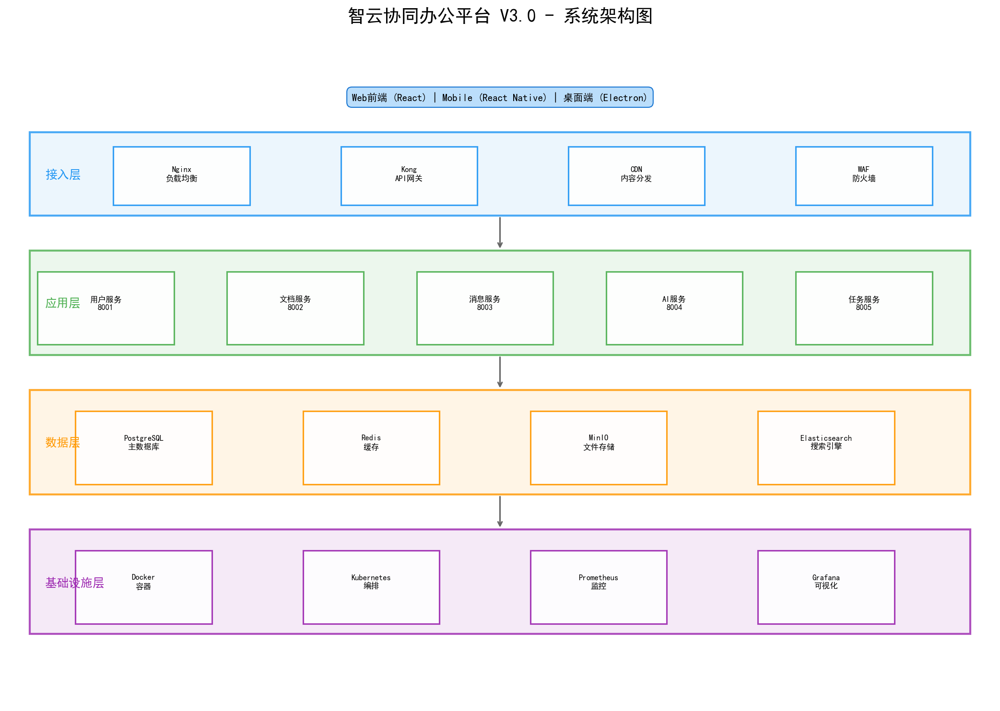

# 智云协同办公平台 V3.0 技术架构设计

## 文档信息

| 属性 | 值 |
|------|-----|
| 文档版本 | V2.1 |
| 编写人 | 李建国 |
| 审核人 | 张明远 |
| 创建日期 | 2026-04-15 |
| 最后更新 | 2026-05-20 |

## 1. 系统架构概述

本系统采用**微服务架构**设计，整体架构如下图所示：



### 1.1 架构分层

| 层次 | 职责 | 主要组件 |
|------|------|----------|
| 接入层 | 负载均衡、SSL终止、路由 | Nginx, Kong Gateway |
| 应用层 | 业务逻辑处理 | 用户服务, 文档服务, 消息服务, AI服务 |
| 数据层 | 数据持久化 | PostgreSQL, Redis, MinIO |
| 基础设施层 | 容器编排、监控 | Kubernetes, Prometheus, Grafana |

### 1.2 核心服务清单

| 服务名称 | 端口 | 负责人 | 代码仓库 |
|----------|------|--------|----------|
| user-service | 8001 | 赵晓峰 | git.zhiyun.com/backend/user-service |
| document-service | 8002 | 赵晓峰 | git.zhiyun.com/backend/document-service |
| message-service | 8003 | 赵晓峰 | git.zhiyun.com/backend/message-service |
| ai-service | 8004 | 李建国 | git.zhiyun.com/backend/ai-service |
| gateway-service | 8000 | 李建国 | git.zhiyun.com/backend/gateway-service |
| web-frontend | 3000 | 陈思远 | git.zhiyun.com/frontend/web-app |

## 2. 数据库设计

### 2.1 用户表 (users)

```sql
CREATE TABLE users (
    id BIGSERIAL PRIMARY KEY,
    username VARCHAR(50) NOT NULL UNIQUE,
    email VARCHAR(100) NOT NULL UNIQUE,
    department_id BIGINT REFERENCES departments(id),
    role VARCHAR(20) DEFAULT 'user',
    created_at TIMESTAMP DEFAULT CURRENT_TIMESTAMP,
    updated_at TIMESTAMP DEFAULT CURRENT_TIMESTAMP
);
```

### 2.2 核心业务表

| 表名 | 说明 | 预估数据量 | 分库策略 |
|------|------|------------|----------|
| users | 用户信息 | 50,000 | 按部门分片 |
| documents | 文档元数据 | 500,000 | 按创建时间分片 |
| document_versions | 文档版本 | 2,000,000 | 按文档ID分片 |
| messages | 消息记录 | 10,000,000 | 按时间分表 |
| tasks | 任务信息 | 200,000 | 按项目分片 |
| audit_logs | 审计日志 | 50,000,000 | 按月分表 |

## 3. 接口设计规范

详细接口文档见 [接口规范文档](10-接口规范.md)

### 3.1 RESTful API 规范

| 项目 | 规范 |
|------|------|
| 基础路径 | `/api/v3` |
| 认证方式 | Bearer Token (JWT) |
| 请求格式 | application/json |
| 响应格式 | 统一包装 `{code, message, data}` |
| 分页参数 | `page`, `pageSize`, 默认 1, 20 |
| 时间格式 | ISO 8601 (UTC) |

### 3.2 核心接口列表

| 接口 | 方法 | 说明 | 负责人 |
|------|------|------|--------|
| /api/v3/users | GET | 获取用户列表 | 赵晓峰 |
| /api/v3/users/{id} | GET | 获取用户详情 | 赵晓峰 |
| /api/v3/documents | POST | 创建文档 | 赵晓峰 |
| /api/v3/documents/{id}/versions | GET | 获取版本历史 | 赵晓峰 |
| /api/v3/messages/send | POST | 发送消息 | 赵晓峰 |
| /api/v3/ai/chat | POST | AI对话 | 李建国 |

## 4. 安全设计

### 4.1 认证授权

- **认证**: JWT Token，有效期2小时，支持Refresh Token
- **授权**: RBAC模型，支持细粒度权限控制
- **审计**: 所有关键操作记录审计日志

### 4.2 权限角色

| 角色 | 权限说明 |
|------|----------|
| admin | 系统管理员，拥有所有权限 |
| project_manager | 项目管理权限，可管理项目和成员 |
| developer | 开发人员，可查看和编辑分配的文档 |
| viewer | 只读用户，仅可查看公开文档 |

## 5. 性能指标

| 指标 | 目标值 | 测试方法 |
|------|--------|----------|
| API响应时间 (P95) | < 200ms | JMeter压力测试 |
| 页面加载时间 | < 2s | Lighthouse |
| 并发用户数 | > 5000 | 分布式压测 |
| 数据库查询 (P99) | < 50ms | 慢查询监控 |
| 系统可用性 | > 99.9% | 监控告警 |

## 6. 部署架构


### 6.1 环境配置

| 环境 | 用途 | 配置 |
|------|------|------|
| dev | 开发环境 | 2C4G × 2 |
| staging | 预发布环境 | 4C8G × 3 |
| production | 生产环境 | 8C16G × 6 |

详细进度参见 [项目进度表](05-项目进度表.xlsx)
